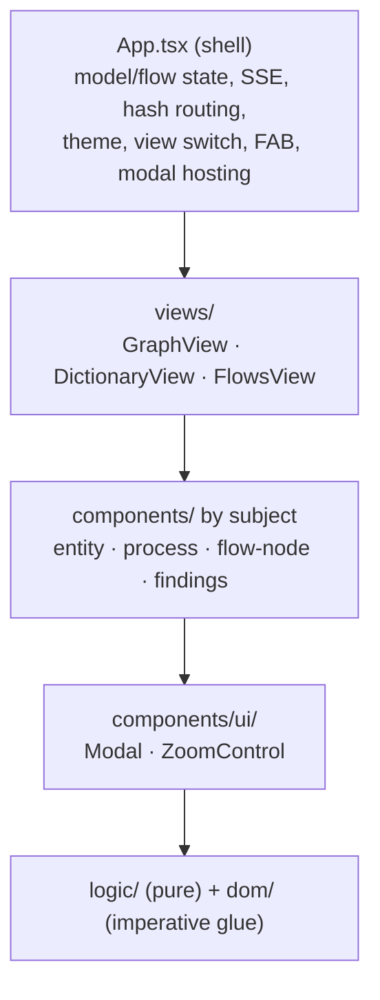

# App.tsx decomposition

## Problem

`src/App.tsx` is 5514 lines hosting all three views (Graph/Cytoscape, Dictionary, Flows/SVG), every modal, the FAB, zoom controls, hash-router glue, the cy-init effect, and ModelIndex wiring. Structural analysis (2026-06-10):

- The `App` component itself is ~1760 lines (32%) — 12 `useState`, 20+ `useRef`, 7+ effects. The refs are imperative bridges (`flowZoomToRef`, `cySetPercentRef`, `openEntityByIdRef`, …) wiring three rendering worlds (cytoscape, flow SVG, React DOM) through one component.
- The other ~3750 lines are ~45 top-level declarations forming low-coupling clusters that happen to share a file.
- Component naming is by **host** (`ColumnsTable` vs `DictColumnsTable`, `ExamplesAccordion` vs `DictExamplesAccordion`, `ChildrenTable` vs `DictRelationshipsTable`) — near-clone renderers of the same subject, duplicated because in-file reuse was harder than copy-paste.
- Components shared across hosts (`FlowIoTable`, `ProcessesSection`, `FlowProcessExamplesSection`) prove the **subject** (entity, process, external, store) is the reusable unit, not the view.

Every change risks unrelated breakage; diffs are hard to gate (render-perf-indexing CP4 touched dozens of call sites in one file). Origin: `.claude/project/followups/app-tsx-decomposition.md`.

## Goals / Non-goals

Goals:

- Layered frontend structure under `src/app/` with a strict downward dependency rule: shell → views → domain components → ui primitives → pure logic.
- Domain components organized by **subject** (entity / process / flow-node / findings), one component per file; pure helpers grouped by family.
- Behavior-neutral relocation first; ownership changes (view extraction, twin merges) as separate, screenshot-gated phases.
- `src/` root remains the shared core (parse, validate, model-index, server, cli, generators); `src/app/` is the browser-code boundary.

Non-goals:

- Splitting `styles.css` (2161L) into per-component CSS — behavior-visible (cascade order, theme vars); separate follow-up.
- Moving already-factored top-level modules (`hash-router.ts`, `markers.ts`, `wrap-label.ts`, `layout-store.ts`, `layout-fingerprint.ts`, `model-index.ts`) — correctly placed; moving churns `server.ts`/`generators/` imports for no gain.
- Touching `src/flow-view/` (the SVG renderer) — already its own module.
- Any rendering/behavior change in P1. Zero visual diff is the contract.
- Refactoring `FlowDiagramSvg.tsx` (1422L) — out of scope; its own follow-up if wanted.

## Layer model

Dependency direction, never upward:



| Layer | Contents | Test |
|-------|----------|------|
| logic | search matchers, dotted sort, doc-resolver, finding-rows, color math, `buildAllFlowNodeIds` | framework-free, `bun test`-able |
| dom | body-links (`resolveBodyClick`, `upgradeMissingLinksInContainer` — DOM mutation), `applyThemeCssVars` | DOM, no React |
| ui | `Modal`, `ZoomControl` | React, domain-blind |
| domain components | subject cards/tables/modals (entity, process, flow-node, findings) | React, view-blind |
| views | GraphView (cy lifecycle), DictionaryView, FlowsView (FlowSurface host) | own renderer lifecycle + view-local controls |
| shell | App: state, SSE, routing, theme, FAB | composition only |

## Target tree

```
src/app/
├── App.tsx                    # shell
├── globals.d.ts               # window globals declaration
├── logic/
│   ├── color.ts               # blendHex, pastel, lighten, hexToRgba
│   ├── search.ts              # 4 matchers, sortGroupNodes, parseDottedNumber, compareDottedProcesses
│   ├── doc-resolver.ts        # splitDocToken, buildFlowDocResolver, FlowDoc types
│   └── finding-rows.ts        # buildFindingRows, FindingRow
│   └── flow-node-ids.ts       # buildAllFlowNodeIds (pure)
├── dom/
│   ├── body-links.ts          # resolveBodyClick, upgradeMissingLinksInContainer
│   └── theme-css-vars.ts      # applyThemeCssVars
├── components/
│   ├── ui/
│   │   ├── Modal.tsx
│   │   └── ZoomControl.tsx
│   ├── entity/
│   │   ├── ClassificationBadge.tsx
│   │   ├── ColumnsTable.tsx + DictColumnsTable.tsx        # twins colocated, P2b merges
│   │   ├── ChildrenTable.tsx + DictRelationshipsTable.tsx # twins colocated
│   │   ├── ExamplesAccordion.tsx + DictExamplesAccordion.tsx
│   │   ├── EntityCard.tsx           # was DictEntitySection
│   │   └── EntityModal.tsx          # was SelectedEntityModal
│   ├── process/
│   │   ├── KindMarker.tsx           # was FlowKindMarker
│   │   ├── IoTable.tsx              # was FlowIoTable
│   │   ├── ProcessExamples.tsx      # was FlowProcessExamplesSection
│   │   ├── ProcessCard.tsx          # was DictProcessSection
│   │   ├── ProcessesTable.tsx       # was DictProcessesTable
│   │   └── ProcessesSection.tsx     # cross-ref table (entity + flow-node hosts)
│   ├── flow-node/
│   │   ├── ExternalCard.tsx         # was DictExternalSection
│   │   ├── StoreCard.tsx            # was DictStoreSection
│   │   ├── FlowNodeModal.tsx
│   │   └── FlowDocModal.tsx
│   └── findings/
│       └── FindingsPanel.tsx
├── views/
│   ├── graph/
│   │   ├── organic-layout.ts        # fan/deoverlap/separate/decollinear/arrange + ELK tiers
│   │   ├── styles.ts                # buildStyles
│   │   ├── navigator.ts             # mountNavigator, teardownNavigator
│   │   └── GraphView.tsx            # P2a: cy-init host
│   ├── dict/
│   │   └── DictionaryView.tsx
│   └── flow/
│       ├── FlowsView.tsx            # P2a: FlowSurface + initFlowGraphCore host
│       └── LegendModal.tsx          # theme/kind legend (view-level, both palettes)
```

`src/main.tsx` import updates to `./app/App`. `src/index.html` unchanged.

## Approaches

| # | Approach | Pros | Cons |
|---|----------|------|------|
| A | Layer-first only (`components/`, `logic/`, `styles/` flat) | familiar React convention | hides subject duplication; domain edges invisible |
| B | Feature-first by view (`graph/`, `dict/`, `flow/` each self-contained) | matches hash-router vocabulary | dict↔flow shared components (IoTable, ProcessesSection, examples) have no home; forces false ownership |
| C | **Hybrid: layers + subject-grouped domain components** | duplication colocated and visible; shared components have a true home; dependency rule enforceable by directory | one more level of nesting |
| D | Single-pass restructure + dedupe + view extraction in one PR | one review | cannot attribute screenshot regressions to move vs redesign |

## Recommendation

**C, phased.** Evidence: the investigator dependency map shows the cross-host components (`FlowIoTable` used by `DictProcessSection` per CP25/26; `ProcessesSection` used by `SelectedEntityModal` and `FlowNodeModal` per CP21) cut across views — view-first (B) would misfile them. The table twins (`ColumnsTable`/`DictColumnsTable` etc.) are evidence that subject is the unit. D is rejected on the followup's own terms: each extraction must be behavior-neutral and screenshot-verified, which requires move and redesign in separate diffs.

Phases:

| Phase | What | Risk |
|-------|------|------|
| P1 | Evacuation: moves + renames only, twins colocated NOT merged, App.tsx keeps shell + `FlowSurface`/`initFlowGraphCore` + cy-init | low — import churn only |
| P2a | Extract `GraphView` / `FlowsView` from the App shell: effects + refs move ownership; narrow imperative handles (pattern: `FlowChromeHandle`) | medium — ref ownership changes |
| P2b | Merge subject twins into single components | medium — rendered output changes, screenshot-gated |
| P2c | Slim the shell: `useModelData` (SSE + fetch + findings state, ~150L), `useHashRoute` (~100L), `useThemeMode` (~60L) hooks + `FabMenu.tsx` component (~200L) | medium — same class as P2a |
| P3 | Signals + CLAUDE.md feature-map refresh (≈10 line-number citations to App.tsx), followup closure | low |

Shell size trajectory: ~1800L after P1 (milestone, not endpoint) → ~600L after P2a → ~250–350L after P2c. Below that is fragmentation for line count — a shell composing three views and four modals legitimately holds a couple hundred lines of state declarations, view switch, and modal hosting.

P1 is ~85% of the review-hazard win at ~10% of the risk. P2a/P2b/P2c can each be separate PRs.

Regression net: 54 check scripts (`bun run test`), `bun run typecheck`, `bun run build:bundle`, and 55 visual tests in `test/visual/` — CP18 (navigator teardown), CP22/23 (zoom), CP3 (dfd deep-links), CP13/CP21 (modal parity) cover the exact seams P2a touches.

## Open questions

- `ExternalCard`/`StoreCard` are consumed by both DictionaryView and FlowNodeModal — `flow-node/` is the chosen home, but if a third host appears they may belong in a `shared/` subject dir.
- CSS split (per-component styles, Bun CSS modules) — deferred; file a follow-up after P3?
- P2b twin merge may surface intentional rendering differences between modal and dict flavors (column subsets, link behavior) — each merge needs a before/after screenshot pair to decide unify vs keep-both-deliberately.
