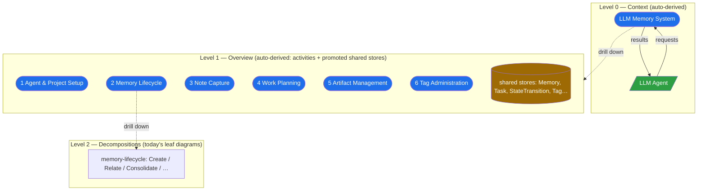

# DFD viewer overhaul — leveling + layout

## Problem

The Flows view is structurally incorrect and graphically noisy. Two failures, confirmed against the code and the dense `llm-memory-db-mssql` diagrams (screenshots) and grounded in [`docs/research/dfd-layout-and-leveling.md`](../research/dfd-layout-and-leveling.md):

- **No leveling.** `parseFlows` ([`src/flows/flow-parse.ts:691`](../../src/flows/flow-parse.ts)) yields a flat list of independent top-level diagrams. There is no context diagram (Level 0) and no Level-1 system overview — the 6 activities read as disconnected islands with no "whole system" view above them. SSADM/Yourdon DFDs are a hierarchy: context → Level-1 exploded view → decompositions down to leaves. ignatius only goes *down* from a leaf process; it never starts at the system bubble.
- **Hand-rolled layout with no crossing minimization.** `computeFlowLayout` ([`src/flow-view/flow-layout.ts:332`](../../src/flow-view/flow-layout.ts)) is a 5-band preset with a single same-row de-collision pass. Dense diagrams (tag-administration's `Merge Tag` fanning to 5 scattered junction stores; memory-lifecycle's 6 processes + shared audit stores) get crossing edges, overlapping long column-list labels, and related stores spread across the full width.

## Goals / Non-goals

- **Goals:**
    - Canonical leveling: context (Level 0) → Level-1 overview → existing leaf diagrams as decompositions, navigable by drill-down + breadcrumbs.
    - ELK-driven layout: crossing minimization, ordered bands, semantic store clustering, overlap-free edge labels — replacing the hand-rolled positioner while keeping the existing SVG renderer.
    - Balancing surfaced via the existing `flow.unbalanced_decomposition` (Class A) — reconciliation, never silent rewrite.
    - Dense diagrams render clean; `ignatius validate` stays clean on the proving model; visual proof via the screenshot harness.

- **Non-goals:**
    - Unifying ELK across the DG (ER graph, `cytoscape-elk`) and DFD views — deferred (open question 4).
    - Rewriting the SVG renderer `FlowDiagramSvg.tsx` — kept; it becomes a position *consumer*.
    - Changing ELK layout for the ER graph, the entity model, or the parsed leaf-diagram content.
    - Queue-payload validation, usage-index changes (out of scope per the flow spec's existing non-goals).
    - Physical folder restructure of `flows/` — re-parenting is logical (see Recommendation).

## Leveling model

Canonical Yourdon/SSADM hierarchy (context = Level 0; the "Figure 0 as a separate tier" framing was refuted in research). Each existing top-level diagram is treated as a **Level-1 process** whose decomposition *is* that diagram — so leveling is logical, requiring no folder churn.

Conceptual hierarchy for the proving model:

- **Context (Level 0)** — single process = the whole system; only flows to/from external entities. Reliably auto-derivable as the union of all external boundary flows across the leaf set.
- **Level-1 overview** — the activities as processes connected through *promoted* shared stores. Store promotion obeys the degree≥2 rule: a store appears at the highest level where 2+ processes touch it; degree-1 (single-process-local) stores are subsumed into their activity, not shown at Level 1. Derivable as a *proposal* reconciled by the balancing lint, because naming collisions (same logical store, different labels across leaves) and balancing drift can make a silent derivation wrong.
- **Numbering** — reuse the existing dotted scheme (`dottedNumber`, `compareDottedProcesses`). A Level-1 process `N` decomposes into its diagram whose processes are `N.1`, `N.2`, …
- **Balancing** — the parent process's boundary flows must reconcile with its child diagram's boundary. Extend `checkUnbalancedDecomposition` ([`src/flows/flow-validate.ts:425`](../../src/flows/flow-validate.ts)) to the context↔L1↔leaf boundaries; emit `flow.unbalanced_decomposition` on mismatch and a naming-collision finding.

## Approaches

Engine choice is settled by the research (ELK is the only headless JS engine with layered Sugiyama + band partitioning + compound grouping + first-class edge-label placement; already a direct dep). The genuine forks the design must pin:

| Fork | Options | Choice |
|------|---------|--------|
| Level-1 overview source | A auto-derive · B hand-author · C hybrid (auto-derive proposal + balancing lint, author may override) | **C** — context fully auto-derived; Level-1 auto-derived but reconciled, not authoritative |
| ELK adoption scope | A replace only DFD positioner · B unify ELK across DG+DFD | **A** — DG already works via cytoscape-elk; unifying is a bigger refactor with no current pain. B deferred. |
| Async seam | A make `FlowDiagramSvg` internal layout async (ripples to viewBox/anchors at [`FlowDiagramSvg.tsx:847`](../../src/flow-view/FlowDiagramSvg.tsx)) · B precompute ELK positions in `FlowsView.renderDiagram` and pass as a `positions` prop | **B** — renderer stays a synchronous position-consumer; the await happens once, upstream, where `renderDiagram` is already async-friendly |
| Re-parenting | A physical folder restructure of `flows/` · B logical (each top-level diagram = a Level-1 process) | **B** — no model file churn; the existing sub-DFD drill-down nav already supports it |
| Sequencing | spike → Stream B (layout) → Stream A (leveling) | each lands + verifies independently; spike de-risks band/label tuning before commitment |

## Recommendation

**Layout (Stream B).** A new async ELK layout module produces positions (and edge-label positions) for a `FlowDiagram` headlessly. `FlowsView.renderDiagram` ([`src/app/views/flow/FlowsView.tsx:267`](../../src/app/views/flow/FlowsView.tsx)) awaits it before mounting `FlowDiagramSvg`, passing positions in as a prop — the renderer keeps consuming a positions map exactly as it already merges `savedPositions`. `buildFlowData` still supplies nodes/edges/storeNums (sync); only the position source changes. ELK config: `partitioning.activate` with per-node `partition` (source-ext=0, input-store=1, process-row=2, output-store=3, sink-ext=4) + `elk.direction=DOWN` for horizontal bands; compound nodes to cluster related stores; ELK label-dummy-node placement for the column-list labels. Use the `elk-worker` build to keep the ~8 MB kernel off the main thread; bump `elkjs` 0.9.3 → 0.11.x. Saved drag positions still override (the existing `flowLayoutStore` path is unchanged).

**Leveling (Stream A).** A derivation module synthesizes the context + Level-1 diagrams from the parsed leaf set and inserts them at the top of the `FlowModel` tree; each existing top-level diagram becomes the decomposition of its Level-1 process. Drill-down, breadcrumbs, and `dfd=` deep-links reuse the existing `selectDiagramById`/`findDiagramPath`/hash machinery unchanged. Balancing + naming-collision checks live in the validator.

**Spike first.** Before committing Stream B, prototype ELK on the two dense diagrams and confirm the band constraint survives crossing minimization and the label-size inflation is acceptable. If labels blow up the drawing, fall back to line-breaking / `xlabel`-style post-placement (research §5).

## Open questions

- Does `partitioning` + `DOWN` yield clean 5-band layouts on the dense diagrams, or does crossing minimization fight the band constraint enough to need per-diagram tuning? (Spike gate.)
- Is ELK's space-reserving edge-label inflation acceptable for long column-list labels, or must labels be line-broken / truncated / `xlabel`-placed? (Spike gate, real label widths.)
- Is auto-derived Level-1 reliable given store-naming consistency across leaves, or should the overview be author-confirmable? (Hybrid C hedges this; revisit after the derivation is built against the proving model.)
- Defer: unify ELK across DG + DFD into one layout layer (open question 4)?
