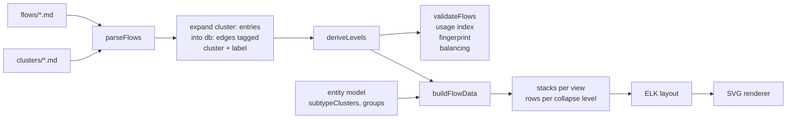
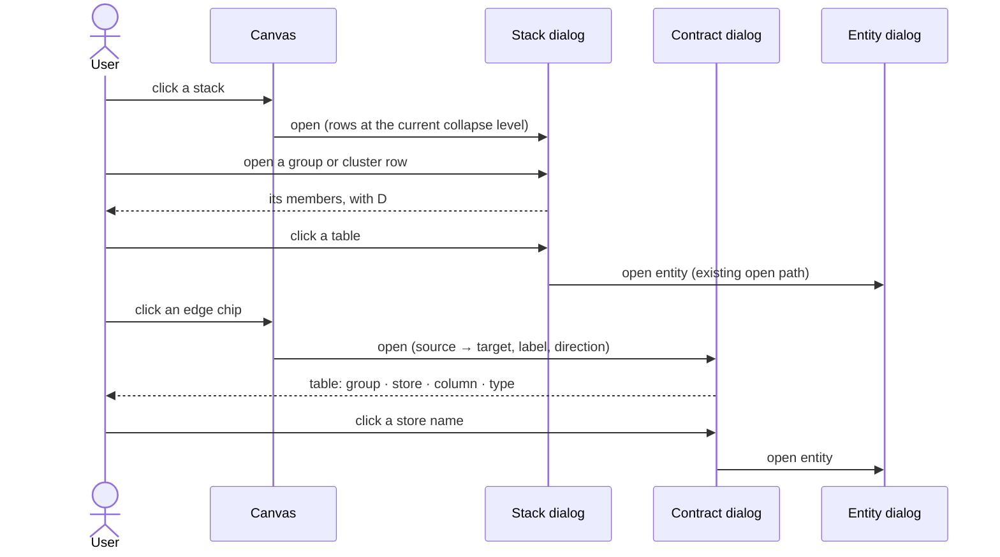

# DFD store clusters


## Problem


A process that touches many tables draws one store box and one edge per table, and every edge carries a chip previewing its column list. On the Compute Loads diagram of the AutomaStructure model that is 9 processes, 22 stores, and 64 edges, each edge chip reading `project_id, Width, Ea…`. Half the edges sit on three hub stores: LoadInfo, BuildingInfo, and Girder. The parent diagram, design-building, has 10 processes, 79 stores, and 230 edges. The hover tooltip on one edge lists ten columns; the dictionary's process IO table lists one row per store per column. The diagram is correct and none of its surfaces are readable at that scale.

Hand-drawn SSADM diagrams solve this three ways at once. Each process gets one stack of stores above it for reads and one below for writes, and a store used by two processes is drawn twice. Every flow carries a short prose label naming the data, never a column list. A store that fans out to many processes is repeated per process rather than wired across the page. ignatius has no way to name a flow, no way to say "these tables are one thing", and no way to draw a process's stores as one stack.

Two earlier attempts inform this one. The ELK spike in `docs/spec/dfd-overhaul.md` tried compound nodes to cluster related stores and dropped them: every member kept its own node and edges inside the parent, and crossings went from 13 to 69. Externals already solved fan-out by contraction: `buildExternalRouting` in `src/flow-view/flow-layout.ts` merges every external into one source copy and one sink copy per diagram. Stacks apply that contraction to stores.


## Goals / Non-goals


- Goals:
    - A prose `label:` on any input or output entry, shown on the edge chip in place of the column list. Clicking any chip that carries data opens a contract dialog listing which columns come from which store.
    - A per-process view, the default, where each process's read set and write set render as one stack each, two processes with the identical set share a stack, and a store in two stacks is flagged as duplicated in the data without drawing the marker, since repetition is the rule in that view. The connected view, today's rendering with grouping applied, stays as the toggle and keeps drawing the duplicate marker, where a repeat is the exception.
    - A collapse level, stores, clusters, or groups, that decides what one row of a stack stands for. A cluster is a subtype family from the entity model or an author-declared set in a `clusters/` file. A group is the entity's existing `group:`.
    - A process file can reference a cluster directly with a `cluster:` entry, name the flow, and give each member's columns in one entry.
    - Clicking a stack opens a dialog listing its rows; a row opens to its members; a member opens its entity dialog.
    - In the connected view, adjacency stacking: stores wired to exactly the same processes in the same directions collapse into one honestly labelled stack. Switchable off in `ignatius.yml`.
    - Validation, balancing, leveling, usage indexes, fingerprints, search, static export, and the modeling skill all understand labels, clusters, and stacks.
- Non-goals:
    - Clusters of non-`db:` stores. Adjacency stacking still groups same-kind non-db stores; author clusters and the `cluster:` token are entity-only.
    - Per-diagram cluster scoping. Cluster files live at the model root and apply wherever two or more members meet; a scoping key can be added later without changing the file shape.
    - Per-diagram collapse level or view. Both are global view settings.
    - Editing a cluster, group, or label from the viewer.
    - ELK compound nodes or any change to the five-band layout contract.
    - Cluster-level `examples:` rows. Examples stay keyed by member `db:` token.
    - Changing the ERD, the dictionary's entity cards, subtype derivation, or the `groups/` format.


## Approaches


| # | Approach | Pros | Cons |
|---|----------|------|------|
| A | Render-time grouping only, no authoring change | Zero parser or validator work; every existing model improves on upgrade | No way to name a flow; no author control over what groups; the diagram shows something the markdown never says |
| B | `cluster:` as a first-class endpoint kind carried through every consumer | The parsed model matches the drawing exactly | Validator, balancing, leveling, usage index, fingerprint, search, and doc resolver all gain a cluster branch; balancing must compare cluster edges against member `db:` edges anyway |
| C | `cluster:` token expands to member `db:` edges at parse time, tagged with the cluster and flow label; stacks and rows are built at render time from the expanded graph | Every downstream consumer keeps seeing `db:` edges unchanged; author clusters, subtype families, groups, and adjacency share one render path; a model authored with or without the token has the same fingerprint | The parsed edge list no longer maps one-to-one onto frontmatter entries; the expansion pass is a new concept the validator must report against |
| D | ELK compound nodes | Native to the layout engine | Rejected by the overhaul spike: members keep their own edges, crossings multiply, bands collapse |

Presentation forks, settled against the AutomaStructure model with an adjacency probe (`tmp/l1-probe.ts`) and the user's hand-drawn diagrams:

| Fork | Options | Choice |
|------|---------|--------|
| Default view | per-process stacks · connected graph | per-process. On Compute Loads the connected view keeps about 48 of 64 edges after every grouping source, because 24 edges sit on hub stores no source can touch; per-process stacks are the only rendering that fits it, and they match how the user draws by hand |
| Adjacency stacking | drop · keep in connected view | keep, as an exploration. On the real model it lands on real families (the three MWFRS load case tables) and on coincidences (Column with OverhangInfo), so the stack label never names a member and the dialog shows the shared processes |
| Flow label scope | `cluster:` entries only · any entry | any entry. Hub-store edges dominate the dense diagrams and no grouping reaches them; the label is the fix for those |
| Grouping granularity | clusters only · clusters and groups | both, as one collapse-level dial. Groups already exist with labels and colors; a group contains clusters, so the levels nest |

Visual decisions, recorded from the two options pages. First page: chose A2 (a store box with two offset outlines behind it, the same affordance a process with a sub-DFD uses), B2 (clicking the node opens a modal listing the members, the canvas never changes shape), C2 was chosen for the chip and then dropped: its member and column counts push the chip past the 22-character inline gate, so the chip shows the label alone and counts live in the dialog. D2 (the contract dialog is one flat table). Rejected: A1 a "C" cap, A3 a closed box with a title bar, B1 and B3 expand in place, C1 and C3 chip variants, D1 one section per table. Second page: chose B1 (externals stay aggregated in per-process view) over B2 (one external copy per process). Panel A resolved by rule: an explicit `cluster:` entry always draws its cluster, implicit grouping needs two members.


## Recommendation


Approach C, with per-process stacks as the default view. The contraction lives where the externals contraction already lives, in `buildFlowData`, and the parsed model stays a plain graph of `db:` edges that every existing rule and index already handles.


### Authoring


Any input or output entry may carry a `label:`. The chip shows it; without one the chip shows the column preview it shows today. The `data:` contract is unchanged and the contract dialog always lists the columns.

```yaml
outputs:
  - to: db:AuthEvent_AddRole
    label: new auth event
    data: [auth_event_id, app_user_id, role_id]
```

A cluster is a file in a new `clusters/` folder at the model root, beside `externals/` and `stores/`. It names a set of entities and explains why they are one thing.

```markdown
---
label: Role grants
entities:
  - AppUser_Role
  - AUR_Action
  - AUR_CommunityAction
---

What a user holds once a role is granted: the role itself, its actions,
and its community-scoped actions. Written together, never separately.
```

A process file today lists every member with its columns:

```yaml
---
process: Grant Role to User
number: 1
inputs:
  - from: ext:App-Admin
    data: granted role, community
  - from: db:AppRole
    data: [role_id]
  - from: db:AppRole_Action
    data: [role_id, action_id]
  - from: db:AR_CommunityAction
    data: [role_id, community_action_id]
outputs:
  - to: db:AuthEvent_AddRole
    data: [auth_event_id, app_user_id, role_id]
  - to: db:AppUser_Role
    data: [app_user_id, role_id]
  - to: db:AUR_Action
    data: [app_user_id, role_id, action_id]
  - to: db:AUR_CommunityAction
    data: [app_user_id, role_id, community_action_id]
---
```

That file keeps working unchanged. Once `clusters/role-grants.md` exists and the collapse level is clusters or groups, the three output stores render as one row labelled Role grants. Rewriting the entry to the `cluster:` token is optional and buys one entry per cluster:

```yaml
---
process: Grant Role to User
number: 1
inputs:
  - from: ext:App-Admin
    data: granted role, community
  - from: cluster:role-definition
    label: role id
    data:
      AppRole: [role_id]
      AppRole_Action: [role_id, action_id]
      AR_CommunityAction: [role_id, community_action_id]
outputs:
  - to: db:AuthEvent_AddRole
    label: new auth event
    data: [auth_event_id, app_user_id, role_id]
  - to: cluster:role-grants
    label: added role
    data:
      AppUser_Role: [app_user_id, role_id]
      AUR_Action: [app_user_id, role_id, action_id]
      AUR_CommunityAction: [app_user_id, role_id, community_action_id]
---
```

On a `cluster:` entry `data:` is a map from member entity to its column list, and every column is checked against that entity exactly as `flow.unknown_attribute` checks a `db:` entry. `label:` is the chip text; without it the chip falls back to the cluster's `label:`. A member listed in the cluster file but absent from the map is not part of this flow. A map with no members is a `flow.cluster_no_members` finding.

A subtype family needs no file and no token. A process that reads the basetype and its subtypes:

```yaml
inputs:
  - from: db:Party
    data: [party_id]
  - from: db:Person
    data: [party_id, first_name, last_name]
  - from: db:Business
    data: [party_id, legal_name]
```

renders at the clusters level as one row labelled Party, because `Party` owns a `subtypes:` cluster listing `Person` and `Business` in the entity model. When only subtypes are present, the row reads `BuildingPart subtypes` rather than naming a basetype that is not on the diagram.

Groups need no new authoring either. The entity's `group:` and the `groups/<name>.md` label and color are what the groups level uses. A group is coarser than a cluster: the identity group holds both the Party family and the Identification family, which are two clusters. `clusters/` exists beside `groups/` because a group is an ERD bucket and a cluster is a set that one process treats as one thing.


### Pipeline


The token is sugar. The parser expands it into member `db:` edges that carry a cluster tag and the flow label, so everything downstream sees the graph it sees today.



Two views produce different stack sets from the same expanded graph. Both are computed per diagram, per direction.

```
per-process view (default):
  for each process P, for each direction:
    members = db stores P touches in that direction
    if |members| ≥ 2 → one stack node, id stack:<sorted member ids>--<direction>
    else               → the plain store node, as today
  two processes with the identical member set produce the same id and share the stack
  a store present in two stacks in the same band is flagged duplicated; the per-process view
  does not draw the marker (repetition is its rule), the connected view does
  externals stay as buildExternalRouting draws them: one source copy, one sink copy

connected view:
  start from today's node model (one node per store, --read/--write split)
  0. edges from a cluster: entry group under that cluster, whatever their count
  1. author clusters: members = stores P touches ∩ C.entities, |members| ≥ 2
  2. subtype families: members = stores P touches ∩ family, |members| ≥ 2
  3. groups, only at the groups level: stores P touches sharing a group:, |members| ≥ 2
  4. adjacency (when flow_view.adjacency_stacks is on):
       signature(store) = (readers, writers, kind); |class| ≥ 2 → one stack
  each step consumes the stores the previous one left; the rest stay plain
  ids: cluster:<slug>, subtype:<basetype>, group:<name>, stack:<sorted ids>, each --read or --write
  a cluster or group node touched by several processes carries the union of the
  members each process touches; the dialog says which member each process uses
  a store grouped for one process and plain for another renders the plain copy
  with the duplicate marker

collapse level (stores | clusters | groups), applied to the rows of every stack:
  stores   → one row per table
  clusters → rows: explicit cluster entries, then author clusters, then subtype
             families (each needing ≥ 2 members in this stack), then loose tables
  groups   → rows: groups (≥ 2 members in this stack) containing their clusters and
             tables, then clusters spanning two groups, then loose tables
  a lone table stays a table row at every level
```

The two-member threshold governs implicit grouping only; a `cluster:` entry gets its cluster row even for one member, showing the member count in parentheses, because the author asked for it. A plain `db:` entry that is the only member of a cluster or group present gets a plain row, because it asked for that.

A stack edge aggregates its members' parsed edges. Its chip shows the members' authored labels one per line, then one column-preview line covering every unlabelled member, so a labelled cluster riding with two unlabelled tables reads `Tag junctions` over `tag_id, memory_id`; with no labelled member the chip is that single preview line. The hover tooltip lists one line per member with its columns, and the contract dialog lists every member's columns.

Stack ids are member sets plus direction, so saved drag positions survive reloads and two processes with the same set converge on one node. Positions are stored per view, keyed by the diagram's layout fingerprint plus the view name, so toggling views never applies one view's drag to the other. Fingerprints are computed on the expanded parsed edges, so a diagram authored with `cluster:` tokens and the same diagram authored with `db:` entries share a fingerprint.

The adjacency stack's label is `N stores`, never a member's name, and its dialog lists the reader and writer processes that produced it. A cluster or subtype row's cap reads `C` and a group row's cap reads `G`, never a D number, because those rows are not data stores; member store rows keep their D numbers. The "more inside" marker on such a row is the stacked-paper store from the hand-drawn convention: three sheets, the front one the row's own box drawn last, the two behind it offset down and right by 3px and 6px, filled the same colour as the box so they read as solid paper rather than outlines over the background, and showing their bottom edge, a short left stair segment between one sheet's bottom and the next, and the short top mark past the open right end, with no cap divider on the copies; the stack's left border and cap divider run per row, not through the strip; the stack reserves the offset plus a stroke width and two pixels after such a row so all three bottom edges stay distinct, except after the last row, where the box ends on the back sheet's bottom edge and draws no closing line of its own.

Synthetic context and Level 1 diagrams from `deriveLevels` go through the same pipeline. Their edges carry no data, so an explicit cluster tag has nothing to survive on and the promoted stores group implicitly like any other.

The view and the collapse level are global settings in `localStorage`, following the minimap toggle in `src/app/App.tsx`. `flow_view: { adjacency_stacks: false }` in `ignatius.yml` turns adjacency off for a model.


### Interaction




The stack's ⓘ badge opens the same dialog. An author cluster row renders the file's markdown body, a subtype row links the basetype, a group row shows the group's description, an adjacency stack shows its shared processes. Opening an entity from either dialog follows the existing flow-surface rule: the current dialog closes before the entity dialog opens, so Back returns to the diagram. The edge hover tooltip stays as it is; the contract dialog is a click, for every edge that carries data. On an `ext:` edge the table has the label lines and no group, store, or type.

Search dimming keys off the base token of a node. A stack matches when any member matches.


### Validation


New `flow.*` rules, following the two-tier scheme in `src/flows/flow-validate.ts`:

| Rule | Tier | Trigger |
|---|---|---|
| `flow.unknown_cluster` | B, strip the edge | `cluster:<slug>` with no `clusters/<slug>.md` |
| `flow.cluster_member_unknown` | B, strip that member | a `data:` map key that is not in the cluster's `entities:` |
| `flow.cluster_no_members` | A | a `cluster:` entry whose `data:` map is empty |
| `flow.cluster_entity_unknown` | A | a cluster file lists an entity that does not exist in the model |
| `flow.cluster_overlap` | A | an entity appears in two cluster files |
| `flow.unknown_attribute` | A, existing | a column in a `data:` map value not on that entity |

The cluster registry rides in `FlowModel` beside `externals`, in the `/api/flow` payload, and in the static export payload, so the browser and the exported HTML group the same way. The `cluster:` prefix is intercepted before endpoint parsing, so the closed prefix set the guides describe stays closed for everything else, and those passages name the one exception.


### Proving cases


The AutomaStructure model is outside this repo, so the repo carries a fixture shaped like its Compute Loads diagram: at least eight processes, two hub stores every process reads, one subtype family, one author cluster, and two stores with the same adjacency. Success is measured there by edge count and by every chip being a label. A manual screenshot against the AutomaStructure model is the acceptance check.


### Surfaces


| Surface | Change |
|---|---|
| `docs/guides/flows.md` | a "Labels, stacks, clusters, and groups" section: `label:`, the two views, the collapse level, the `clusters/` folder, the token, adjacency and its switch, the two dialogs |
| `docs/guides/folder-format.md` | `clusters/` joins the recognized root folders; `groups/` notes its role in the flow view |
| `docs/guides/validation.md` | the five new rules |
| `docs/glossary.md` | stack, cluster, group, collapse level, per-process view, connected view |
| `skills/ignatius-modeling` | `dfd-authoring.md` gains a label step and a cluster step; `flow-templates.md` gains the cluster file and `label:`; `discover-flow.md` asks whether derived stores belong together; `verification.md` lists the rules |
| `docs/wiki/feature-map.md` | one row |


## Open questions


- None.
