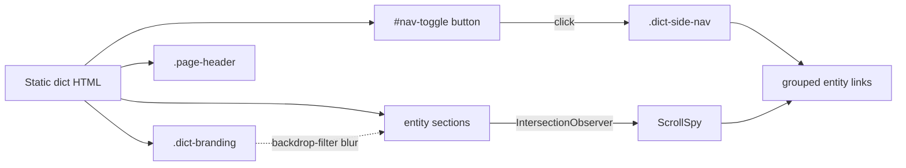

# Dict navigation

## Problem

The static data dictionary is one long scroll with no in-page navigation. Two specific pain points:

1. **No outline / jump nav.** Users scroll-hunt to find entities. The header's `.legend` shows groups but not their members; FK cross-links only jump from one entity to another, never to a top-level outline.
2. **Branding overlaps content.** The fixed top-left branding block sits over the first entity heading on desktop. Body padding doesn't reserve space for it. The contrast also kills legibility — title text fights the colored badges underneath.

This affects both the standalone `ignatius dict <models> -o out.html` output and (once `viewer-fab-ux` ships) the server-rendered `/dict` endpoint.

## Goals / Non-goals

- **Goals**
    - Toggleable side panel listing all entities grouped by their group, with the current entity highlighted as the user scrolls (scrollspy).
    - Click any entry → jump to that entity's section.
    - Side panel toggle button lives upper-right, same visual treatment as the interactive viewer's theme toggle (so the two surfaces feel related).
    - Body content starts below the branding block — branding does not overlap the page header or first entity heading at any viewport size.
    - Branding block has a translucent blurred backdrop so any content that scrolls under it remains legible.

- **Non-goals**
    - Search within the dict (filter outline). Could come later.
    - Sticky entity headings inside their sections.
    - Multi-level nav (entity attributes as sub-items).
    - Persisting nav scroll position separately from the document scroll.
    - Reflowing the side nav on mobile — at < 768px, hide the toggle entirely and rely on existing dict flow (mobile already relocates branding to top-right per CP-2 of `dict-polish`).

## User-facing behavior

### Side nav toggle

- Button pinned upper-right, mirroring the theme-toggle position from the interactive viewer (`top: 16px; right: 16px`, circular, 36×36).
- Default state: collapsed (no nav showing).
- Click → panel slides in from the right, ~280px wide, ~80vh tall, scrollable.
- Click outside, press Esc, or click toggle again → collapses.
- Open/closed state persisted to `localStorage` under `ignatius-dict-nav` so the user's preference survives reloads.

### Side nav contents

- One section per group, in the same `sort_key` order as the dict body.
- Within each group, entities listed in the same hierarchy order as the body (basetype + subtypes, etc).
- Each entry is a link to the entity's anchor (`#entity-<id>`).
- Subtypes visually indented under their basetype to mirror hierarchy.
- The currently-in-view entity (or the closest one above the fold) is highlighted.

### Scrollspy

- Updates highlight via `IntersectionObserver` on `.entity-section` elements.
- Threshold: entity is "current" when its top crosses the upper third of the viewport. Standard pattern.
- Throttled / batched — no scroll-event polling.

### Branding overlap fix

- Body gets a top padding equal to `branding height + safety margin` (resolved via a CSS variable for layout symmetry with `--fab-region`).
- Branding gets `backdrop-filter: blur(8px)` + a semi-transparent background tinted by `--color-background`.
- On mobile, branding already moves top-right (existing dict-polish behavior); the backdrop still applies.
- Print stylesheet unaffected — branding remains `position: static` in print.

## Architecture

### Implementation surfaces

- All work in `src/generators/dict.ts` (markup + CSS + inline JS for scrollspy and toggle).
- Inline JS only — no module imports, no runtime fetches. Keeps the dict self-contained.
- New layout var `--dict-branding-height` so body padding + nav top offset both reference one source.

## Open questions

(none — user resolved approach via clarify round)

## Approaches considered and rejected

| Rejected | Why |
|----------|-----|
| Render side nav as a separate `<aside>` always-visible at desktop | Forces a column layout, reflows the existing body width / centering, and competes with the user's reading flow. Toggleable matches the "viewer chrome" pattern already established. |
| Implement scrollspy with scroll-event listener | `IntersectionObserver` is standard, native, and doesn't require throttling. Lower complexity + better perf. |
| Push content down only (skip the blurred backdrop) | Solves overlap but leaves the branding block visually fighting whatever's under it as the user scrolls. Backdrop is cheap and makes the chrome feel intentional. |
| Make the side nav always-on for ≥1280px viewports | Adds breakpoint complexity for marginal value. Toggle is one click. |
| Bundle a JS framework for the nav | Inline vanilla JS keeps the dict self-contained — no fetch, no runtime dep, no bundle step needed for the static output. |
