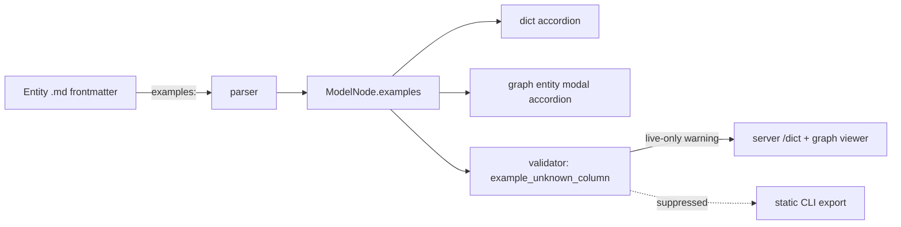

# Example instance tables

## Problem

Models without concrete data are abstract. An author looks at `Customer (id, name, tier_id)` and trusts that the FK direction, nullability, and discriminator choices are right. A reader looks at the same entity and has to mentally invent rows to check whether the model makes sense.

IDEF1X solves this with **example instance tables**: 2–5 literal rows shown under each entity. Reading "Customer #42 = Acme, tier=enterprise" alongside "Order #99 → customer_id=42, total=$1,200" forces the abstraction to meet a concrete scenario. Bugs jump out: a dangling FK, a discriminator that doesn't discriminate, a nullable column that's never null in practice.

The model files in this repo are increasingly LLM-authored. An LLM can generate consistent, plausible example rows during entity creation far more reliably than a human can backfill them later. Examples become a free-with-authoring artifact that hardens the model.



## Goals

- Authors attach `examples:` to entity frontmatter as an array of row objects.
- Examples render in the data dictionary inside a collapsible accordion, positioned after the body markdown.
- Examples render in the graph viewer's entity-detail modal as the bottom-most accordion.
- A validator rule flags example rows with keys that don't exist on the entity (typos, renamed columns).
- The validator finding is **live-only** — suppressed from static outputs because they're meant to ship clean and the LLM authoring loop is what catches drift.
- The modeling skill always generates 2–3 example rows when creating a new entity, and adds more on request.

## Non-goals

- Cross-entity FK consistency checking (e.g. verifying that `Order.examples[0].customer_id` corresponds to a real `Customer.examples` row). Deferred; would be a Class B rule in a follow-up.
- Importing examples from CSV / JSON / external sources. Markdown frontmatter only.
- Generating test fixtures, seed scripts, or runtime mocks from examples. Examples are descriptive, not executable.
- Cap on example row count. Author judgment; the rendered table scrolls.
- Editing examples through the UI. Read-only render surface.

## Approaches: example shape

| # | Shape | Sketch | Pros | Cons |
|---|-------|--------|------|------|
| A | Array of objects | `examples: [{id: 1, name: "Acme"}]` | Sparse-friendly, reorder-safe, trivial validation, matches predicate normalization style | Verbose for wide tables |
| B | Array of arrays with header row | `examples: [[id, name], [1, "Acme"]]` | Compact | Positional, silent break on column reorder, awkward with nulls |
| C | External per-entity CSV file | `_examples/Customer.csv` | Familiar tabular shape | Two-file sync, weakens markdown-is-the-source-of-truth premise |

**Recommendation: A.** Decided in prior conversation. Sparse-friendly matters because nullable columns are exactly where examples earn their keep (show one row with the value set, one with it null). Validation reduces to `Object.keys(row) ⊆ columns ∪ pk`. Consistent with the `{ fwd, rev }` predicate normalization — chose verbose-but-self-describing there too.

## Approaches: graph-viewer surface

| # | Surface | Sketch | Pros | Cons |
|---|---------|--------|------|------|
| A | Entity-detail modal on node tap | Tap node → modal with id/body/columns/examples-accordion | Reuses existing modal pattern at `App.tsx:290`; gives examples room to breathe | Adds a new UX surface (modal didn't exist for entities before) |
| B | Hover tooltip | Mouse over node → small floating panel | No new modal | Cramped; hover already drives predicate swap + fade; layering conflict |
| C | Dict-only | Click node → navigate to `/dict#entity-X` | Cheapest; one render surface | Loses in-place reading; user must context-switch to a different page |

**Recommendation: A.** The user explicitly asked for a click-into-entity modal with examples as the bottom-most accordion. Modal scope stays minimal: id, classification badge, body HTML, columns table, examples accordion. No editing, no FK navigation inside the modal — that lives in `/dict`. The modal is a quick-look surface, not a full entity inspector.

## Approaches: live-only validation surface

| # | Mechanism | Sketch | Pros | Cons |
|---|-----------|--------|------|------|
| A | `liveOnly?: boolean` field on `RuleEntry` | One flag; filter in `formatFindingsForStderr` + static dict generator path | Minimal registry change; filter logic localized | Adds a new dimension to the rule registry |
| B | New severity tier (`'live-warning'`) | EntityError.severity gains a third value | Type-level distinction | Cascading changes to every consumer that switches on severity |
| C | Two parallel rule registries | `LIVE_RULES` + `STATIC_RULES` | Conceptually clean separation | Doubles bookkeeping; rules typically belong to both |

**Recommendation: A.** Single boolean on `RuleEntry`. Default `false` (rule surfaces everywhere). `entity.example_unknown_column` sets `liveOnly: true`. Two filter points: `formatFindingsForStderr` drops live-only rows; the dict generator drops them from the findings banner when called with `mode = 'static'` (or, equivalently, when called from the CLI rather than the server). Server `/dict`, `/api/model`, and the React viewer surface them.

## Authoring convention

```yaml
---
id: Customer
group: core
pk: [id]
columns:
  id: { type: int }
  name: { type: text }
  tier_id: { type: int, nullable: true }
examples:
  - id: 1
    name: Acme
    tier_id: 100
  - id: 2
    name: Globex
    # tier_id omitted → renders as empty cell / "—"
---
```

- Keys must be drawn from `columns ∪ pk`. Extra keys trigger the warning.
- Values render with `toString()`. YAML's native scalar types (string / number / boolean / null) are preserved by the parser; no coercion beyond that.
- Sparse rows are first-class: omit a key to leave its cell empty.
- Order of rows is the author's order. No sorting.

## Dict rendering

Accordion placement: after the body markdown, before relationships. `<details class="dict-examples">` with summary "Examples (N)". Open by default when N ≤ 3; closed when larger. Table columns are PK columns first, then declared `columns` in author order. Empty cells render as a muted en-dash.

## Graph modal

Click any node → opens a centered modal (existing `modal-backdrop` + `modal` pattern). Modal content top-to-bottom:

1. Header: entity id, group color swatch, classification badge.
2. Body markdown HTML (already rendered at parse time).
3. Columns table (PK columns flagged with key glyph).
4. Examples accordion — bottom-most. Same table shape as dict.

Backdrop click or ESC closes. Modal does not affect hash router state — current entity selection persists in the URL whether the modal is open or closed.

## Validator behavior

New rule `entity.example_unknown_column` — Class A, severity `warning`, `liveOnly: true`. Fires once per offending key per entity: `"<entityId>: example column \"<key>\" not in columns or pk"`. Coercion: invalid keys are not stripped from `cleanedModel` (they're advisory, not destructive — the row still renders, the key just gets a subtle warning treatment in live mode).

## Modeling skill changes

`SKILL.md` entity flow gains step **E5b — Examples**:

> Generate 2–3 example rows that exercise the entity's interesting axes (nullability, classification membership, FK populations). Use plausible domain values, not "foo / bar". Offer to add more if the entity has many states to illustrate.

E5b runs every time an entity is created. It is not skippable — examples are part of modeling, not a polish step. Verification loop at E8 also checks that the generated examples parse cleanly (no `example_unknown_column` warnings in `ignatius dict` output).

`docs/design/ignatius-modeling-skill.md` mermaid updates to show E5b between E5 (columns) and E6 (description). `docs/spec/ignatius-modeling-skill.md` gets a change log entry recording the new step.

## Resolved questions

- **Accordion default-open state:** depends on row count. Open when ≤ 3 rows, closed when more. Keeps small example sets discoverable while large ones don't dominate the page.
- **"Open in dict" link in the modal:** **out of scope for this spec.** The modal is a quick-look surface; users who want full context use the FAB's "Data Dict" link or the dict's entity anchors. Adding a per-modal link is a follow-up if friction emerges.
- **Composite-PK header grouping in examples table:** deferred to a dict-polish follow-up. PK columns appear first in declared order; visual grouping is cosmetic.

## Rejected approaches

- **CSV file per entity** — breaks the single-source markdown contract; introduces sync friction.
- **Examples in a separate `_examples/` directory** — same issue; entity authors would author in two places.
- **Cross-entity FK consistency now** — desirable but heavy: requires AK resolution, composite-key handling, graph traversal. Strictly a follow-up.
- **YAML anchor sharing between entities** — too clever; obscures what each entity's examples look like.
