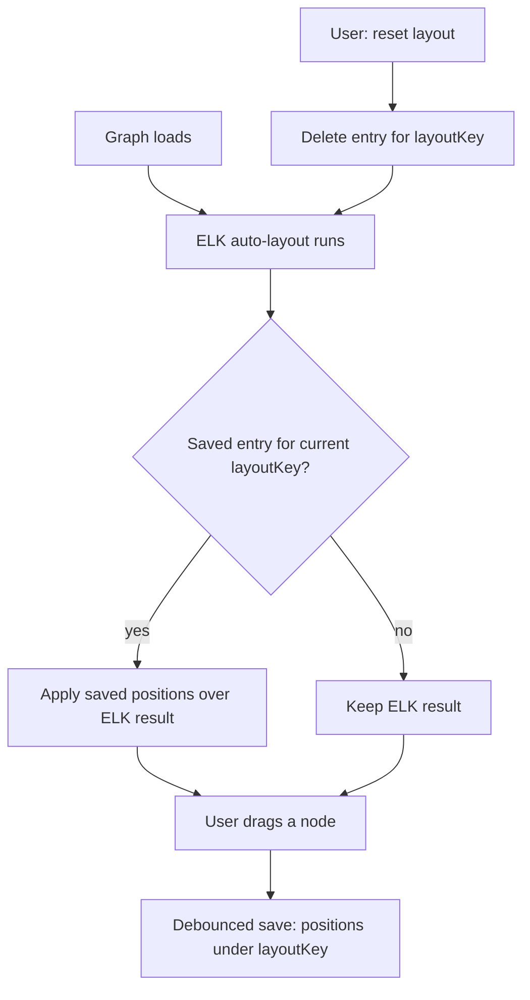

# Graph node position persistence

## Problem

The graph viewer auto-lays-out entities with ELK on every load. A user can drag nodes into an arrangement that reads better for their mental model, but the arrangement is lost the moment they reload, navigate away, or (in live mode) save a model file. Hand-tuning a layout is throwaway work today.

We want drag-arranged positions to survive reloads — but *only* while the arrangement still makes sense. If the model's structure changes (an entity added/removed, a relationship rewired), the old coordinates describe a graph that no longer exists, and restoring them would strand new nodes at the origin or pin stale ones. In that case auto-layout should win.

## Goals / Non-goals

- Goals
    - Persist user-dragged node positions across reloads in the same browser.
    - Restore them only when the model's *structure* is unchanged since the save.
    - On structural change, silently fall back to ELK auto-layout (never a partial/wrong restore).
    - Give the user a way to discard a saved arrangement and re-run auto-layout.
- Non-goals
    - Sharing arrangements across browsers/machines or committing them to the repo.
    - Multiple named layouts, or layout history/undo (see migration trigger below).
    - Persisting zoom/pan beyond what the existing hash-router already does.
    - Reconciling a *changed* structure onto old positions (we re-layout instead).

## Key insight — fingerprint the structure, make restore all-or-nothing

The fragile part of position persistence is reconciliation: when the model changes, which saved positions are still valid? We sidestep it entirely. A **structural fingerprint** of the model becomes the storage key:

- Fingerprint matches the saved entry → topology is identical → restore every position.
- Fingerprint differs → something structural moved → ignore the entry, let ELK lay out.

There is never a partial-restore state. The cost of a stale fingerprint is always the *safe* direction — re-layout — so the failure mode is "forgot your arrangement", never "drew a broken graph". This removes the live-reload reconciliation problem rather than solving it.

## What goes in the fingerprint (the contract)

The layout is determined by **topology**, not content. Evidence from the current code:

- Node box size derives only from the entity *name* (`wrapEntityLabel` wraps the id; columns/descriptions render in the modal and dict, not in the node box) — so adding a column does not move the tree.
- ELK placement is a function of the node set and the directed edges (`source → target`). `identifying`/`cardinality` drive markers and styling, not placement.
- `layerSpacing` (App.tsx) is derived from the longest predicate string — a fresh-layout-only input.

| Input | In fingerprint? | Why |
|-------|-----------------|-----|
| Node ids (sorted) | ✅ | The set of boxes that exist |
| Edge `source>target` pairs (sorted) | ✅ | What connects to what — the topology |
| Edge `identifying` / `cardinality` | ❌ | Styling/markers, not placement |
| Predicate text | ❌ | Only affects *fresh* layerSpacing; saved positions are absolute, so a verb rename shouldn't blow away a hand-tuned layout |
| Columns / AKs / pk | ❌ | Render in modal/dict, never in the node box |
| Entity description / body | ❌ | Content, not structure |
| Group / theme / branding | ❌ | Color, not position |

Rule of thumb: include only what changes *which boxes exist and what connects to what*. Being too inclusive just causes more cache misses (safe — re-layout). Being too exclusive risks restoring onto a structurally-different graph; the chosen set (ids + edges) flips the key on every add/remove/rewire, which is exactly the all-or-nothing guarantee.

## Backend derives, frontend persists

The fingerprint is a pure function of the `Model`, and both model-delivery paths originate in Bun. So the key is computed once, server/CLI-side, and shipped to the browser — there is no hashing code in the frontend bundle, and a single definition keeps backend and frontend from disagreeing on what "structural" means.

| Responsibility | Owner | Where |
|----------------|-------|-------|
| Derive `layoutKey` from the model | Backend (Bun) | new pure module beside `parse.ts` |
| Ship key — live mode | `server.ts` | `/api/model` payload gains `layoutKey` |
| Ship key — static mode | `generators/graph.ts` | `window.__LAYOUT_KEY__` injection beside `__MODEL__` |
| Read key, save/restore/reset positions | Frontend | `App.tsx` |

Persistence is irreducibly frontend: localStorage lives in the browser; the server cannot write it. So the split is backend-derives-key / frontend-owns-store.

### Hash function

A non-cryptographic 32-bit hash (FNV-1a) over the canonical structural string. It is a cache key, not a security boundary — a collision merely restores positions from a structurally-different graph, which self-corrects on the next drag. Because derivation runs in Bun, `Bun.hash()` is also available; a hand-rolled pure FNV-1a is preferred for portability and trivial unit-testing against `Model` literals. SHA-256 / `crypto.subtle` is rejected: async ceremony for no benefit at this scale.

## Storage: localStorage now, IndexedDB later

Position data is tiny — `N × {id, x, y}` ≈ 25 bytes/entity, so a 1000-entity model ≈ 25KB against localStorage's ~5MB budget (~200× headroom). localStorage is synchronous, which fits the synchronous cy-init / `layoutstop` path cleanly. IndexedDB's advantages (large quota, structured storage) are dormant at this size and cost async ceremony in the hot path.

**Migration trigger (documented, not built):** switch to IndexedDB when the feature grows past "one current arrangement" — specifically *named saved layouts*, *layout history/undo*, or storing larger per-entity UI state alongside positions. At that point quota and structured storage start earning their async cost.

**Orphaned keys:** every structural change mints a new `layoutKey`, so prior entries orphan. Prune to keep the last N fingerprints (small N, e.g. 10) on save, so localStorage doesn't accumulate dead arrangements indefinitely. Trivial bookkeeping, but a required line item.

## Open questions

- localStorage namespace: a single key holding `{ [layoutKey]: positions }` (one read/write, easy LRU prune) vs one key per fingerprint (`ignatius-positions-<key>`). Leaning single-key-map for simpler pruning. Implementer's call unless it affects a success criterion.
- Should `reset` re-fit/re-center after re-layout, matching the initial `cy.fit(undefined, 30)`? Assumed yes (reset = "back to how it first loaded").
