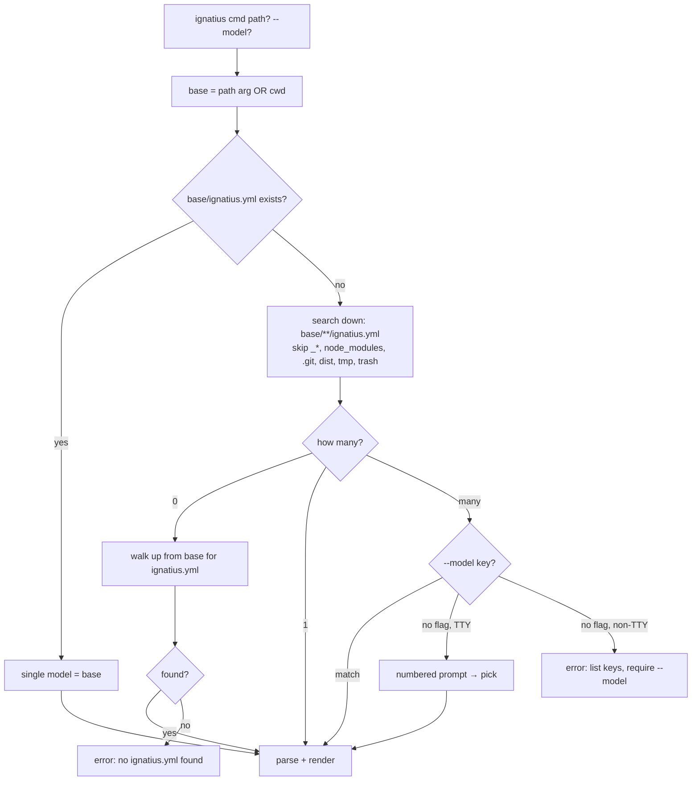

# Ignatius project config (`ignatius.yml`)


## Problem

A model's configuration is scattered across three optional sibling files (`_theme.yaml`, `_branding.yaml`, `_meta.yaml`) loaded by `parseModels` (`src/parse.ts:131-145, 305-313`). There is no explicit marker for "this directory is a model" — a model is implicitly "whatever dir you point the CLI at." With `models/` now holding three sibling models (`key-inherited`, `orm-hybrid`, `orm-pure`), that implicitness breaks: `ignatius dict models` globs all three merged. We need an explicit project marker that (a) consolidates config into one file, (b) defines a model root, and (c) lets the CLI discover and choose among multiple models.

Forward-only: the project is unpublished. No legacy `_*.yaml` support, no migration shims. `ignatius.yml` is the sole config source; the old loaders are deleted.


## Goals / Non-goals

- **Goals**
    - One `ignatius.yml` per model root holding `meta` + `theme` + `branding`.
    - A model is *defined* by the presence of `ignatius.yml`; entity `**/*.md` globbing starts from that directory.
    - CLI + server discover models: one → use it; many → user picks (`--model <key>` always works; interactive prompt when TTY; clear error when non-TTY and ambiguous).
    - Both discovery directions: walk **up** to the enclosing model root; search **down** to enumerate multiple.
    - The three `models/` variants each carry an `ignatius.yml` and render via discovery.
- **Non-goals**
    - No backward compat with `_theme.yaml`/`_branding.yaml`/`_meta.yaml` (deleted).
    - No multi-model serve (one server = one chosen model in v1; not a model-switcher UI).
    - No config for non-model concerns (build, output paths) — `ignatius.yml` is model config only.
    - No JSON/TOML config formats — YAML only.


## Config schema

`ignatius.yml` at a model root. All sections optional except an implied identity:

```yaml
name: Key-Inherited                         # display label (defaults to dir basename)
version: 0.1.0                              # optional meta
description: IDEF1X key-inherited reference model   # optional meta
updated: 2026-05-30                         # optional meta
theme:                                      # former _theme.yaml (dark/light/spacing)
  dark: { ... }
  light: { ... }
branding:                                   # former _branding.yaml
  title: ...
  logo: { dark: ..., light: ... }
  copyright: { ... }
  poweredBy: true
```

- `--model <key>` matches the **directory basename** (`key-inherited`), not `name` — filesystem-grounded and stable. `name` is display only.
- Empty `ignatius.yml` (just `name:`) is valid → theme/branding fall to defaults.


## Discovery

Caption: resolving which model to render from a path/cwd, marker file = `ignatius.yml`.



- **Walk-up** handles "I'm in a model subdir" (`cd models/key-inherited/identity; ignatius dict`).
- **Search-down** handles containers (`ignatius dict models` → 3 found → pick).
- The marker file makes `groups/`, `data/`, and other named subdirs invisible to discovery (they have no `ignatius.yml`).


## Approaches

| # | Approach | Pros | Cons |
|---|----------|------|------|
| A | **Discovery in CLI layer; `parseModels(dir)` stays pure dir-based** | Clean separation; parser stays unit-testable; server + CLI share one `resolveModel()` | Two layers to wire |
| B | Push discovery into `parseModels` | One entry point | Pollutes the pure parser with fs-walking + TTY concerns; breaks the 17 tests that call `parseModels(dir)` |
| CLI-1 | **Rebuild `cli.ts` on `citty`** (`defineCommand` + `runMain`); delete hand-rolled `parseArgs` | Declarative subcommands, free `--help`, typed args, room for `@bomb.sh/tab` completion later | Rewrites the tested entrypoint; obsoletes `test-cli-parse.ts`; +1 dep |
| CLI-2 | Keep hand-rolled `parseArgs`, bolt on discovery | No rewrite | Hand-rolled arg parsing stays; picker still needs a prompt lib |
| PICK-1 | **`@clack/prompts` `select` for the picker**, TTY-guarded | Real picker UX + `isCancel()`; compiles into the binary | +1 dep |
| PICK-2 | Bun global `prompt()` | No dep | Plain text only; unverified in `--compile` |


## Recommendation

**A + CLI-1 + PICK-1.** Rebuild `cli.ts` on `citty` (`defineCommand` for `serve`/`dict`/`graph`, `runMain` entry — same `bun build --compile src/cli.ts` pipeline). Discovery lives in a pure `resolveModel(base, { model })` helper (`src/discover.ts`), shared by all three commands; `parseModels(modelRoot)` keeps its dir-in signature and absorbs the three old loaders into one `ignatius.yml` read. Picker via `@clack/prompts` `select` + `isCancel`, gated on `process.stdin.isTTY`; non-TTY + ambiguous → exit non-zero with the key list; `--model <key>` short-circuits everywhere (CI-safe).

Evidence: probe (`tmp/probe-cli.ts`, compiled via `bun build --compile`) confirmed citty `--help` renders in the binary, `--model` bypass works (exit 0), and a piped-stdin (non-TTY) ambiguous run exits 2 with the key list and **does not hang** (10s timeout never fired) — because the `isTTY` guard runs before clack ever touches stdin. `parseModels` is already pure dir-in (`src/parse.ts:125`); the restructure already repointed tests to `models/key-inherited` (`9105e9c`).


## Open questions

- **Interactive prompt render in a real TTY** — the compiled-binary `select` UI can only be eyeballed in an actual terminal (the probe ran non-TTY). Low risk (clack compiled + bundled cleanly; non-TTY path proven safe), but CP-3 must include one manual TTY run captured in the impl log. *(The earlier Bun `prompt()` unknown is resolved — superseded by citty + clack, probe-verified.)*


## Change log


### 2026-06-17 — Discovery wording updated for five-folder model (#16)

**What changed:** The discovery explanation updated to reflect that `groups/`, `data/`, and other named subdirectories are invisible to discovery (they carry no `ignatius.yml`). Previously named `_groups/` as the example non-root dir.

**Superseded:** Reference to `_groups/` as the example of a non-root dir that is invisible to discovery.
