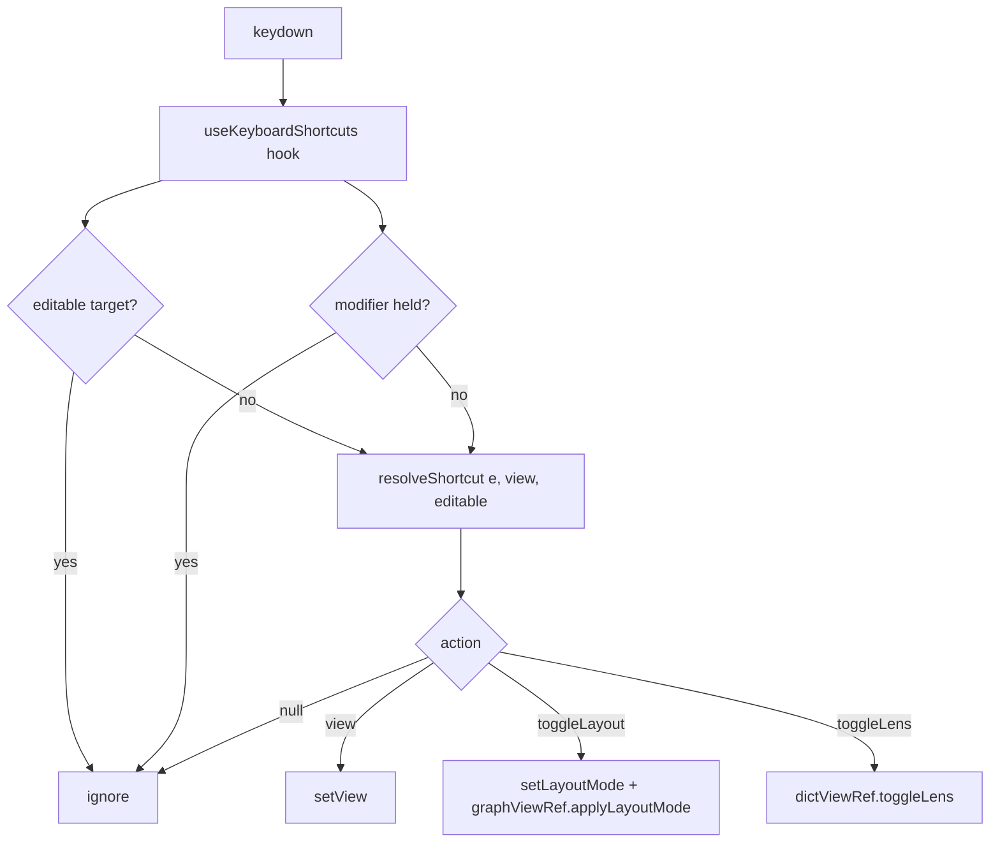

# Keyboard navigation shortcuts

## Problem

View and mode switching in the unified SPA is mouse/FAB-only. Someone navigating a
model repeatedly has no keyboard path for the high-frequency toggles: switching
between the Graph (DG), Dictionary (DD), and Flows (DF) views; flipping the DG
layout between organic and hierarchical; flipping the DD lens between read and
browse. Source: issue #13.

## Goals / Non-goals

- **Goals**
  - Plain-key shortcuts to jump to each view, toggle the DG layout, and toggle the DD lens.
  - Shortcuts never fire while the user is typing (search box, zoom input, modal fields).
  - Shortcuts never shadow browser/OS chords (anything with ctrl/meta/alt).
  - The decision of "which key does what" is a pure, unit-testable function.
  - Discoverable: the existing controls that own each action surface their key hint.
- **Non-goals** (from the issue)
  - Per-node / per-edge keyboard navigation inside a diagram.
  - Remappable / configurable bindings.
  - A theme-toggle shortcut (out of the issue's three asks; deliberately excluded to stay surgical).
  - A help/cheat-sheet overlay.

## Keymap

Single plain keys, no modifier. Mnemonic where possible. Context-gated keys are
inert when their view is not active.

| Key | Action | Active when |
|-----|--------|-------------|
| `g` | Switch to Graph (DG) | any view |
| `d` | Switch to Dictionary (DD) | any view |
| `f` | Switch to Flows (DF) | any view |
| `l` | Toggle DG layout (organic ↔ hierarchical) | Graph view only |
| `b` | Toggle DD lens (read ↔ browse) | Dictionary view only |

Rationale: single-letter plain keys are the established web-app pattern (GitHub,
Gmail) and are safe once text-input focus and modifier chords are guarded. `g`/`d`/`f`
are the view initials; `l` = layout; `b` = browse. View jumps are idempotent
(pressing `g` while already on Graph is a no-op). Context-gating `l`/`b` to their
view avoids surprising the user with a toggle they can't see.

## Guards

A keystroke is ignored (resolves to no action) when any of:

- A modifier is held: `ctrlKey || metaKey || altKey || shiftKey`. Keeps `Cmd+D`
  (bookmark), `Ctrl+L` (address bar), etc. working.
- Focus is in an editable target: `<input>`, `<textarea>`, `<select>`,
  `contenteditable`, or any element inside an open `.modal`. This is the existing
  DD search box (`.dict-search-input`), the zoom inline editor
  (`.zoom-control-input`), and modal fields.

Existing global `keydown` listeners only handle `Escape` (Modal close, FAB-menu
close, DD browse-lens deselect). The letter keymap does not collide with any of them.

## Approaches — reaching the DD lens

Everything the keymap drives is already shell-reachable except the DD lens:
`setView` and `setLayoutMode`/`applyLayoutMode` live in / are called from the shell,
but `DictionaryView`'s `lens` state (`'read' | 'browse'`, persisted to the
`ignatius-dict-lens` localStorage key) is fully internal — `DictionaryView` is a
plain function component with no imperative handle.

| # | Approach | Pros | Cons |
|---|----------|------|------|
| A | Convert `DictionaryView` to `forwardRef`, expose `DictionaryViewHandle { toggleLens() }`; shell holds a `dictViewRef` and calls it. | Mirrors `GraphViewHandle` / `FlowsViewHandle` exactly — the codebase's established cross-component imperative pattern. Lens state stays encapsulated (the `switchLens` side effects — clearing hover/pin/focus — stay inside the component). | Adds a ref + forwardRef wrapper. |
| B | Hoist `lens` state up to `App.tsx`, pass down as prop + setter. | No new handle. | Breaks `DictionaryView` encapsulation; the `switchLens` reset side effects (hover/pin/focus) would have to move or be duplicated in the shell; larger diff in a 720L+ component. |

## Recommendation

**Approach A.** It is the same pattern `GraphView` and `FlowsView` already use to
expose imperative actions to the shell (`applyLayoutMode`, `selectDiagramById`, …),
so it adds no new concept. `toggleLens()` wraps the existing `switchLens(next)` so
all its reset side effects stay put.

The keymap decision is a pure function `resolveShortcut(event, view, editable)` in
`src/app/logic/` (same discipline as `spotlight.ts` / `flow-spotlight.ts`), unit-tested
in isolation. A thin `useKeyboardShortcuts` hook owns the single global `keydown`
listener, computes the `editable` guard from `document.activeElement`, and dispatches
the resolved action through callbacks the shell supplies. End-to-end behavior is
proven by a Playwright check that drives real keypresses against the served app —
the actual runtime, not just the pure function.

## Diagram

Keystroke resolution flow:

## Open questions

None blocking. Discoverability is intentionally minimal (key hints on the controls
that already own each action); a richer cheat-sheet is a possible later enhancement,
not part of this issue.
