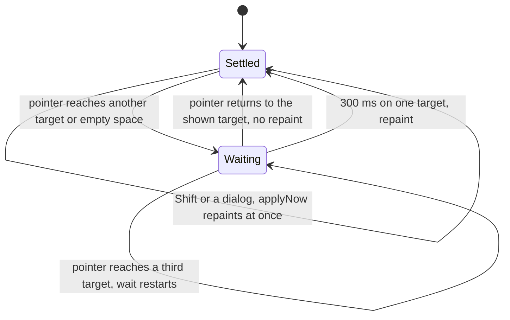
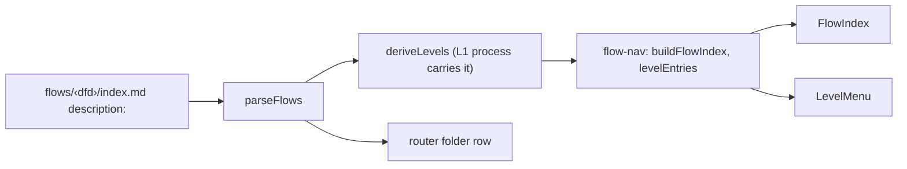

# Large-model navigation

## Problem

On a large model the viewer stops being usable in two ways.

**Hover repaints the whole view.** Hovering any node or edge in the Flows view, any entity in the Graph, or any card in the Dictionary browse lens fades everything outside its connections. The fade applied on pointer contact, so moving the pointer across a diagram faded and restored the whole view once per element it crossed, each time with an opacity transition on every element. The DFD also rebuilt its node and edge model on every render (`buildFlowData` ran unmemoized in `FlowDiagramSvg`), and the edge tooltip re-rendered the SVG on every pointer move.

**Flows have no index.** The CSCLeverage enhanced model has 29 flows and 203 processes. Parsing wraps every flow in one synthetic `Context` root (`deriveLevels`), so the DFD nav card, which only appears with two or more roots, never showed. The only route to a flow was drilling down from `Context` through `0 System`, and nothing on screen said what a flow was for: a top-level flow folder had no file of its own to carry a `description:`.

A large model is exactly where a user needs to find a flow and look at one element at a time.

## Goals / Non-goals

- Goals: a hover focus applies only when the pointer rests on one target; a view large enough to stall on its fades drops the animation and jumps to the end state; a browsable index of every flow and process with descriptions; breadcrumbs that switch between the diagrams at their own level; a place for a flow folder's description.
- Non-goals: virtualizing or culling large diagrams; changing layout; a validator rule that requires flow descriptions; fixing the Dictionary's process-id React keys, which collide when two flows share a process name (tracked separately).

## Approaches

We picked from rendered mocks (codes below). Hover timing, where a pointer that has left a focused element crosses empty space:

| # | Approach | Pros | Cons |
|---|----------|------|------|
| A1 | Settle: every target change, including leaving to empty space, applies after 300 ms at rest | A sweep does nothing; moving A → B switches in one step with no un-fade/re-fade | Leaving takes 300 ms to clear |
| A2 | Enter waits 300 ms, leave clears at once | Instant clear | A → gap → B restores the whole view, then fades again 300 ms later: two full repaints |

Flow index:

| # | Approach | Pros | Cons |
|---|----------|------|------|
| B1 | Side drawer with a collapsible outline and filter | Stays open while working | A list of names; no picture of the hierarchy |
| B2 | Book-style contents page | Reads like a table of contents | Full-screen; hides the diagram |
| B3 | SSADM process-hierarchy chart with a description pane | The standard SSADM picture of the process model; hover reads a description without leaving the chart | Tall on large models (one row per process) |

Breadcrumb level switching:

| # | Approach | Pros | Cons |
|---|----------|------|------|
| C1 | Split crumb: the label goes up, a ▾ opens that level's diagrams | Keeps today's click; the ▾ marks which crumbs have a menu | Two targets per crumb |
| C2 | Separator menus (Explorer path bar): each separator lists the children of the crumb to its left | Also drills down | The level a separator lists is one off from where the eye lands |
| C3 | The whole crumb opens a menu whose first row goes up | One target | Going up takes two clicks |

Where a flow folder's description lives:

| # | Approach | Pros | Cons |
|---|----------|------|------|
| D1 | `description:` frontmatter in the folder's index file (`flows/<dfd>/index.md`) | The router file already exists per folder; `ignatius index` rewrites only its `<ignatius-*>` regions, so frontmatter survives; the same value fills the router's empty folder rows | The index file is partly generated, so authors edit a file the tool also writes |
| D2 | A new per-folder file | Nothing generated in it | A new file kind; the folder model forbids `_*` files and a second `.md` would be read as a process |
| D3 | A `flows:` map in `ignatius.yml` | One place | Descriptions drift away from the folders they describe |

## Recommendation

A1, B3, C1, and D1.

A1, because the cost is the repaint, not the delay: A2 still repaints twice on every move between neighbours. Every hover site feeds one helper, `createHoverIntent` in `src/app/logic/motion.ts`, which holds the settled target and applies a new one after `HOVER_INTENT_MS` (300) at rest.

The view repaints only when a new target has held the pointer for 300 ms, or on a deliberate action; every other pointer move is free.

Pressing Shift over a Graph node and opening a dialog are deliberate actions, so they apply at once through `applyNow`. Above `ANIMATION_ELEMENT_LIMIT` (150 rendered nodes plus edges, or Dictionary sections and cards) the view drops its transitions and smooth scrolls: the fade then covers hundreds of elements in one frame and the animation itself is the cost. The Graph has no hover animation, so it only gets the delay. The Dictionary marks its root `data-motion="off"`, and `scrollBehaviorWithin` reads that marker, so the shell's scroll into the Dictionary gets the same answer without recounting.

B3 and C1 read one navigation model, `src/flow-view/flow-nav.ts`, built from the leveled tree. Both address a diagram by its id path from the root rather than a bare id, because a sub-DFD's id is its process file name and two flows can share one; a bare-id lookup returns the first match. The Flows core gained `selectDiagramPath` for this. The URL follows suit: `dfd=` carries the path below the derived levels (`invoicing/Submit-PCI`), so a reload, Back/Forward, a live-reload rebuild, or a view toggle resumes at the same diagram. `findDiagramByRef` matches a reference by its trailing ids, so a bare-id link written earlier resolves exactly as before.

The index, level menus, and descriptions all derive from the leveled tree the parser already builds.

The two derived levels leave the breadcrumb. Every trail used to start `Context / 0 System`: two crumbs no author wrote, each the only diagram at its level, so neither could carry a ▾, and the view opened on Context's single box. Now the view opens on the `0 System` overview, the trail reads `☰ Process Flows / ⌂ / 9 Invoicing ▾ / …`, and the house button returns to the overview from any depth in one click. The index drops the same two levels, so the flows are its top rows. The Context diagram stays in the tree (it is the only picture of every external against the system boundary) and opens by `dfd=__context__`.

D1, because the index file is already per folder and the router already writes a description column for every other kind. A sub-DFD needs no index file: its owning process's `description:` describes it. `Context` and the whole-system process use the model's `description:` from `ignatius.yml`. When a folder has a description, the router folds it into that folder row's hash, so rewording it marks the parent router stale; a folder without one keeps its old digest, so existing models do not go stale on upgrade.

## Open questions

- A flow index row for a process with no sub-DFD opens the diagram that contains it. Should it also open that process's ⓘ dialog?
- One settled hover still costs one main-thread task: about 80 ms on the CSCLeverage `0 System` overview (103 nodes), mostly React re-rendering every node for the new opacity; the Graph's settle stays under 50 ms. Memoizing the node components, or dimming through the DOM instead of props, would cut the DFD cost. The 300 ms delay and the 150-element limit are one constant each in `motion.ts`.
