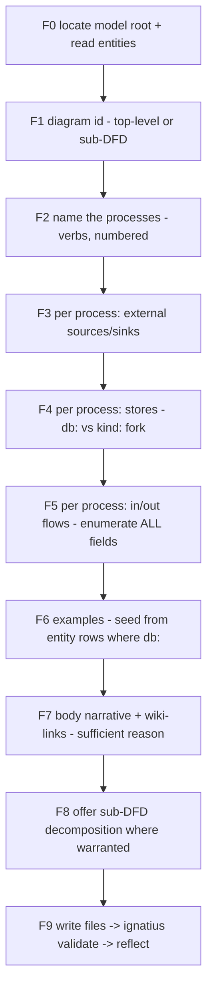

# Noorm flow authoring + Socratic discovery modes

## Problem

The `noorm-modeling` skill authors ERD entities (`entity` mode) and bootstraps models (`model` mode). It has **no mode for authoring SSADM data flow diagrams** — the flows feature ships parsing, validation, and an in-app viewer, but a user writes flow markdown by hand against `docs/spec/process-flows.md`. Two distinct gaps:

1. **No structured flow-authoring path.** A user who already knows their processes still hand-writes `process:`/`inputs:`/`outputs:`/`examples:` frontmatter, the `_externals/` and `_stores/` folder layout, and the `db:`/`kind:` store taxonomy — with no guide and no first-run verification.

2. **No discovery path.** A user who knows *what their business does* but has not decomposed it into processes, entities, and stores has nothing. The hardest modeling work — turning a business description into precise, justified, evidence-backed entities and flows — is exactly the work the skill does not help with. `/pressure-test` challenges an existing design; nothing helps *generate* one.

Both gaps share a root cause: flow modeling demands judgment the format can't teach (is this a process or an entity? a `db:` store or a transient queue? does this flow label carry every field it should?). That judgment is what a skill encodes.

## Goals / Non-goals

- **Goals**
    - Add **`flow`** mode: structured Q&A authoring of DFD markdown, parallel to `entity`/`model`. Default door for users who know their processes.
    - Add **`discover`** mode: opt-in Socratic interview that extracts the business and generates **both** ERD entities and DFDs, with examples. Two evidence sources: the user's description (greenfield), or an existing system read via reverse-engineering.
    - Add **reverse-engineering** as `discover`'s artifact-evidence source: extract entities + flows from a live DB, schema/DDL, codebase, stored procedures, or API, in the phased IDEF1X spirit.
    - Every flow a `flow`- or `discover`-mode session produces carries in/out `examples:`, seeded from touched entities' sample rows where the flow is `db:`.
    - Reuse the existing skill scaffold: SKILL.md router + `references/*.md`, one-question-at-a-time, write-then-`ignatius validate` loop, the existing core rules.
    - No new validator rules; no source changes to `flow-validate.ts`. The method enforces; existing validation is the backstop.

- **Non-goals**
    - No new `flow.*` validation rules. Examples, business-context richness, and structural legality are enforced by the authoring method, not new code. (The existing `flow.process_to_process` Class-A warning and `flow.illegal_connection` Class-B error remain the only backstops.)
    - No autonomous bulk authoring (no "generate 20 processes from a CSV").
    - No reverse-engineering the model's own `.md` files into an editable form. (Reverse-engineering an *external* system into a model is in scope — see below.)
    - The `discover` mode does not replace `/pressure-test` — it is the generative counterpart, not a critique tool.

## Background: what a DFD is for

Codified so the skill frames every question around analysis, not drawing. Priority order:

1. **Explain what the business does** (primary) — processes are verbs the business performs.
2. **Analyze how data moves** through the system — flows trace it.
3. **Identify what must be captured and stored** — stores answer "what persists".

Two structural truths the skill teaches positively (it describes only the correct shape; it never names the illegal connections as things to avoid):

- **Processes are verbs.** Every process is an imperative phrase — something that happens or will happen. A noun named as a process is a misidentified entity or store.
- **Flow labels are complete data contracts.** The text on every line enumerates *all* the data the flow carries — every field, not a vague noun. A `db:` flow's field list is checked against the entity by the existing `flow.unknown_attribute` rule (the DFD as a demand list on the ERD).

Grounding reference: `docs/research/ssadm-dfd-rules.md` (canonical rules + the ignatius adoption table).

## `flow` mode (structured)

Parallel to `entity` mode. F-step Q&A, one question at a time, infer-before-asking (reads the existing ERD and any existing `flows/`). Conceptual shape:

Key decisions baked into the steps:

- **`db:` vs `kind:` store fork (F4).** Read the ERD first; offer matching entities as `db:` candidates. Fall to a `kind:` store only when nothing persists as a business record. Standard kinds presented as a skill-side menu: `db:` (existing entity) first, then `cache`, `queue`, `file`, `doc`, `manual`, `other`. The menu guides classification; the parser's token prefix set is closed, so off-menu kinds are authored as `kind: other` + `title:`.
- **Examples always (F6).** Not "offered" — produced. Seeded from the entity's own sample rows when the flow touches `db:<Entity>`, so in/out data is consistent with the ERD rather than invented twice.
- **Required business-context sections (F7).** Externals: role + `## What X does` + what they expect. Non-db stores: a stated reason-for-existence + sample `rows:`. Db-entity rationale reinforced when thin.
- **Positive framing throughout.** The only shape ever described is process↔store and process↔external. Illegal connections are never surfaced as options.

## `discover` mode (Socratic, opt-in)

The generative twin of `/pressure-test`. Same logical apparatus pointed at a blank page to construct precise definitions, rather than at a claim to break it. Produces **both** entities and flows.

**Voice (settled).** The mode *thinks* in classical logic but *speaks* only plain business English — it never lets formal-logic jargon reach the user, mirroring pressure-test's translation rule. It acts on excluded middle by forcing a binary; it never says "excluded middle".

**Verb-led ordering (settled).** Discover what the business *does* (processes) → derive the nouns (entities + stores) those verbs require → write entities first → then write the flows that reference them. A discovery session always produces or extends the ERD before it produces the DFD, because a flow's `db:` labels reference entity columns that must exist first.

**Crystallization (settled).** Lean toward incremental writes — write a thing's file once it has passed all five gates — per the skill's existing "act, don't just suggest" rule. A half-finished discovery still leaves real, valid files.

**Two doors, opt-in (settled).** Structured F-steps stay the default. `discover` is the opt-in second door into the same artifacts; a user who already knows their processes is not Socratically interrogated about what they already know.

### The five-gate spine

Each classical principle is a decision-forcing gate, translated to plain language for the user:

| Gate | Principle (internal, never surfaced) | Job | Plain-English form |
|------|--------------------------------------|-----|--------------------|
| 1. Identify | Law of identity (A is A) | Name the thing precisely; one name, one thing; catch conflation | "Same thing, or two different things?" |
| 2. Decide | Excluded middle + non-contradiction | Force every maybe to binary; a nullable property is three-valued logic — refuse the middle | "Always present, or not? If sometimes absent, that's a subtype or an optional link — which?" |
| 3. Justify | Law of sufficient reason | Nothing enters the model without a stated why; this fills the business-context sections | "Why does this exist — what question does it answer that nothing else does?" |
| 4. Derive | Causality / four causes | Run causality backward from verbs to the nouns they require | "You collect payment — what must exist for that to be possible?" |
| 5. Ground | Evidence + analysis | Elicit three real instances as evidence; these become the examples; if none, the definition is still fuzzy — loop to gate 1 | "Show me three real ones." |

The conflation gate-1 catches in practice: `Customer` (external actor) vs `db:Party` (the persisted record) — the demo already documents this exact split.

### Discovery → artifacts

## Reverse-engineering (discover's second evidence source)

Discovery has two possible inputs: the user's head, or a system that already exists. When a real
artifact is available — a live database, a schema dump / DDL, ORM models, a codebase, stored
procedures, an API surface, production data — extraction reads the system instead of
interviewing. The five gates still govern: extraction *proposes* candidates; the gates *dispose*.

Done in the **IDEF1X spirit** — phased, evidence-driven, faithful reconstruction:

- **Read, don't invent.** Reconstruct the existing structure exactly, including key migration.
- **Faithful first, better second.** Capture what the system *is* before judging it; surface
  anti-patterns (plural names, surrogate-everywhere, junk-drawer tables) to the user as decisions,
  never silently "fix" them during extraction. The `idef1x` and `database-designer` skills carry
  that judgment conversation.

The mapping is mechanical where the evidence allows it:

| Source artifact | Extracts to |
|-----------------|-------------|
| Table → entity; column → attribute; PK shape → key convention (key-inherited vs orm) | ER entities |
| FK constraint → relationship (identifying derived from FK-in-PK) | ER edges |
| Shared-PK + discriminator → subtype cluster | ER clusters |
| Code unit / stored proc / handler → process (named as its verb) | DFD processes |
| A process's `SELECT` columns → input flow; `INSERT`/`UPDATE` columns → output flow | DFD data contracts |
| Table/cache/queue/file touched → `db:`/`kind:` store; outside caller → external | DFD stores + externals |
| Real rows (masked) → examples | Gate 5 grounding |

The reads→inputs / writes→outputs mapping is the elegant part: a process's SQL *is* its flow
contract — the same column-level demand-list the `flow.unknown_attribute` rule already checks.
Lives in `references/reverse-engineering.md`, routed to from `discover` when a system exists.

## Approaches

| # | Approach | Pros | Cons |
|---|----------|------|------|
| A | Two new modes on `noorm-modeling` (`flow` + `discover`), reusing the SKILL.md + references scaffold | Single skill knows both ERD and flows, so `db:` resolution and discovery's entity-derivation stay coherent; matches existing two-mode structure | SKILL.md grows; four modes to route |
| B | A separate `noorm-flows` skill | Smaller per-skill surface | Splits the model knowledge in two; discovery (which emits entities) would straddle both skills; `db:` store resolution needs the ERD anyway |
| C | New validator rules to enforce examples + context richness | Code-guaranteed | User explicitly rejected: LLMs remember; "be and maybe be" not a code problem; blocks half-authored flows from validating |
| D | Bake the store-kind taxonomy into the validator as an enum | Standardized in code | User chose skill-side menu; keeps the kind list a suggestion, not a hard contract |

## Recommendation

**Approach A.** Discovery's defining move — deriving entities from processes (gate 4) and writing the ERD before the DFD — only works if one skill owns both entity and flow authoring. Splitting (B) would force discovery to straddle two skills. Code-side enforcement (C, D) was settled against with the user: the method enforces examples and richness; the existing `flow-validate.ts` rules are the backstop, unchanged.

Evidence: existing skill scaffold (`skills/noorm-modeling/SKILL.md` + `references/*.md`) already carries two modes and the core rules `flow` mode inherits verbatim (positive form, act-don't-suggest, infer-before-asking, derive-never-ask). The logical apparatus is modeled on `~/.claude/commands/pressure-test.md` lines 73–102 (three laws, four causes, sufficient reason) — translated to a generative posture, not cloned. Canonical rules and the existing ignatius adoption decisions live in `docs/research/ssadm-dfd-rules.md`.

## Resolved decisions

- **Mode name = `discover`.** Settled. A later rename is a trivial find-replace across SKILL.md + the one reference filename, so this is not a blocking choice.
- **Sample-rows reconciliation is out of scope for this batch.** Entity `entity` mode emits a prose `## Sample rows` section; the entity spec contracts structured `examples:` frontmatter; flows use structured `examples:`. Unifying the two formats is tracked separately. This batch handles the seam gracefully: when seeding flow examples from a `db:` entity, `dfd-authoring.md` reuses structured `examples:` if present, else the prose `## Sample rows` values, else co-creates with the user. Flow templates always emit the structured `examples:` form.

## Open questions

- None blocking. The format reconciliation above is the one piece of adjacent debt, deliberately deferred.
