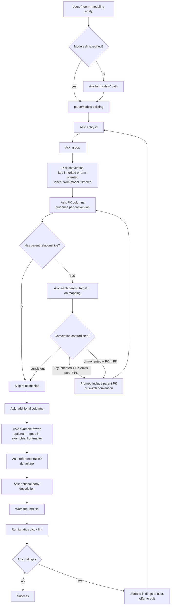
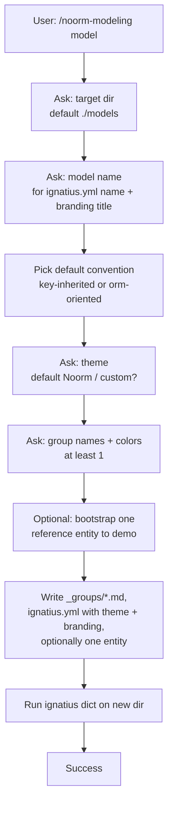

# Noorm modeling skill

## Problem

Authoring an ignatius entity file today means:

1. Hand-write the YAML frontmatter without IDE help (no schema, no completion).
2. Remember the IDEF1X classification rules (independent vs dependent vs subtype — including the FK-in-PK = dependent rule that even seasoned users get wrong).
3. Know that group color, sort_key, and theme must live in `_groups/*.md` and `ignatius.yml`, not on the entity itself.
4. Run `ignatius dict` afterwards to discover mistakes — by which point the lint surface is reactive, not preventive.

The result: every new contributor's first entity is a half-broken file that produces lint warnings on first run. Reviewers spend cycles on mechanical issues. The skill is the antidote — a guided authoring loop that produces a properly-formed file the first time and verifies it by invoking the CLI.

## Goals / Non-goals

- **Goals**
    - One skill (`/noorm-modeling`) with two modes selected by a positional arg:
        - **`entity`** — author a single entity .md file given an existing `models/` root.
        - **`model`** — bootstrap a complete `models/` skeleton (`_groups/`, a single `ignatius.yml` carrying optional theme + branding, one or two reference entities).
    - The skill knows the IDEF1X rules — it asks the right questions in the right order so the resulting file satisfies the linter on first run.
    - After writing, the skill runs `ignatius validate <models>` and reports any lint findings. If findings appear, the skill prompts the user to fix them iteratively.
    - The skill is invoked via the standard Claude Code skill mechanism: `/noorm-modeling entity` or `/noorm-modeling model`. Bare `/noorm-modeling` asks the user to pick.
    - Skill output: real file(s) on disk, staged but not committed.

- **Non-goals**
    - The skill is NOT the linter. It depends on the linter (`schema-lint-and-error-ux` spec) to verify output.
    - No autonomous bulk-create (skill won't loop through "add 20 entities from a CSV" — single-entity or single-model invocations only).
    - No model migration (the older YAML format → current markdown format). `scripts/convert-yaml-to-md.ts` covers that case.
    - No reverse-engineering of an existing entity (.md file → form to edit). Could come later.

## Sub-modes

### `entity` flow

Key behavior: the skill uses the user's earlier answers to *prevent* lint violations rather than just catching them. The classification (`Independent`, `Dependent`, `Associative`, `Subtype`, `Classifier`) is **derived by the parser** from PK/FK structure — the skill does not ask. Instead the skill catches **convention contradictions** in the question flow: if the user picked `key-inherited` but declared a PK that omits parent PK columns, or picked `orm-oriented` but put an FK in the PK, the skill prompts to either fix the keys or switch the convention.

### `model` flow

The skeleton is intentionally minimal — no inflated example data. One group, optionally one entity, ready to grow. The default convention is recorded as a comment in `ignatius.yml` so subsequent `entity` invocations against this root inherit it.

## Invocation

- Skill file lives in this repo so it ships with the project. Path: `skills/noorm-modeling/SKILL.md` (project-scoped skill).
- Name: `/noorm-modeling`. One skill, one file. Mode selected by positional arg: `entity` or `model`.
- Bare `/noorm-modeling` (no arg) prompts the user to pick which mode. Unknown args fall to the same prompt.
- Invokable from anywhere; if not inside an ignatius `models/`-bearing project the skill asks for paths.

## Knowledge encoded in the skill

The single `SKILL.md` must encode:

- The exact required + optional fields for an entity .md file (id, group, pk, columns, relationships, alternateKeys, reference, body). **No `classification`, no per-edge `identifying`** — both are derived by the parser.
- The **authoring convention axis** (`key-inherited` vs `orm-oriented`) and how key placement differs:
    - `key-inherited`: parent PK propagates into child composite PK; FK columns live in the child PK.
    - `orm-oriented`: each entity has a single surrogate `id` PK; FK columns sit outside the PK as plain columns.
- The convention-contradiction detection rules:
    - `key-inherited` + PK that omits parent PK columns → prompt to include them or switch convention.
    - `orm-oriented` + FK column in the PK → prompt to drop it or switch convention.
- The IDEF1X *intuition* behind the conventions (so the user understands what derivation will produce), but **never as a question the user has to answer**. Classification follows from key shape.
- The `_groups/*.md` schema (label, color, optional sort_key, optional desc).
- The `ignatius.yml` schema (`name`, `version`, `description`, `updated`, `theme:`, `branding:` blocks — single config file per `docs/spec/ignatius-project-config.md`).
- Pointers to the linter rule catalog so the skill's questions map 1:1 with what the linter would flag.

These are kept in sync with the canonical sources by referencing `docs/spec/schema-lint-and-error-ux.md`, `docs/spec/derive-classification.md`, `docs/spec/ignatius-project-config.md`, and `docs/design/markdown-driven-erd.md` in the skill's frontmatter / inline body. If the linter rules change, the skill author updates the skill — explicit, not automatic.

## Verification loop

After writing files, the skill runs `ignatius validate <dir>` (the validate-only quality gate — no HTML output) and parses the CLI's stderr lint output (the format defined by `schema-lint-and-error-ux`). For each finding:

- The skill reports the category + message + fix hint to the user.
- The skill offers to revise: "Update the file?" — if yes, the skill walks the relevant question subset again with the original answers prefilled, writes the file, re-runs.
- Loop bounded to 5 attempts (defensive against infinite cycles from misbehaving CLI).

The verification step depends on the linter's structured stderr — `src/validate.ts:formatFindingsForStderr` is live and emits `<sev>  <ruleId>  <location>  <message>` one line per finding, called from `src/cli.ts` after `parseModels` + `validateModel`. The skill parses that format directly; no soft-verify gate remains.

## Open questions

- **Skill auto-stage?** Should the skill `git add` the new file(s)? Likely no — leave staging to the user. They might want to iterate before committing.
- **Body markdown content** — should the skill ask for a short description or leave the body blank? Probably ask for an optional one-sentence summary; longer prose is better written outside a Q&A flow.

## Approaches considered and rejected

| Rejected | Why |
|----------|-----|
| Two separate skills (`/new-entity` + `/new-model`) | User picked "separate sub-modes" — one skill, two args — in the original clarify round. Splitting into two skill files contradicts that selection and doubles the surface for no benefit. |
| Hand-rolled CLI subcommand (`ignatius new entity`) | Skills are the right surface — interactive, in-IDE, in the same loop as everything else Claude Code touches. CLI sub-command duplicates that surface. |
| Skill that writes through a templating library (Mustache, EJS) | Overkill. Skills are markdown + LLM judgment; templates would add a dep without buying much. |
| Skill that bypasses the linter and trusts its own checks | Would diverge over time. Skill DEPENDS on the linter; doesn't reimplement it. |
| Skill that doesn't verify (just writes the file) | Fails the goal — the whole point is "lint-clean on first run". Verify is non-optional. |
