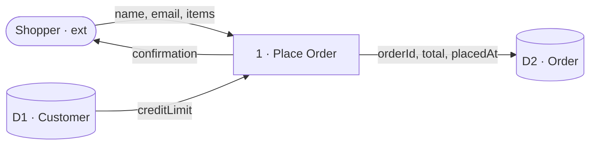
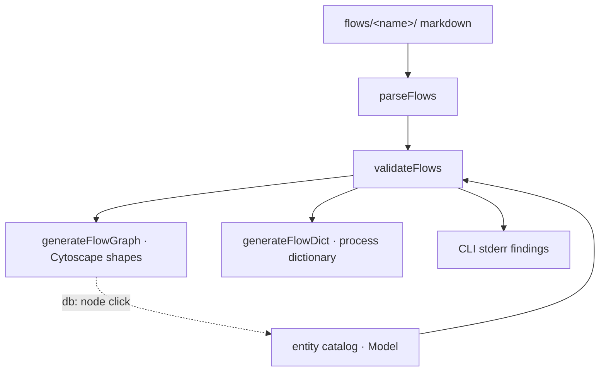

# SSADM process flows (data flow diagrams)


## Problem


A data flow diagram answers, better than any other artifact, "what actually needs to happen here?": who the parties are, what data each process consumes, where that data rests, who it answers to, and what it emits. It is equally a *thinking* tool and a *conversation* tool — and it works in an agile loop (analyse the next slice), not only in waterfall planning.

The mental model is a signal chain: an external entity is the source (the cable), a process is a transform (the pedal), a data store is where signal lands (the amp). Data is the signal a business runs on; the DFD is its routing diagram.

ignatius already owns the data model, and that is the unfair advantage. A flow authored here references *real entities*. So a process flow becomes a **demand list against the ERD**: a flow that needs `Customer.email` when `Customer` stores no `email` is signal — the DFD has discovered an attribute the data model must collect. No standalone DFD tool can do this, because none of them also own the schema. The DFD is the precursor to the data model; here the two live in one repo and validate each other.


## Goals / Non-goals


Goals:

- Author DFDs as markdown — file-per-process, file-per-external — with the same ergonomics as entities (name on the node, narrative in the body).
- Many DFDs per model, each scoped to one task/feature, all sharing the entity catalog as `db:` stores.
- SSADM well-formedness validation, reusing the existing findings system (rules, severity tiers, surfaces).
- Attribute-level flows against `db:` stores — the demand-list keystone.
- Render through the existing Cytoscape + ELK harness with DFD node shapes; reuse drag-to-save position persistence, the findings panel, and banners.
- A process dictionary mirroring the data dictionary.

Non-goals (v1):

- Hard balancing *enforcement* — decomposition mismatch is a soft warning, never a blocking error.
- The current-physical → logical → required progression and logicalisation.
- Schema validation on non-`db:` stores (they have no schema here).
- Perfect auto-layout — drag-to-save absorbs the gap.
- The rest of SSADM: the LDS is already the ERD; ELH is out of scope.


## Conceptual model — SSADM mapped onto ignatius


| SSADM element | ignatius node | New? | Marker |
|---------------|---------------|------|--------|
| Data store (computerised) | existing entity (`db:`) | reuse | `D` |
| Data store (cache / transient) | lightweight store (`cache:`) | new | `C` |
| Data store (queue / in-flight) | lightweight store (`queue:`) | new | `Q` |
| Data store (filesystem) | lightweight store (`file:`) | new | `F` |
| Data store (document) | lightweight store (`doc:`) | new | `Do` |
| Data store (manual / physical) | lightweight store (`manual:`) | new | `M` |
| External entity (source / sink) | actor (`ext:`) | new | — |
| Process | transform (`proc:`) | new | numbered |
| Data flow | named, directional edge carrying data | new | — |

Only `D` (db) stores resolve to the entity catalog and carry attribute validation. The other kinds are opaque named stores — they appear on the diagram with their marker but have no schema to check against. SSADM's coarse `D`/`M`/`T` is widened to a per-kind marker so the *kind* of resting place is visible on the diagram, which is half of what a DFD is for.

A small DFD (external → process → db store, with attribute-level flows):




## Folder and file format


A model gains a `flows/` directory; each child folder is one DFD, assembled from process files plus an `_externals/` folder. Entities in the parent model are the shared `db:` catalog and are not duplicated here.

```
models/shop/
  ignatius.yml
  Customer.md            ← entity (D-store, shared)
  Order.md               ← entity (D-store, shared)
  flows/
    checkout/            ← one DFD
      _externals/
        Shopper.md       ← external entity (actor)
      _stores/
        Sessions.md      ← optional description of a non-db store (kind: cache)
      Place-Order.md     ← process
      Place-Order/       ← sub-DFD (decomposition)
        Reserve-Stock.md
        Charge-Card.md
        Charge-Card/     ← sub-DFD recurses to the leaves
          Authorize.md
    refund/              ← another DFD
      ...
```

Decomposition recurses: a process file paired with a same-named folder is its sub-DFD, and that folder's processes may pair with their own folders, all the way to the leaves. Every process box is drillable into its own DFD.

A process file declares its inputs and outputs in frontmatter; the body is business narrative, exactly like an entity body. Endpoints are typed (`ext:` / `<storekind>:` / `proc:`); every flow uses one `data:` key. On a `db:` endpoint the value is always columns — a string is one column, an array is several, all validated against the entity. On a non-`db:` endpoint the value is an opaque label (no schema to check). Non-`db:` stores are inline-by-first-use; an optional `_stores/<name>.md` file attaches a narrative description to one.

```yaml
---
process: Place Order
inputs:
  - from: ext:Shopper
    data: [name, email, items]
  - from: db:Customer          # read
    data: [creditLimit]
outputs:
  - to: db:Order               # write
    data: [orderId, total, placedAt]
  - to: ext:Shopper
    data: confirmation         # string → opaque label
---
Validates the cart against the customer credit limit, then…
```

The exact frontmatter contract (field names, defaults, read/write direction) is the spec's job. The shape above is illustrative.


## Endpoint resolution


A bare endpoint name resolves if it is unique across the three namespaces (externals, stores, processes) — the common case, since most names are unique. A real collision (`Customer` exists as both an actor and a store) must be qualified: `ext:Customer` vs `db:Customer`. An unqualified collision is a finding, not a guess. This mirrors the tool's existing posture: derive when unambiguous, surface a finding when not.

An actor named `Customer` and a store named `Customer` are *not* an error — SSADM expects exactly this distinction (the person who hands over an order vs. the table that stores customer rows). The DFD's job is to show the actor's data landing in the store.


## Validation rules


A new `flow.*` domain in the validator, riding the existing two-tier severity model (Class A = warn + degrade; Class B = omit + global banner) and the existing finding surfaces (CLI stderr, dict panel, graph panel).

| Rule | Class | Fires when |
|------|-------|------------|
| `flow.unknown_store` / `flow.unknown_external` / `flow.unknown_process` | B | endpoint id not found in its namespace |
| `flow.unknown_attribute` | A | a `db:` flow names a column the entity lacks (string = one column, array = several; always checked) — *the keystone* |
| `flow.ambiguous_endpoint` | A | a bare endpoint name collides across namespaces |
| `flow.process_no_input` / `flow.process_no_output` | A | a process has no input / no output (black hole / miracle) |
| `flow.illegal_connection` | B | store↔store, ext↔store, or ext↔ext direct flow |
| `flow.process_to_process` | A | a flow runs directly process→process |
| `flow.duplicate_number` | A | two sibling processes in a diagram declare the same local `number:` |
| `flow.unbalanced_decomposition` | A | the columns crossing a sub-DFD's boundary ≠ the columns on its parent process's in/out, at any seam |

The connection-legality rules (`illegal_connection`) are the SSADM invariants: every flow must touch a process; stores and externals may not connect directly to each other.

**On `process_to_process` being a warning, not an error.** The canonical sources permit process→process flows: Visual Paradigm's connection matrix lists it explicitly, Wikipedia's rule ("each flow must have at least one process endpoint") is *satisfied* by it, and SSADM teaching that says "data flows between processes within the system" assumes it. A stricter, widely-taught variant forbids it, to force every flow to rest in a store or external. We adopt the strict variant as the **default warning** (it surfaces where data is passing untracked) but make it Class A and config-silenceable, so the canonical-permissive behavior is one switch away. Recording the provenance here so the rule's severity is not mistaken for a bug.


## Leveling


Decomposition is folder-based and recurses to the leaves: a process file `Place-Order.md` paired with a same-named folder `Place-Order/` means that folder is its sub-DFD; processes inside it may pair with their own folders, and so on down. The viewer drills in on click at every level. This is cheap and reuses the navigation surface.

Process numbers are local-authored and tree-composed. Each process declares one local `number:` — its rank among its siblings. The tool composes the full dotted SSADM number (`1.2.1`) by walking the folder path. Because the dotted prefix is derived from where the file sits, it cannot be authored wrong; the only consistency check needed is sibling-local uniqueness (`flow.duplicate_number`).

Balancing — SSADM's rule that what crosses a process's boundary is conserved when you decompose it — is *checked as a soft warning*, not enforced, **at the data level and at every seam**. At each process/sub-DFD boundary the *columns* crossing out of the children (sibling-to-sibling internal flows excluded) must equal the columns on the parent process's inputs/outputs, compared per outside connection. This catches the case box-level checking misses: the same store touched on both sides but a different column moving through it. Surfaced as `flow.unbalanced_decomposition`. Hard enforcement is still deferred — the data-level check is a warning, never a block.


## Approaches


Two independent axes: how flow data integrates with the existing model, and how it renders.

| # | Axis | Approach | Pros | Cons |
|---|------|----------|------|------|
| A | model | Separate `FlowModel` (own parse + validate), referencing the entity `Model` by id | clean separation; entity ERD untouched; many-DFD shape natural | a second parse path + types |
| B | model | Fold process/external/flow nodes into the existing `Model` | one type, one parser | breaks the ERD (flows are many-per-model, not one graph); rejected |
| C | render | Reuse the existing React bundle; branch `App.tsx` on a flow mode | one bundle, one embed/compile pipeline | `App.tsx` (already large) grows a second rendering mode |
| D | render | Separate `FlowApp.tsx` + second compiled bundle | clean separation of viewers | doubles the build/stable-names/embed pipeline |


## Recommendation


- **Model: A.** Flows are a separate `FlowModel` that references entities by id. Folding them into `Model` (B) breaks the single-graph ERD invariant and the shared-catalog shape — rejected. `parseFlows(dir)` produces the flow diagrams; `validateFlows(flowModel, entityModel)` cross-checks `db:` references against the catalog.
- **Render: C, refined.** Pressure-testing settled the C-vs-D question as a middle path: **one compiled bundle, but separate render paths inside it.** The flow viewer reuses the existing bundle and ELK engine (keeping the single `stable-names` → `embedded-bundle` → `--compile` pipeline — D's doubling is real cost avoided) but has its own stylesheet builder and its own `initFlowGraph` entry, never appending to the ERD's `buildStyles`. That buys D's isolation where it matters (flow and ERD styles cannot regress each other) without D's build cost. The original worry — a shared `buildStyles` breaking ERD when flow styles change — is designed out rather than mitigated. Position persistence likewise uses a `localStorage` key distinct from the ERD's, so the two surfaces never share a storage pool.

Pipeline, end to end:




## Rejected approaches


- **A standalone DFD tool / separate binary** — throws away the one feature no competitor has: flows validated against a real schema. The whole point is co-location with the ERD.
- **Folding flows into the entity `Model`** (approach B) — a model has one ERD but many DFDs; merging them collapses that cardinality and pollutes the entity graph.
- **Hard balancing enforcement in v1** — a cross-level conservation solver over attribute-level flows is a large build for a rule most users will satisfy by hand. A warning delivers the value at a fraction of the cost.
- **Forbidding process→process as an error** — would reject valid SSADM diagrams. Demoted to a config-silenceable warning.


## Open questions


Resolved during spec authoring and the `/pressure-test` pass — see `docs/spec/process-flows.md` → *Resolved decisions*: `db:` flow data is always column-checked (string = one column); non-`db:` stores are inline-by-first-use with an optional `_stores/<name>.md` description; decomposition recurses to the leaves; balancing is data-level at every seam; process numbering is local-authored / tree-composed with `flow.duplicate_number` guarding sibling uniqueness; render is one bundle with separate flow stylesheet + `initFlowGraph`; flow positions use a distinct `localStorage` key; `manual:`/`M` is IN; `db`-node cross-nav uses a static `href` to `graph.html#entity-<id>` (live: route swap); the surface is discriminated by `window.__IGNATIUS_SURFACE__` (`erd` / `flow`). Genuinely still open:


- **Queue/message payload validation.** v1 treats every non-`db:` flow as an opaque label. A `queue:` message often has a known payload shape worth checking — validating it against a declared schema is a separate, larger feature than `_stores/` descriptions. Out of scope for v1; decide if/when it's wanted.
- **Numbering gaps.** Sibling-local uniqueness is enforced (`flow.duplicate_number`); whether a gap (`1, 2, 4`) should also warn is undecided. Left silent for now.
- **Usage index (deferred).** A derived back-reference — for any store or entity, every flow/process that reads or writes it (the reverse of the demand list). Filed as a `kind: plan` follow-up (`.claude/project/followups/usage-index-back-reference.md`); deliberately not specced so it isn't half-built as a side effect of `_stores/`.
- **Surfaces to update on landing.** New signals domain, a `Feature ↔ documentation ↔ skill map` row, and likely a `noorm-modeling` skill mode for authoring flows.
