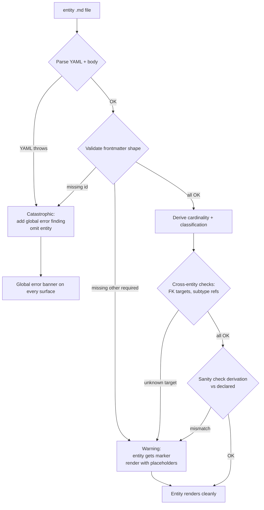

# Schema lint + error UX


## Problem

Today an incomplete or misconfigured entity has three failure modes:

1. **Silent miss** — a typo'd FK target produces a broken anchor link in the dict; a missing classification falls through to a default badge; nothing tells the user.
2. **Hard crash** — a malformed YAML frontmatter throws at parse time, the entire CLI invocation fails, the user is left to bisect.
3. **Wrong derivation** — a classification FK (non-PK) wrongly marks the entity dependent; the dict and graph display incorrect cardinality and classification badges. This is the silent-but-misleading case the user explicitly called out.

The user wants:

- A linter that runs at parse time and produces structured findings (per-entity + global).
- A render policy that errs on the side of showing partial information with visible warning markers, rather than crashing or hiding errors.
- The same findings surfaced on every consumer surface — dict HTML, graph HTML, server viewer, CLI stderr — using the same UI vocabulary.


## Goals / Non-goals

- **Goals**
    - Parse time produces a `LintReport` alongside the `Model`. Both flow through the generators and the server.
    - Each finding has a stable category, severity, message, location (file path + entity id when applicable), and a one-line fix hint.
    - Best-effort render: parser keeps going past recoverable problems; the affected entity (or model) acquires a warning marker. Click → inline detail panel.
    - Catastrophic failures (entity can't be constructed at all — e.g. missing id, malformed YAML that can't be recovered) cause the entity to be omitted, and a global error banner names it with the reason.
    - Findings surface on all four targets: static dict, static graph, interactive viewer, CLI stderr. The CLI stderr exit code reflects whether any errors (not warnings) occurred.
    - Live updates in the server viewer — when the user fixes a file, the model and lint report regenerate via the existing SSE channel.

- **Non-goals**
    - Auto-fix. Lint reports, user fixes.
    - Suggesting model-design improvements ("you could consider promoting X to a basetype"). Lint catches what's *wrong*, not what's *suboptimal*.
    - LSP / IDE integration. CLI + browser surfaces only.
    - Stylistic linting of markdown body content.
    - A configurable severity policy (no `.ignatius-lint.json` for now — categories have fixed severities).


## Vocabulary

| Term | Meaning |
|------|---------|
| **Finding** | One lint result. Has category, severity, scope (`global` or `entity:<id>`), message, optional `file`, optional `fix` hint. |
| **Category** | Stable identifier (`SCHEMA_MISSING_FIELD`, `FK_UNKNOWN_TARGET`, etc). Used for filtering, dedup, future config. |
| **Severity** | `error` (entity omitted from rendering OR global parse failure) or `warning` (entity renders with marker). |
| **Scope** | `global` (model-level — affects parse as a whole) or `entity:<id>` (one specific entity). |
| **LintReport** | `{ findings: Finding[], hasErrors: boolean, hasWarnings: boolean }`. Flows from parser through every generator. |


## Render policy (the "best-effort" contract)



- **Warning** = entity renders. The user can still navigate around it. The marker tells them something is off; clicking it explains what.
- **Error** = entity DOES NOT render. It appears in the global error banner instead. Nothing else references it via FK anchor (links to omitted entities become `#missing-<id>` markers — see "FK to omitted entity" handling below).


## Lint rule catalog

Concrete rule set, each with category id, severity, and detection logic. This is the menu the parser walks for every entity.

### Schema rules

| Category | Severity | Detection |
|----------|----------|-----------|
| `SCHEMA_MISSING_ID` | error | Frontmatter has no `id` field. Entity cannot be referenced. Omit. |
| `SCHEMA_MISSING_FIELD` | warning | Required field absent (`classification`, `pk`, `columns`). Render with placeholder text + marker. |
| `SCHEMA_INVALID_YAML` | error | YAML parse throws. Omit entity, global finding. |
| `SCHEMA_INVALID_FIELD_TYPE` | warning | Field present but wrong shape (e.g. `pk` is a string instead of array). Coerce to a safe default + marker. |

### Type integrity rules

| Category | Severity | Detection |
|----------|----------|-----------|
| `FK_UNKNOWN_TARGET` | warning | Edge `target` references an entity not present in the model. Render with marker, anchor goes to `#missing-<id>`. |
| `SUBTYPE_UNKNOWN_BASETYPE` | warning | `subtypeCluster.basetype` references a missing entity. Cluster still emits; basetype shown as a stub. |
| `SUBTYPE_UNKNOWN_MEMBER` | warning | Cluster `members` includes a missing entity. Drop that member from the cluster + marker on the basetype. |
| `GROUP_UNKNOWN` | warning | Entity declares `group` that has no `_groups/<group>.md`. Entity renders without color band. |

### Cardinality / classification rules

| Category | Severity | Detection |
|----------|----------|-----------|
| `CLASSIFICATION_MISMATCH_DEPENDENT` | warning | Declared `independent`/`kernel` but PK contains an FK column. Marker explains: "PK includes FK from `<parent>` → entity is dependent." |
| `CLASSIFICATION_MISMATCH_INDEPENDENT` | warning | Declared `dependent` but no PK column is also an FK. Marker explains: "No PK column is an FK; classification FK is not a dependency. Should be independent." |
| `PK_EMPTY` | warning | `pk` is an empty array. Cardinality cannot be derived. Marker + dependent fallback. |

**The dependency rule is explicit per the user's clarification:** an entity is dependent iff *at least one column appears in BOTH its `pk` and the `on` mapping of an incoming FK edge*. A classification FK (FK column NOT in PK) does not establish dependence. This lives in `deriveCardinality` already — the lint check is the same predicate applied as a cross-check against the declared classification.

### Naming / style rules

| Category | Severity | Detection |
|----------|----------|-----------|
| `NAMING_NOT_PASCAL_CASE` | warning | Entity id does not match `^[A-Z][a-zA-Z0-9]*$`. Marker only — render unchanged. |
| `COLUMN_NAME_NOT_SNAKE_CASE` | warning | Column key does not match `^[a-z][a-z0-9_]*$`. Marker only. |

Naming rules are the only category the user noted as "lower priority" — implementable but a candidate for "off by default" once configuration exists. For v1 they fire as warnings.


## Surface UX

### Dict HTML (static + server-served)

- **Global banner** at the top of the page (sticky? or above page header?). Red background for errors; absent if no errors. Listed errors include catastrophic parse failures and entity omissions.
- **Entity warning marker** rendered next to the entity heading — `⚠` triangle, same color treatment as a warning badge. Clicking opens an inline disclosure (`<details>`) listing the entity's findings with category + message + fix hint.
- Anchors to omitted entities render as `<a class="dict-link-missing" href="#missing-<id>">`. The page has one `#missing-<id>` placeholder section at the bottom listing all omitted entities.

### Graph HTML (static + server-served)

- **Global banner** overlaid at the top of the canvas — same content as the dict banner.
- **Node warning badge** — small `⚠` corner indicator on the node (Cytoscape custom marker, similar pattern to the crow's-foot overlay). Clicking the node opens its modal (existing pattern); the modal gets a new "Issues" section listing findings.
- Omitted entities don't render as nodes; the banner names them.

### Interactive server viewer

- Reuses the graph HTML surface.
- The SSE `model-changed` event already triggers a re-fetch of `/api/model`. The new payload includes `lintReport`; the React component updates the banner + node markers reactively.

### CLI stderr

- After generation, print all findings to stderr in a structured format:
    ```
    error  SCHEMA_MISSING_ID  models/identity/Mystery.md  Entity has no id; omitted.
    warn   FK_UNKNOWN_TARGET  models/identity/Person.md   Edge target 'Hat' not found.
    ```
- Exit code: `0` if zero errors (warnings OK), `1` if any errors.
- A `--strict` flag can promote warnings to errors (i.e. exit 1 if any warnings). Optional v1 addition.


## Data flow

```mermaid
flowchart LR
    Files[*.md / *.yaml in models/] --> Parser
    Parser --> Model
    Parser --> LintReport
    Model --> DictGen[generateDict]
    Model --> GraphGen[generateGraph]
    Model --> ServerAPI[/api/model]
    LintReport --> DictGen
    LintReport --> GraphGen
    LintReport --> ServerAPI
    LintReport --> Stderr[CLI stderr]
    DictGen --> DictHTML[dict.html]
    GraphGen --> GraphHTML[graph.html]
    ServerAPI --> SPA[React viewer]
```

- `parseModels(dir)` returns `{ model, lintReport }` (existing call sites updated).
- Generators accept the report as a peer of the model. They emit banners and markers, but do not RUN lint themselves — parser is the single source of truth.
- The server's `/api/model` response payload becomes `{ model, lintReport }`. Front-end React state holds both.


## Open questions

- **Markdown body validation.** Should we lint the rendered body (broken `[[wiki-link]]` refs, missing images)? Initial answer: no — body is free-form prose, out of scope.
- **Strict mode default.** `--strict` flag promotes warnings to errors. Should it be default for CI? Initial answer: no — opt-in.
- ~~**Findings ordering.** Sort by severity (errors first), then category, then entity id alphabetical? Probably yes — surfaces this way too.~~ Resolved in spec: errors-first, then category alphabetical, then entity id alphabetical within each severity.


## Approaches considered and rejected

| Rejected | Why |
|----------|-----|
| Throw on first error, no recovery | Hides downstream errors. User fixes one, runs again, gets the next — slow loop. Best-effort surfaces everything at once. |
| Lint as a separate `ignatius lint` subcommand | Splits the truth: would the dict's banner match `lint` output? Easier to make it always-on, then optionally print to stderr. |
| Severity from a config file | Adds a config surface before the rules even exist. Hardcode severities in v1; config later if needed. |
| Inline lint markers in YAML source files (à la ESLint --fix) | Big lift, requires source-mapping back from parsed structure. The HTML surfaces give a similar feedback loop without touching the user's files. |
| Use JSON Schema for validation | Heavyweight. Hand-rolled checks for ~10 rules is simpler and gives clearer messages. |
