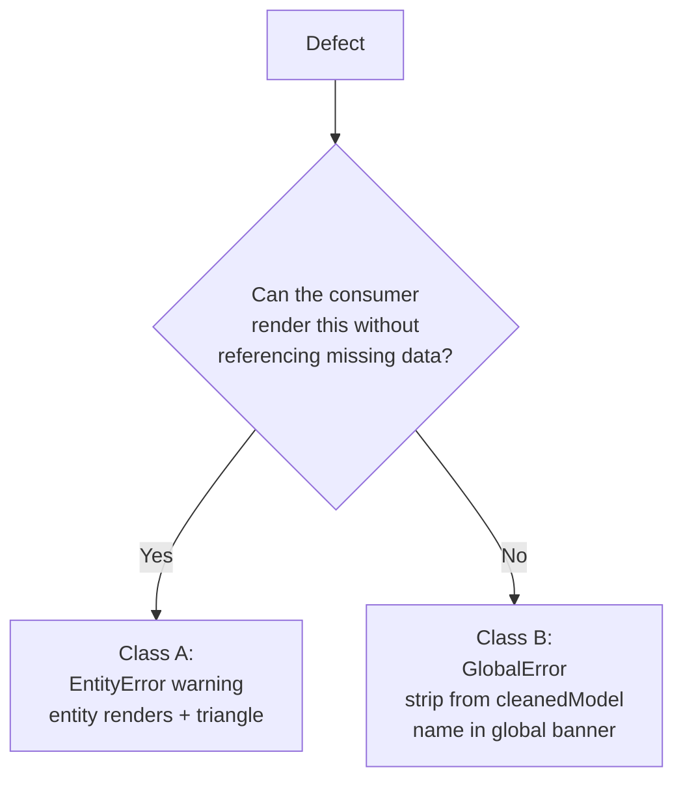

# Schema lint + error UX


## Problem

Today an incomplete or misconfigured entity has three failure modes:

1. **Silent miss** — a typo'd FK target produces a broken anchor link in the dict; a missing classification falls through to a default badge; nothing tells the user.
2. **Hard crash** — a malformed YAML frontmatter throws at parse time, the entire CLI invocation fails. Worse: dangling FK targets and absent subtype basetypes survive parse and **white-screen the viewer** at `cytoscape()` (App.tsx:633, no try/catch).
3. **Wrong derivation** — a classification FK (non-PK) wrongly marks the entity dependent; the dict and graph display incorrect cardinality and classification badges. The silent-but-misleading case.

The user wants:

- A linter that runs over the parsed model and produces structured findings (per-entity + global).
- A render policy that errs on the side of showing partial information with visible warning markers, rather than crashing or hiding errors.
- The same findings surfaced on every consumer — dict HTML, graph HTML, interactive viewer, CLI stderr.
- In the live authoring loop (`ignatius serve`), a persistent top-right panel that updates on every save and lets the user click straight to the broken entity.


## Goals / Non-goals

- **Goals**
    - A pure `validateModel(model) → ValidationResult` layer. Three consumers (viewer, dict, future CI lint) call it.
    - Each finding has a stable namespaced rule ID, a class (Class A = degrade + warn, Class B = omit + global error), a message, and a fix hint.
    - Best-effort render: bad data does not white-screen the viewer. Class A entities render with a warning triangle. Class B references are stripped from a `cleanedModel`.
    - The static `graph` bundle re-runs `validateModel` on `window.__MODEL__` so a stale graph.html still shows current findings against its embedded model.
    - Live authoring loop in `ignatius serve`: on every SSE `model-changed`, a persistent collapsible top-right panel re-lists all current findings. Click a row → pan/zoom + select the affected entity.
    - The CLI `dict` and `graph` commands print findings to stderr and exit `1` on errors.

- **Non-goals**
    - Auto-fix. Lint reports; user fixes.
    - Model-design suggestions ("consider promoting X to a basetype").
    - LSP / IDE integration. CLI + browser surfaces only.
    - Markdown body validation (broken wiki-links, missing images). Body is free-form prose.
    - Configurable severity. Severities are hardcoded; class is determined by the rule.
    - `--strict` flag. Exit-code semantics in v1: errors → 1, warnings → 0.
    - A separate `ignatius lint` subcommand. Designed for, but not shipped this pass.
    - Per-edge triangles. Node triangles + global banner cover the stated UX.
    - `_meta.yaml` / `_branding.yaml` malformed handling. Deferred.


## Vocabulary

| Term | Meaning |
|------|---------|
| **EntityError** | A warning attached to one entity. Entity still renders, decorated with a triangle. `{ ruleId, entityId, severity: 'warning', message }`. |
| **GlobalError** | An error reporting something was omitted. `{ ruleId, severity: 'error', omitted: { kind, id }, reason }`. |
| **RuleId** | Stable namespaced string: `parse.*` (catch inside parse loop), `entity.*` (own data), `edge.*` (dangling refs), `cluster.*` (subtype problems). |
| **Class** | A = render degraded + entity triangle (warning). B = omit the broken reference + global banner (error). Encoded in the type system — `EntityError` is always Class A, `GlobalError` is always Class B. |
| **ValidationResult** | `{ entityErrors: EntityError[], globalErrors: GlobalError[], cleanedModel: Model }`. `cleanedModel` has Class-B references stripped (omitted edges, broken cluster wiring) so consumers can render it without crashing. |
| **Rule registry** | `Record<RuleId, { title, explanation, class }>`. Single source of truth for the click→explanation UX in the live panel and the static surfaces. |


## Architecture — standalone `validateModel` layer

```mermaid
flowchart LR
    Files[*.md / *.yaml] --> Parser[parseModels]
    Parser --> ParseGlobals[parse-time<br/>GlobalError[]<br/>parse.* ruleIds]
    Parser --> Model
    Model --> Validate[validateModel]
    Validate --> Result[ValidationResult:<br/>entityErrors, globalErrors,<br/>cleanedModel]
    Result --> DictGen[generateDict]
    Result --> GraphGen[generateGraph]
    Result --> ServerAPI[/api/model]
    ParseGlobals --> ServerAPI
    ServerAPI --> Bundle[React bundle]
    Bundle -->|stale graph.html| Revalidate[validateModel<br/>on window.__MODEL__]
    Bundle --> Panel[Live findings panel<br/>top-right, SSE-driven]
    ParseGlobals --> Stderr[CLI stderr]
    Result --> Stderr
```

Key points:

- **One `GlobalError` lane, two emit sites.** `parseModels` emits `parse.*` ruleIds for files that didn't produce a `Model` entry. `validateModel` emits `edge.*` / `cluster.*` ruleIds for Class B defects on the parsed `Model`. Both flow as the same `GlobalError` type; callers concatenate. Surfaces consume one merged array.
- **`parseModels` returns `{ model, globalErrors }`** — model holds every entity that parsed; `globalErrors` lists files that didn't. `parseModels` does not call `validateModel`.
- **`validateModel(model)` is pure.** Same `Model` in → same result out. Unit-testable with literal `Model` values (matches `test/checks/` idiom — no fixture files).
- **Three consumers share one verdict.** Dict, graph, and (future) `ignatius lint` all import the same `validateModel`. No re-implementation per surface.
- **The bundle re-validates in static mode only.** A build-time flag `window.__IGNATIUS_MODE__` (set by whoever emits the HTML — `'static'` from `generateGraph`, `'live'` from `src/server.ts`) tells the bundle which path to take. In `'static'` it runs `validateModel(window.__MODEL__)`; in `'live'` it consumes `/api/model`'s `validation` payload and never calls `validateModel`.
- **One exception lives in parse.ts.** Per-file YAML parse failures are caught inside the scan loop (parse.ts:181) and emitted as `parse.invalid_yaml`. There is no `Model` yet for the standalone layer to operate on, so this is the one rule that fires from parse, not validate.


## Render policy — Class A vs Class B

**The crisp rule:** if a defect can be represented as a node/edge without throwing a consumer, it's Class A (degrade + triangle). If rendering requires referencing something absent, it's Class B (omit + global banner).



Subtlety: "omit" means omit the broken **reference or edge**, not the whole entity. Dropping an entity because one of its three FKs has a typo is too destructive. The entity stays; the dangling edge is stripped.


## Rule catalog

Stable rule IDs. The class is encoded in the type (`EntityError` → A, `GlobalError` → B), not a per-rule field. The catalog drives both detection and the registry.

### Parse-time rules (fire inside `parseModels`, before `Model` exists)

| Rule ID | Class | Detection |
|---------|-------|-----------|
| `parse.invalid_yaml` | B | YAML parse throws. File excluded from `Model`. |
| `parse.missing_id` | B | Frontmatter has no `entity` field. File excluded. |
| `parse.empty_frontmatter` | B | `parseYaml('')` returns null (empty fences). File excluded. |

### Entity rules (`validateModel`, Class A — render with triangle)

| Rule ID | Detection |
|---------|-----------|
| `entity.missing_pk` | `pk` absent or empty array. Render with placeholder; cardinality falls back to dependent. |
| `entity.missing_columns` | `columns` absent. Render with empty attribute table. |
| `entity.invalid_field_type` | Field present, wrong shape (e.g. `pk` is a string). Coerce to safe default. |
| `entity.classification_mismatch_dependent` | Declared `independent`/`kernel` but PK contains an FK column. Should be dependent. |
| `entity.classification_mismatch_independent` | Declared `dependent` but no PK column is also an FK. |
| `entity.unknown_classification` | `classification` not in the canonical lowercase set. Renders unstyled. |
| `entity.unknown_group` | `group` ref has no `_groups/<group>.md`. Renders without color band. |
| `entity.naming_not_pascal_case` | Entity id does not match `^[A-Z][a-zA-Z0-9]*$`. |
| `entity.column_not_snake_case` | Column key does not match `^[a-z][a-z0-9_]*$`. |

### Edge rules (`validateModel`, mixed class)

| Rule ID | Class | Detection |
|---------|-------|-----------|
| `edge.unknown_target` | B | Edge `target` references an entity id not present in `Model.nodes`. Strip the edge from `cleanedModel`. |
| `edge.dangling_fk_column` | A | FK `on` mapping references a column that doesn't exist on the source entity. Source renders with triangle. |

### Cluster rules (`validateModel`)

| Rule ID | Class | Detection |
|---------|-------|-----------|
| `cluster.missing_basetype` | B | `subtypeCluster.basetype` references a missing entity. Strip the cluster from `cleanedModel`. |
| `cluster.missing_member` | A | `cluster.members` includes a missing entity id. Drop that member from `cleanedModel`; basetype gets triangle. |
| `cluster.no_discriminator` | A | Subtype declared with no discriminator column. Basetype gets triangle. |

### Classification canonicalization

Cross-cutting bug surfaced by the strategist scan: parse.ts:106 capitalizes, dict.ts:15 lowercases, dict.ts:174 hard-codes `kernel` (not in `KNOWN_CLASSIFICATIONS`). The validator picks **lowercase** as canon (matches dict and the user-authored markdown). `validateModel` normalizes; `entity.unknown_classification` fires on anything outside the canonical set.


## Surface UX

### Live authoring panel (`ignatius serve` viewer)

The active-editing surface. Lives in the React bundle so both the live viewer and a static `graph.html` get it; SSE updates only happen in the live viewer.

- **Position:** fixed, top-right, ~360px wide.
- **States:** expanded (default when findings > 0) shows the full list; collapsed shows a small badge `⚠ N issues`.
- **Content:** the merged `GlobalError[]` (`parseModels` globals concatenated with `validation.globalErrors`) plus `validation.entityErrors`, sorted errors-first, then by rule ID, then by entity id. No diffing — the panel always reflects current state.
- **Row interaction:** click an entity-scoped row → row expands accordion-style with registry-resolved title, full explanation, and fix hint, AND the viewport pans + zooms + selects the affected entity. Click a global-scoped row → row expands inline only (no pan, no selection — there is no entity to focus). Clicking the node itself still opens the existing detail modal whose "Issues" section repeats the entity's findings — the panel and modal are independent read paths.
- **SSE behavior:** on every `model-changed` event, the React component re-fetches `/api/model` and rebuilds the panel from the server's `validation` payload (live mode — no local `validateModel`). No animations, no toast stack — the panel is the alert.
- **Empty state:** panel is hidden entirely when there are zero findings. No empty "✓ All good" chrome.

### Static dict HTML

- **Global banner** at the top of the page, above the page header, not sticky. Red. Lists the merged `GlobalError[]` (parse-time + validator-emitted) with rule ID + name + reason.
- **Entity triangle** next to the entity heading. Click expands a `<details>` block listing the entity's findings with rule ID + message + fix hint pulled from the registry.
- **Missing references** render as `<a class="dict-link-missing" href="#missing-<id>">`. One `#missing-<id>` placeholder section at page bottom listing all omitted ids.

### Static graph HTML

- **Global banner** overlaid at the top of the canvas, dismissible. Same content as dict.
- **Node triangle** as a corner badge on entities with findings. Implementation: extend the existing `src/markers.ts` canvas overlay rather than per-node DOM.
- **Click a triangled node:** opens the existing detail modal; the modal gets a new "Issues" section listing findings with registry-resolved titles.
- **Omitted entities** don't render as nodes; the banner names them.
- **Bundle re-validates in static mode:** when the build-time flag `window.__IGNATIUS_MODE__ === 'static'`, the React bootstrap calls `validateModel(window.__MODEL__)`. A stale graph.html still shows current findings against the embedded model.

### CLI stderr

```
error  parse.invalid_yaml             models/identity/Mystery.md  Cannot parse YAML frontmatter: <reason>.
error  edge.unknown_target            (Person → Hat)              Target entity 'Hat' not present in model.
warn   entity.classification_mismatch models/identity/Order.md    Declared 'kernel' but pk contains FK column 'customer_id'.
```

- Format: `<severity>  <rule-id>  <location>  <message>`, one per line.
- Sort: errors first, then by rule ID, then by entity id alphabetical.
- Exit: `1` if any errors (Class B), `0` if only warnings.


## Open questions

- ~~Render-vs-omit boundary — omit edge vs entity~~. Resolved: edge-only.
- ~~Default `pk`/`columns` to `[]`/`{}` vs harden consumers~~. Resolved: default in parse, contract change to `Model` is small.
- ~~Classification canonical casing~~. Resolved: lowercase, normalize in validator.
- `_meta.yaml` / `_branding.yaml` malformed handling — deferred to a follow-up entry.
- Static-output CI strict mode (`--strict` exit-1 on warnings) — deferred.
- Future `ignatius lint` subcommand wiring — designed for but out of scope this pass.


## Approaches considered and rejected

| Rejected | Why |
|----------|-----|
| Rules inline in `parse.ts` (one return shape `{ model, lintReport }`) | Static `graph.html` bundle would have no way to re-validate `window.__MODEL__` at viewer load — lint state freezes at build time. Also entangles rules with parse control flow, making unit tests need on-disk fixtures instead of literal `Model`s. |
| Throw on first error, no recovery | Hides downstream errors. User fixes one, runs again, gets the next. Best-effort surfaces everything at once. |
| Separate `ignatius lint` subcommand as the only entry point | Splits the truth — would the dict's banner match `lint` output? Always-on + reusable `validateModel` makes the registry the single source. (`lint` subcommand is fine as a *future* extra surface, not the primary one.) |
| Severity in a per-rule field | Class is intrinsic to whether the data is renderable — encoding it in the type (`EntityError` always A, `GlobalError` always B) makes "this rule can't be downgraded" structurally true instead of policy. |
| Severity from a config file | Adds a config surface before the rules even exist. Hardcode in v1. |
| Inline lint markers in YAML source files (ESLint --fix style) | Big lift, requires source-mapping back from parsed structure. HTML surfaces give the same feedback loop without touching the user's files. |
| JSON Schema for validation | Heavyweight for ~15 rules. Hand-rolled checks give clearer messages and tighter integration with the `Model` shape. |
| Toast stack that auto-dismisses on each save | Findings disappear even when still broken. Persistent panel keeps the user honest about open work. |
