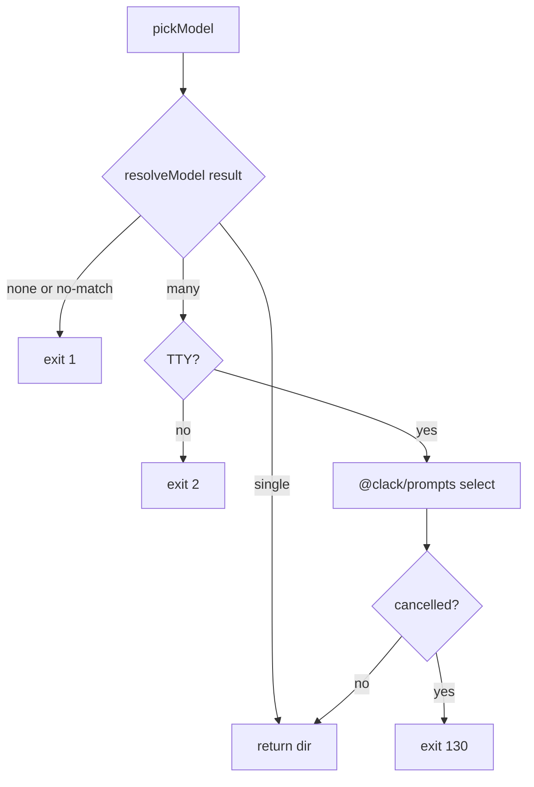
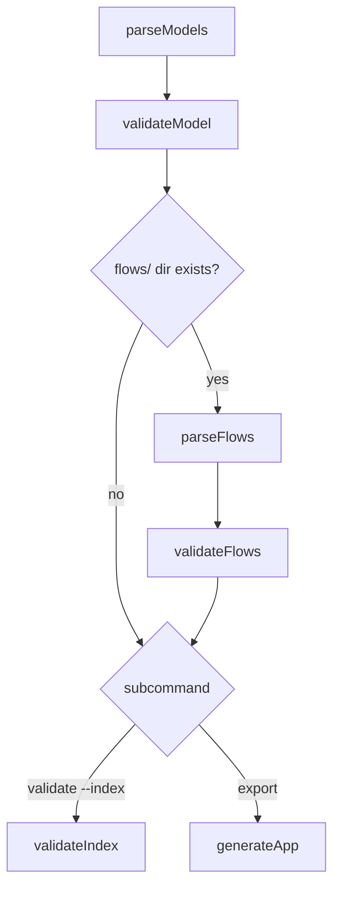
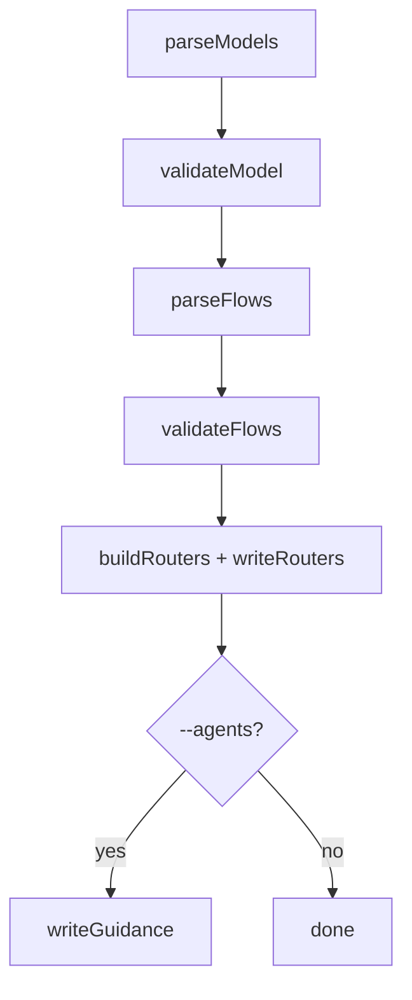
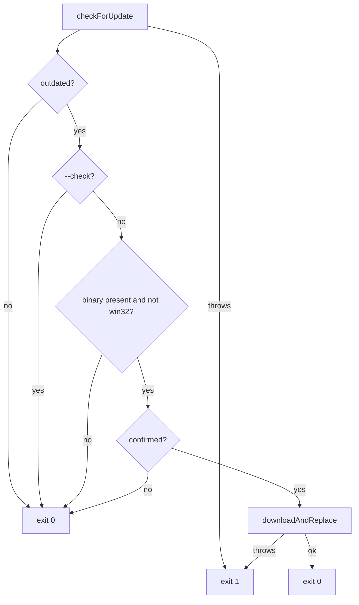
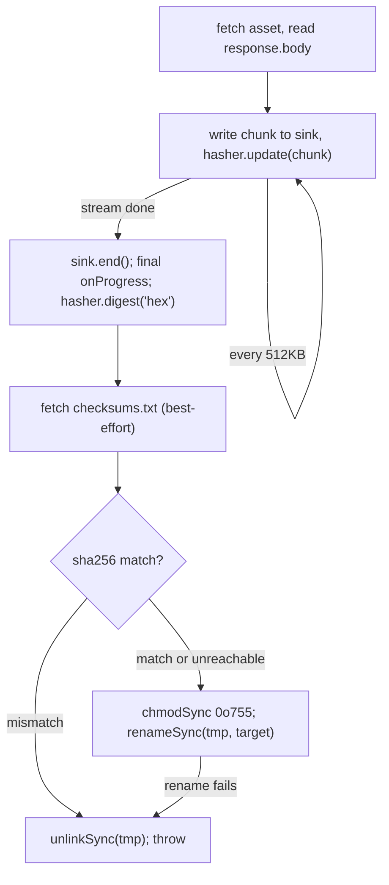
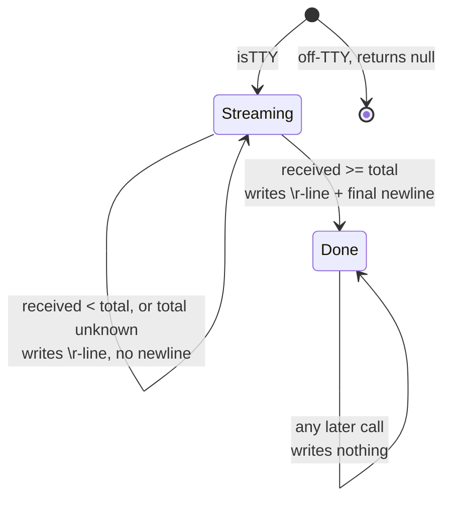

# cli

## What it does

[`src/cli/cli.ts`](../../src/cli/cli.ts) is the single entry point a user or CI job runs: the compiled `dist/ignatius` binary, or `bun src/cli/cli.ts` in a dev checkout. `cli.ts` registers nine subcommand definitions (`serve`/`server` share one, so `server` is an alias, not a tenth). Every other domain in this repo (server, parser, validate, flows, generators, router) is reached only through one of those nine — there is no other production caller of `serveCommand` or `generateApp`. `parseModels`, though, is also called directly by [`src/server/server.ts`](../../src/server/server.ts), and `buildRouters` also directly by `validateIndex` in [`src/model/validate.ts`](../../src/model/validate.ts) (see Coupling). Two responsibilities exist outside dispatch: finding which directory on disk is "the model" when the user did not say, and keeping the installed binary current against GitHub Releases, streaming the download with a live progress line rather than buffering it.

## How it works

| Subcommand | Flags | Behavior |
|---|---|---|
| `serve` (alias `server`) | `path`, `--port`/`-p` (default `3000`), `--model`, `--open`/`-o` | Resolves the model dir via `pickModel`, binds via `serveWithPortFallback`; `--open` dynamically imports `open-browser.ts` |
| `validate` | `path`, `--model`, `--index` | `parseModels` → `validateModel`; folds in `parseFlows`/`validateFlows` when `<dir>/flows` exists; `--index` additionally calls `validateIndex` to recompute router digests and report drift, without writing anything |
| `index` | `path`, `--model`, `--agents` | Full parse + validate + flow pipeline, then `buildRouters`/`writeRouters` writes `index.md` routers into every organizing folder; `--agents` also writes `AGENTS.md`/`SKILL.md` and, when the harness resolves to Claude, [`CLAUDE.md`](../../CLAUDE.md) |
| `export` | `path`, `--out`/`-o` (required), `--theme` (`light`\|`dark`), `--model` | Same parse/validate/flow pipeline as `validate`, then `loadEmbeddedBundle()` + `generateApp()` writes one self-contained HTML file |
| `dict`, `graph`, `flow` | none | Removal stubs: write `"<name> was removed — use: ignatius export -o model.html"` to stderr, exit 1 |
| `version` | none | Prints `VERSION` (baked from [`package.json`](../../package.json) at compile time) |
| `update` | `--check`, `--yes`/`-y` | Delegates to `runUpdateCommand()`, exits with its returned code |

`validate`, `index`, and `export` all resolve the model dir through `pickModel` before doing anything else, then run `parseModels` → `validateModel`. `validate` and `export` call `parseFlows`/`validateFlows` only when `<dir>/flows` exists, and diverge from each other only at the last step; `index` calls the same two functions unconditionally, with no existence guard, so it diverges from `validate`/`export` mid-pipeline, not just at the end.

### Model resolution

`pickModel` collapses any number of candidate directories to exactly one, or to a specific exit code, never to a silent default:

`resolveModel` ([`src/cli/discover.ts`](../../src/cli/discover.ts)) itself has no TTY dependency: it checks `base/ignatius.yml` first, then searches down (skipping `_`-prefixed dirs and `node_modules`, `.git`, `dist`, `tmp`, [`trash/`](../../trash), `.worktrees/`, [`.claude/`](../../.claude), treating any directory holding `ignatius.yml` as a leaf), then walks up if nothing was found below. `pickModel` ([`src/cli/resolve-model.ts`](../../src/cli/resolve-model.ts)) is the only file that imports `@clack/prompts`'s `select` specifically, so the TTY-gated `select` prompt can never fire inside a spawned, non-interactive process.

### Shared validate/export pipeline

`validate` and `export` share every step through the optional flow pass, and diverge only at the last call:

`validate --index` and `index` both end up computing router digests via `buildRouters`, but only `index` calls `writeRouters` to persist them; `validate --index` reports `index.stale`/`index.orphaned` findings and writes nothing to disk.

### index pipeline

`index` skips the `flows/`-exists guard that `validate` and `export` use — it always runs the flow pipeline, and `--agents` is its only branch:

Two other subsystems sit off this pipeline. `serveWithPortFallback` ([`src/cli/serve-port.ts`](../../src/cli/serve-port.ts)) wraps `serveCommand`: on `EADDRINUSE` a non-TTY process silently advances to `port + 1` and retries the real bind, while a TTY prompts via `@clack/prompts` `text`, defaulting to the next free port `findAvailablePort` locates by binding and immediately releasing a throwaway `Bun.serve`. `update.ts` drives `ignatius update` against GitHub Releases: `checkForUpdate()` resolves the latest tag from the `releases/latest` redirect `Location` header (no API token needed). Its decision path, download mechanism, and progress renderer are each their own shape, below.

### Self-update decision path

`runUpdateCommand` exits 0 at every disqualifying condition; `checkForUpdate` and `downloadAndReplace` are the only two calls that can exit 1:

"Binary present" is `runningBinaryPath()` returning non-null (`process.execPath`'s basename is not `bun`/`node`); "confirmed" is `--yes`, or a TTY `@clack/prompts` `confirm` answered yes. A `win32` target always stops at the disqualifying branch: `downloadAndReplace` never runs there, and the command prints a manual-download message instead.

### Streaming download and checksum verification

`downloadAndReplace` streams the release asset straight to a staging file instead of buffering it, hashing each chunk as it writes so the file is never read a second time:

A genuine checksum mismatch aborts and deletes the staged file; an unreachable `checksums.txt` does not block the install, so verification is best-effort by design, not by accident. The staging file is named `.{basename(target)}.update-{pid}` next to `target` so the final `renameSync` is same-filesystem and atomic; overwriting the running binary this way is safe on Unix because the live process keeps its old inode until it exits. Each of those three throw paths (chunk-read failure, checksum mismatch, rename failure) unlinks the staging file first. The `chmodSync(tmp, 0o755)` call between checksum verification and rename sits outside any try/catch, though: if it throws (e.g. a read-only staging directory), the error propagates without unlinking `tmp`, leaving the staged file behind.

### Progress renderer state

`downloadProgressRenderer` is a pure `\r`-rewriting status line that latches shut once the download completes, so a stray final tick can never reprint the 100% line:

`downloadAndReplace` calls `onProgress` once every `PROGRESS_EMIT_BYTES` (512KB) while streaming, then once more after the loop with `total || received`, which forces a positive total on its final call even when the response carried no `Content-Length`, guaranteeing every download reaches `Done`. Each status line is `padEnd`-ed to `STATUS_LINE_WIDTH` (40 characters) before the `\r` rewrite, so a shorter line fully overwrites a longer one instead of leaving a stray tail on screen.

## Where it lives

| Path | Responsibility |
|---|---|
| [`src/cli/cli.ts`](../../src/cli/cli.ts) | citty `defineCommand`/`runMain` entry point; registers nine subcommand definitions (`server` is an alias of `serve`) |
| [`src/cli/discover.ts`](../../src/cli/discover.ts) | `resolveModel(base, opts)` — pure, TTY-agnostic model-root search; exports the `ModelCandidate`/`ResolveResult` types |
| [`src/cli/resolve-model.ts`](../../src/cli/resolve-model.ts) | `pickModel(base, modelKey)` — the shared resolution+prompt layer used by `serve`, `validate`, `index`, `export`; the only file that imports `@clack/prompts`'s `select` |
| [`src/cli/serve-port.ts`](../../src/cli/serve-port.ts) | `serveWithPortFallback`, `findAvailablePort`, `isAddrInUse` — port-conflict recovery for `serve` |
| [`src/cli/open-browser.ts`](../../src/cli/open-browser.ts) | `browserOpenCommand(platform, url)` (pure) and `openBrowser()` (fire-and-forget `Bun.spawn`); dynamically imported by `cli.ts` only when `--open` is passed |
| [`src/cli/version.ts`](../../src/cli/version.ts) | `VERSION`, a JSON import of [`package.json`](../../package.json) that Bun inlines at `bun build --compile` time |
| [`src/cli/update.ts`](../../src/cli/update.ts) | `runUpdateCommand`, `checkForUpdate`; pure helpers `parseVersion`, `compareVersions`, `parseTagFromLocation`, `assetForPlatform`, `parseChecksums`, `downloadProgressRenderer`; the `ProgressCallback`/`UpdateCheck`/`UpdateOptions` types; internal (unexported) `downloadAndReplace` and `runningBinaryPath` |
| [`docs/design/cli-and-outputs.md`](../design/cli-and-outputs.md), [`docs/spec/cli-and-outputs.md`](../spec/cli-and-outputs.md) | Design/spec pair for the CLI and its output modes |
| [`docs/spec/update-download-progress.md`](../spec/update-download-progress.md) | Contract for `update.ts`'s streamed download and progress renderer |

## Constraints

| Condition | Exit code |
|---|---|
| Normal success | 0 |
| Any other CLI error (missing `-o`, bad `--port`, validation Class-B errors, `index`'s try/catch) | 1 |
| `pickModel`: many candidates found, no `--model`, non-TTY | 2 |
| `pickModel`: `select` prompt cancelled; `serveWithPortFallback`: `text` prompt cancelled | 130 |
| `update.ts`'s `confirm` prompt cancelled or declined | 0 (logs `Update cancelled.`, not treated as an error) |

Other constraints observed in the source:

- `validate`, `export`, and `index` all read `RULES[ruleId].class` (`'B'` = error) to decide their exit code rather than each finding's own severity field, so the exit code and the rule registry cannot silently diverge; all three share the identical `allGlobalErrors.length > 0 || hasClassBFlowErrors` exit condition.
- `dict`, `graph`, and `flow` stay registered as citty subcommands (rather than being removed outright) purely so they can print a redirect message to `export` — deleting them would surface citty's generic "unknown command" error instead.
- `@clack/prompts` is imported dynamically, only inside the three files that need a TTY prompt (`resolve-model.ts`, `serve-port.ts`, `update.ts`); importing it eagerly in `cli.ts` would risk its TTY-gated prompts firing inside a spawned, non-interactive process, such as a CI job invoking the compiled binary with no attached terminal.
- `update.ts`'s checksum verification is best-effort: a genuine sha256 mismatch against `checksums.txt` aborts the update, but an unreachable `checksums.txt` does not block it.
- On a permission-denied write to `target`, matched by regex against the error message (`EACCES`/`EPERM`/`EROFS`, or the words "permission"/"denied"), `runUpdateCommand` prints a `sudo ignatius update --yes` suggestion and a `curl … install.sh` reinstall fallback instead of the generic "update failed" message.
- The compiled binary or `bun src/cli/cli.ts` is the only production entry point; five [`test/checks/`](../../test/checks) files (`test-discover.ts`, `test-serve-port.ts`, `test-open-browser.ts`, `test-update-helpers.ts`, `test-update-progress.ts`) import individual [`src/cli/`](../../src/cli) modules directly for unit testing, so a signature change to any of those exports breaks a check even when `cli.ts`'s own dispatch logic hasn't changed. `test-update-progress.ts` covers `downloadProgressRenderer` only (off-TTY null, mid-stream no-newline, 100%-latch, unknown-total); the network and self-replace paths in `update.ts` are exercised manually against a real release, not by a check.

## Coupling

- `cli.ts` calls into **server** (`serveCommand`, reached through `serve-port.ts`), **parser** (`parseModels` in [`src/model/parse.ts`](../../src/model/parse.ts)), **validate** (`validateModel`, `formatFindingsForStderr`, `RULES`, `validateIndex` in [`src/model/validate.ts`](../../src/model/validate.ts)), **flows** (`parseFlows` in [`src/flows/flow-parse.ts`](../../src/flows/flow-parse.ts), `validateFlows` in [`src/flows/flow-validate.ts`](../../src/flows/flow-validate.ts)), and **generators** (`loadEmbeddedBundle` in [`src/generators/embedded-bundle.ts`](../../src/generators/embedded-bundle.ts), `generateApp` in [`src/generators/app.ts`](../../src/generators/app.ts)) — a signature change in any of those exports forces a change in `cli.ts`.
- `cli.ts`'s `index` subcommand additionally calls into **router**, the new domain added by this range: `buildRouters` and `writeRouters` ([`src/router/build.ts`](../../src/router/build.ts), [`src/router/write.ts`](../../src/router/write.ts)), and — only under `--agents` — `resolveHarness` ([`src/router/detect.ts`](../../src/router/detect.ts)) and `writeGuidance` ([`src/router/agents.ts`](../../src/router/agents.ts)). `validate --index` reaches the same router domain indirectly, through `validateIndex` in [`src/model/validate.ts`](../../src/model/validate.ts), which dynamically imports `buildRouters` itself.
- `validate`, `index`, and `export` all read `RULES[ruleId].class` from **validate** to decide their exit code — renaming or restructuring the rule-class scheme in [`src/model/validate.ts`](../../src/model/validate.ts) breaks all three subcommands' exit-code logic.
- `update.ts` talks only to GitHub Releases (`github.com/noormdev/ignatius`) and the local filesystem; it has no dependency on any other domain in this repo, and no other domain calls into it outside `cli.ts`'s `update` subcommand.
- The **skill** domain ([`skills/ignatius-modeling/`](../../skills/ignatius-modeling)) drives this domain from outside dispatch: `references/verification.md` shells out to `ignatius validate`, `ignatius validate --index`, `ignatius index`, and `ignatius index --agents` as its own write-verification step, coupling the skill's authoring loop to this domain's stderr format and exit codes.
</content>
