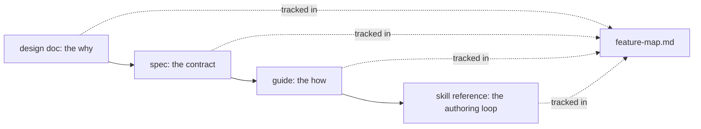
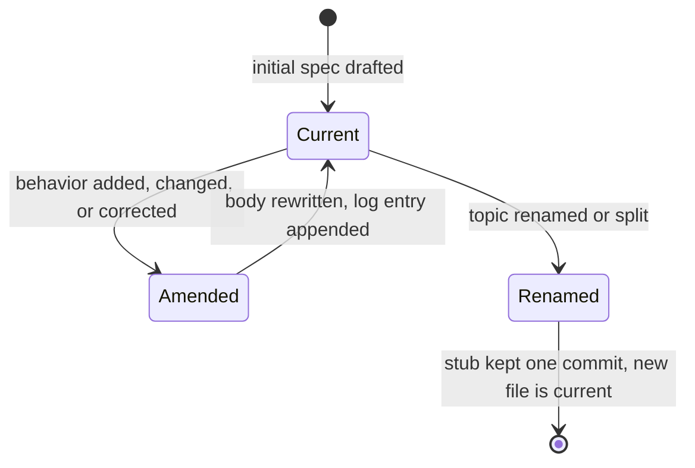

# docs

## What it does

[`docs/`](..) (excluding the generated [`docs/wiki/`](.)) is ignatius's documentation corpus: 76 markdown files plus [`docs/glossary.md`](../glossary.md), split across four directories that each answer a different question about a feature. [`docs/design/`](../design) (29 files) states why a feature exists and which approach was chosen over its alternatives. [`docs/spec/`](../spec) (35 files) is the implementation contract derived from a design: checkpoints, success criteria, and (for two specs so far) a change-tree/outline/flows triad. [`docs/guides/`](../guides) (10 files) teaches a user how to drive the built feature. [`docs/research/`](../research) (2 files) records background investigation that fed a design's option table. None of these files execute; every other domain's code and tests point back at them by name for the "why is it built this way" and "what is the contract" questions code alone can't answer.

[`README.md`](../../README.md) states the design/spec relationship directly: "Conceptual designs live in [`docs/design/`](../design); the implementation contracts derived from them live in [`docs/spec/`](../spec)."

## How it works

A feature's four surfaces are written by hand, in sequence, and kept in sync by a fifth file that is neither generated nor derived from any of them.

A design doc that never gets a spec (`markdown-driven-erd.md`) or a spec with no design doc (seven of them, see Where it lives) are both valid end states; `feature-map.md` records the actual per-feature surface set rather than assuming every feature has all four.

### A spec's body describes only current truth; correction and rename are explicit states

[`docs/spec/model-index-routing.md`](../spec/model-index-routing.md) alone carries four dated `## Change log` entries that append a **Superseded:** line rather than leaving the old text in place ("Reserved-name skip covers every scan, not just `data/`", "Correction: routers follow the folder tree, not declared groups", "Audit corrections", "Region boundaries are position-based"); a fifth entry, "Correction: `build.ts` does I/O", amends the body but carries no **Superseded:** line. [`docs/spec/noorm-modeling-skill.md`](../spec/noorm-modeling-skill.md) and [`docs/design/noorm-modeling-skill.md`](../design/noorm-modeling-skill.md) show the renamed-file end state: both are 12-line stubs whose body is one sentence pointing at `ignatius-modeling-skill.md`, kept only so a rename-era grep still finds them.

### The change-tree / outline / flows triad is opt-in by spec age, not by feature size

[`docs/spec/graph-flow-search.md`](../spec/graph-flow-search.md) and [`docs/spec/model-index-routing.md`](../spec/model-index-routing.md) are the only two of 35 specs carrying `## Change tree`, `## Outline`, and `## Flows` sections; the other 33 predate the rule that requires them and are not backfilled by an unrelated amendment. 28 of 35 specs also carry a `## Implementation log` (narrative build history: checkpoints landed, out-of-scope work performed, unforeseens, deferred items) — a section distinct from `## Change log`, which records contract amendments, not build narrative.

## Where it lives

### [`docs/design/`](../design) — conceptual/approach docs (29 files)

| Path | Lines | Covers |
|------|-------|--------|
| [`docs/design/model-index-routing.md`](../design/model-index-routing.md) | 476 | Per-folder generated routers (`index.md`), rolled-up SHA digests, `<ignatius-*>` managed regions, `index_file:`/`harness:` config, in-folder `AGENTS.md`/[`CLAUDE.md`](../../CLAUDE.md)/`SKILL.md` agent guidance |
| [`docs/design/markdown-driven-erd.md`](../design/markdown-driven-erd.md) | 333 | Canonical source for the markdown-driven entity file format; no [`docs/spec/`](../spec) counterpart |
| [`docs/design/process-flows.md`](../design/process-flows.md) | 218 | SSADM DFD subsystem: processes, externals, stores, sub-DFDs |
| [`docs/design/schema-lint-and-error-ux.md`](../design/schema-lint-and-error-ux.md) | 205 | Schema lint + error UX |
| [`docs/design/noorm-flow-discovery.md`](../design/noorm-flow-discovery.md) | 179 | `ignatius-modeling` skill's `flow` and `discover` Q&A modes |
| [`docs/design/key-inheritance-lineage.md`](../design/key-inheritance-lineage.md) | 175 | Key-edge connected-component lineage (FK ⊆ child PK), associative-entity traversal barriers |
| [`docs/design/ignatius-modeling-skill.md`](../design/ignatius-modeling-skill.md) | 160 | The `ignatius-modeling` skill itself |
| [`docs/design/branding.md`](../design/branding.md) | 160 | Branding system |
| [`docs/design/unified-app.md`](../design/unified-app.md) | 152 | Unified SPA collapse (Graph/Dictionary/Flows in one app) |
| [`docs/design/viewer-fab-ux.md`](../design/viewer-fab-ux.md) | 144 | Floating action button UX |
| [`docs/design/app-tsx-decomposition.md`](../design/app-tsx-decomposition.md) | 142 | `src/App.tsx` → [`src/app/`](../../src/app) decomposition |
| [`docs/design/cli-and-outputs.md`](../design/cli-and-outputs.md) | 135 | CLI modes and the static output approach |
| [`docs/design/example-instance-tables.md`](../design/example-instance-tables.md) | 135 | Example/sample-row instance tables |
| [`docs/design/viewer-ux-polish.md`](../design/viewer-ux-polish.md) | 133 | 6-fix viewer-ux-polish batch |
| [`docs/design/folder-model.md`](../design/folder-model.md) | 104 | Folder-model migration (`_*`-prefix vs hoisted top-level folders) |
| [`docs/design/keyboard-nav-shortcuts.md`](../design/keyboard-nav-shortcuts.md) | 110 | Single-key keyboard navigation shortcuts |
| [`docs/design/ignatius-project-config.md`](../design/ignatius-project-config.md) | 107 | `ignatius.yml` config + model discovery |
| [`docs/design/graph-position-persistence.md`](../design/graph-position-persistence.md) | 118 | Graph node position persistence |
| [`docs/design/dict-navigation.md`](../design/dict-navigation.md) | 100 | Data-dictionary side navigation |
| [`docs/design/dfd-edge-hover-data.md`](../design/dfd-edge-hover-data.md) | 100 | DFD edge-hover data reveal |
| [`docs/design/dfd-overhaul.md`](../design/dfd-overhaul.md) | 93 | DFD viewer overhaul: Yourdon/SSADM leveling, ELK layout, 5-band partitioning |
| [`docs/design/graph-flow-search.md`](../design/graph-flow-search.md) | 84 | Search on Graph and Flows views |
| [`docs/design/dfd-nesting-depth.md`](../design/dfd-nesting-depth.md) | 75 | Arbitrary DFD nesting depth fix |
| [`docs/design/bidirectional-predicates.md`](../design/bidirectional-predicates.md) | 67 | Bidirectional predicate feature |
| [`docs/design/help-overlay.md`](../design/help-overlay.md) | 62 | View-aware help overlay |
| [`docs/design/dd-spotlight-grid.md`](../design/dd-spotlight-grid.md) | 60 | DD browse-lens spotlight grid |
| [`docs/design/wiki-entity-links.md`](../design/wiki-entity-links.md) | 59 | Wiki-style `[[Entity]]` body links |
| [`docs/design/src-root-organization.md`](../design/src-root-organization.md) | 49 | [`src/`](../../src) top-level subdirectory split |
| [`docs/design/noorm-modeling-skill.md`](../design/noorm-modeling-skill.md) | 12 | Rename stub; points to `ignatius-modeling-skill.md` |

### [`docs/spec/`](../spec) — implementation contracts (35 files)

| Path | Lines | Covers |
|------|-------|--------|
| [`docs/spec/process-flows.md`](../spec/process-flows.md) | 682 | Largest spec; SSADM DFD: parse, 11 `flow.*` rules, viewer, sub-DFD drill-down, `db:` store dialog |
| [`docs/spec/key-inheritance-lineage.md`](../spec/key-inheritance-lineage.md) | 372 | `buildInheritedConnections` key-edge connected-component algorithm, DG/DD lineage reveal |
| [`docs/spec/model-index-routing.md`](../spec/model-index-routing.md) | 270 | Router build/write, fingerprint roll-up, `index_file`/`harness` config, four `config.index_file_*`/`index.*` rules, `--agents` guidance files |
| [`docs/spec/app-tsx-decomposition.md`](../spec/app-tsx-decomposition.md) | 246 | `App.tsx` decomposition |
| [`docs/spec/dd-spotlight-grid.md`](../spec/dd-spotlight-grid.md) | 239 | DD browse-lens spotlight grid |
| [`docs/spec/dfd-polish-round3.md`](../spec/dfd-polish-round3.md) | 238 | CP18–23 |
| [`docs/spec/render-perf-indexing.md`](../spec/render-perf-indexing.md) | 231 | Preset-layout cache-skip, ELK cost scaling, `buildModelIndex` |
| [`docs/spec/unified-app.md`](../spec/unified-app.md) | 216 | Unified SPA |
| [`docs/spec/ignatius-modeling-skill.md`](../spec/ignatius-modeling-skill.md) | 211 | `ignatius-modeling` skill contract |
| [`docs/spec/graph-flow-search.md`](../spec/graph-flow-search.md) | 199 | Graph/Flows search (SC1–SC12) |
| [`docs/spec/unified-app-polish.md`](../spec/unified-app-polish.md) | 194 | CP1–CP13 unified-app-polish batch |
| [`docs/spec/keyboard-nav-shortcuts.md`](../spec/keyboard-nav-shortcuts.md) | 189 | `resolveShortcut`, `useKeyboardShortcuts` |
| [`docs/spec/viewer-ux-polish.md`](../spec/viewer-ux-polish.md) | 180 | viewer-ux-polish batch |
| [`docs/spec/example-instance-tables.md`](../spec/example-instance-tables.md) | 170 | Example/sample-row instance tables |
| [`docs/spec/dfd-polish-round2.md`](../spec/dfd-polish-round2.md) | 169 | CP14–17 |
| [`docs/spec/dfd-polish-round4.md`](../spec/dfd-polish-round4.md) | 159 | CP24–26 |
| [`docs/spec/bidirectional-predicates.md`](../spec/bidirectional-predicates.md) | 157 | Bidirectional predicates |
| [`docs/spec/dfd-overhaul.md`](../spec/dfd-overhaul.md) | 155 | DFD viewer overhaul; success criteria C1–C18 |
| [`docs/spec/cli-and-outputs.md`](../spec/cli-and-outputs.md) | 144 | CLI output modes and theme system |
| [`docs/spec/schema-lint-and-error-ux.md`](../spec/schema-lint-and-error-ux.md) | 141 | Schema lint + error UX |
| [`docs/spec/folder-model.md`](../spec/folder-model.md) | 117 | Folder-model migration |
| [`docs/spec/ignatius-project-config.md`](../spec/ignatius-project-config.md) | 108 | `ignatius.yml` config loading + model discovery |
| [`docs/spec/graph-position-persistence.md`](../spec/graph-position-persistence.md) | 106 | Graph node position persistence |
| [`docs/spec/branding.md`](../spec/branding.md) | 102 | Branding |
| [`docs/spec/viewer-fab-ux.md`](../spec/viewer-fab-ux.md) | 101 | FAB UX |
| [`docs/spec/dict-navigation.md`](../spec/dict-navigation.md) | 90 | Dict side nav |
| [`docs/spec/dict-polish.md`](../spec/dict-polish.md) | 87 | Dict visual polish; no design-doc counterpart |
| [`docs/spec/noorm-flow-discovery.md`](../spec/noorm-flow-discovery.md) | 83 | `flow`/`discover` skill modes; skill-markdown-only |
| [`docs/spec/dfd-edge-hover-data.md`](../spec/dfd-edge-hover-data.md) | 83 | DFD edge-hover data reveal |
| [`docs/spec/src-root-organization.md`](../spec/src-root-organization.md) | 82 | [`src/`](../../src) directory split |
| [`docs/spec/wiki-entity-links.md`](../spec/wiki-entity-links.md) | 79 | Wiki-entity links |
| [`docs/spec/derive-classification.md`](../spec/derive-classification.md) | 72 | 5-rule classification derivation; no design-doc counterpart |
| [`docs/spec/dfd-nesting-depth.md`](../spec/dfd-nesting-depth.md) | 69 | DFD nesting-depth fix |
| [`docs/spec/help-overlay.md`](../spec/help-overlay.md) | 64 | Help overlay |
| [`docs/spec/noorm-modeling-skill.md`](../spec/noorm-modeling-skill.md) | 12 | Rename stub; points to `ignatius-modeling-skill.md` |

Seven specs ship without a design-doc counterpart: `dict-polish.md`, `derive-classification.md`, `render-perf-indexing.md`, `unified-app-polish.md`, `dfd-polish-round2.md`, `dfd-polish-round3.md`, `dfd-polish-round4.md`. Exactly one design doc ships without a spec: `markdown-driven-erd.md`.

### [`docs/guides/`](../guides) — user-facing how-to (10 files)

All ten are linked from [`README.md`](../../README.md)'s docs table. Six were updated for model-index-routing (marked below).

| Path | Lines | Covers |
|------|-------|--------|
| [`docs/guides/folder-format.md`](../guides/folder-format.md) | 256 | ★ `ignatius.yml`, the five top-level folders, entity/column/relationship authoring, `index_file:`/`harness:` config, generated routers, `description:` frontmatter |
| [`docs/guides/commands.md`](../guides/commands.md) | 174 | ★ The CLI subcommands including `index`/`index --agents`, `validate --index`, and the full keyboard-shortcut table |
| [`docs/guides/flows.md`](../guides/flows.md) | 150 | ★ DFDs: processes, externals, stores, sub-DFDs, `description:` on process/external/store |
| [`docs/guides/validation.md`](../guides/validation.md) | 137 | ★ The linter, severity tiers, and the new Config-rules/Index-rules tables (`config.index_file_*`, `index.stale`, `index.orphaned`, `index.unreadable_target`) |
| [`docs/guides/getting-started.md`](../guides/getting-started.md) | 93 | ★ Install, build from source, serve the first model; command list now names `index` |
| [`docs/guides/modeling-skill.md`](../guides/modeling-skill.md) | 73 | ★ The `/ignatius-modeling` skill's Q&A modes; verification loop now runs `ignatius validate --index` |
| [`docs/guides/derivation.md`](../guides/derivation.md) | 45 | What gets derived (cardinality, classification, subtype clusters) vs authored by hand |
| [`docs/guides/predicates.md`](../guides/predicates.md) | 83 | Bidirectional relationship-edge label authoring |
| [`docs/guides/themes-and-branding.md`](../guides/themes-and-branding.md) | 83 | `theme`/`branding` blocks in `ignatius.yml` |
| [`docs/guides/building-from-source.md`](../guides/building-from-source.md) | 50 | Bun build stages, project layout, tests |

### [`docs/research/`](../research) (2 files)

| Path | Lines | Covers |
|------|-------|--------|
| [`docs/research/dfd-layout-and-leveling.md`](../research/dfd-layout-and-leveling.md) | 129 | DFD layout engines and Yourdon leveling; primary source for `dfd-overhaul`'s ELK algorithm choice |
| [`docs/research/ssadm-dfd-rules.md`](../research/ssadm-dfd-rules.md) | 118 | SSADM DFD rules |

### [`docs/glossary.md`](../glossary.md) (52 lines)

Canonical vocabulary table: DG (Data Graph), DD (Data Dictionary), DFD (Data Flow Diagram), DE (Data Entity), DS (Data Store), EE (External Entity), Process, Data Flow, plus the DS ⊃ DE relationship note and the `kind:` store taxonomy (`db`/`cache`/`queue`/`file`/`doc`/`manual`/`other`).

[`docs/wiki/`](.) also lives under [`docs/`](..) as the generated signals wiki; it is separate, self-referential infrastructure, out of scope for this domain.

## Constraints

| Constraint | Detail |
|------------|--------|
| Spec body is forward-only | `docs/spec/<topic>.md` must describe only the current decision; superseded content moves to a dated `## Change log` entry with a **Superseded:** line. Leaving old text in the body instead means a subagent implementing from the spec reads a contradicted or stale contract as current truth |
| Change-tree/outline/flows apply forward only | The three required sections apply to specs drafted after the rule shipped; only 2 of 35 specs (`graph-flow-search.md`, `model-index-routing.md`) carry them. Backfilling them onto a pre-existing spec via an unrelated amendment would bundle an unrelated structural change into that amendment's `## Change log` entry, misstating what the amendment actually changed |
| Reserved router filename | `index_file:` (default `index.md`) is reserved model-wide: an entity file under `data/` sharing that basename and declaring `entity:` fails `config.index_file_entity` ([`docs/spec/model-index-routing.md`](../spec/model-index-routing.md) SC3) |
| Guidance files stay under 200 lines | `AGENTS.md`, [`CLAUDE.md`](../../CLAUDE.md), `SKILL.md` generated by `ignatius index --agents` carry only model name, description, router filename, key-style convention, and the `[[Entity]]` rule (SC11); adding entity/column/relationship content would make the file grow with the model and fail SC11 |
| Managed-region writes are byte-scoped | A generator (routers, or the `--agents` guidance files) owns only the bytes inside its own `<ignatius-*>` tag; a boundary is a tag starting at column 0 and ending its line, and mismatched/nested/orphan/unclosed tags throw with a line number rather than silently corrupting the file |

## Coupling

| Docs surface | Coupled domain | Coupling |
|---|---|---|
| [`docs/design/model-index-routing.md`](../design/model-index-routing.md) + [`docs/spec/model-index-routing.md`](../spec/model-index-routing.md) | **router** (new) | The pair is the sole source for [`src/router/`](../../src/router) (`region.ts`, `fingerprint.ts`, `build.ts`, `write.ts`, `detect.ts`, `agents.ts`); the spec's Change tree also names edits to **parser** ([`src/model/parse.ts`](../../src/model/parse.ts)), **validate** ([`src/model/validate.ts`](../../src/model/validate.ts)), **flows** ([`src/flows/flow-parse.ts`](../../src/flows/flow-parse.ts)), **cli** ([`src/cli/cli.ts`](../../src/cli/cli.ts)), and **skill** (`skills/ignatius-modeling/**`) |
| [`docs/spec/dfd-overhaul.md`](../spec/dfd-overhaul.md) | **flow-view**, **frontend** | Success criteria C4/C16/C17 cited by name in [`src/flow-view/elk-flow-layout.ts`](../../src/flow-view/elk-flow-layout.ts); all six (C4/C5/C13/C15/C16/C17) checked directly by [`test/checks/test-cp4b-elk-edge-routing.ts`](../../test/checks/test-cp4b-elk-edge-routing.ts) and siblings |
| [`docs/spec/graph-flow-search.md`](../spec/graph-flow-search.md) | **frontend** | SC5 cited by name in [`src/app/logic/search.ts`](../../src/app/logic/search.ts); CP1 checked by [`test/checks/test-viewer-search.ts`](../../test/checks/test-viewer-search.ts) |
| [`docs/spec/derive-classification.md`](../spec/derive-classification.md) | **parser**, **validate** | Cited by name in [`test/checks/test-validate-entity.ts`](../../test/checks/test-validate-entity.ts) for classification-derivation rules |
| [`docs/spec/example-instance-tables.md`](../spec/example-instance-tables.md) | **skill** | Names [`skills/ignatius-modeling/references/entity-flow.md`](../../skills/ignatius-modeling/references/entity-flow.md) and directs it to add Step E7b — Examples, between E7 (Columns) and E8 (Reference table) |
| [`docs/spec/process-flows.md`](../spec/process-flows.md) | **skill** | Its `flow.*` frontmatter/token grammar is matched by [`skills/ignatius-modeling/references/flow-templates.md`](../../skills/ignatius-modeling/references/flow-templates.md) |
| [`docs/guides/themes-and-branding.md`](../guides/themes-and-branding.md) | **theme**, **skill** | Its worked example is pointed to by [`skills/ignatius-modeling/references/model-flow.md`](../../skills/ignatius-modeling/references/model-flow.md) |
| [`docs/wiki/feature-map.md`](feature-map.md) | all domains | Hand-authored feature-to-doc-to-skill cross-reference table; not generated by this signals pipeline, maintained separately |
