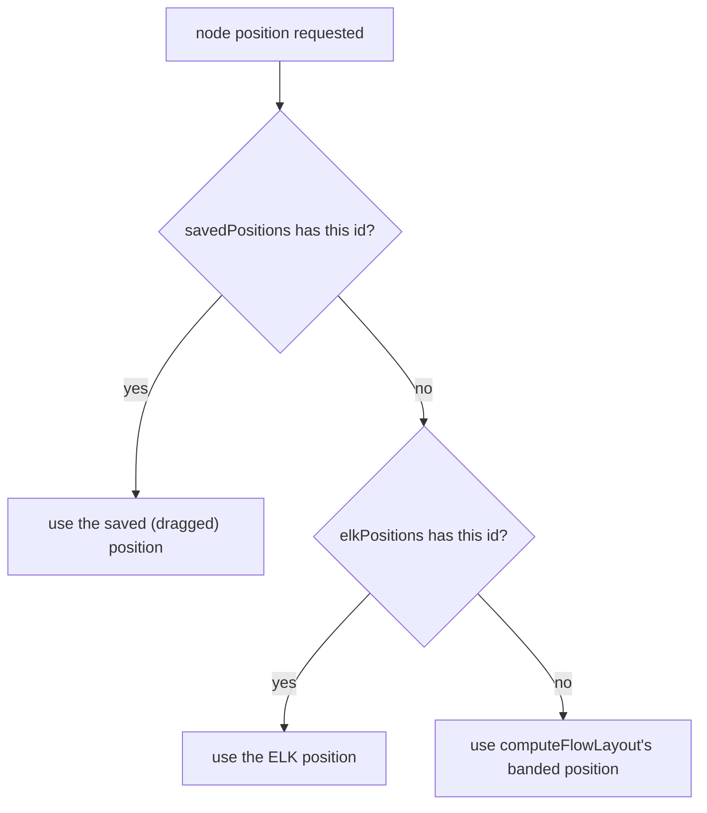
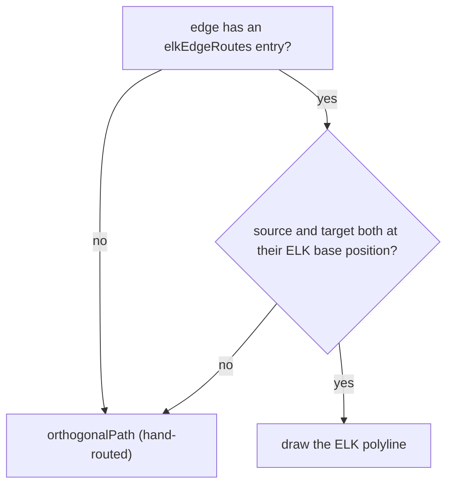
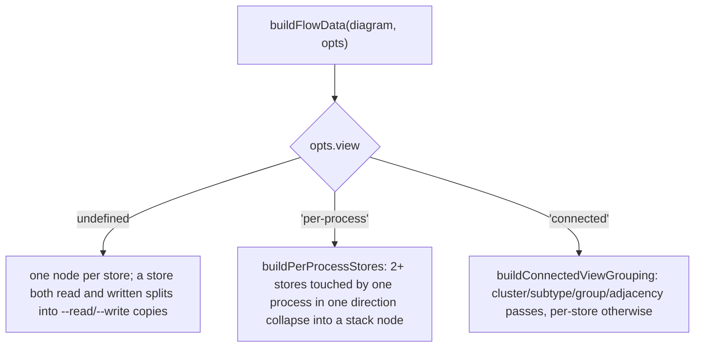
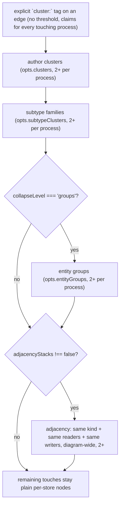
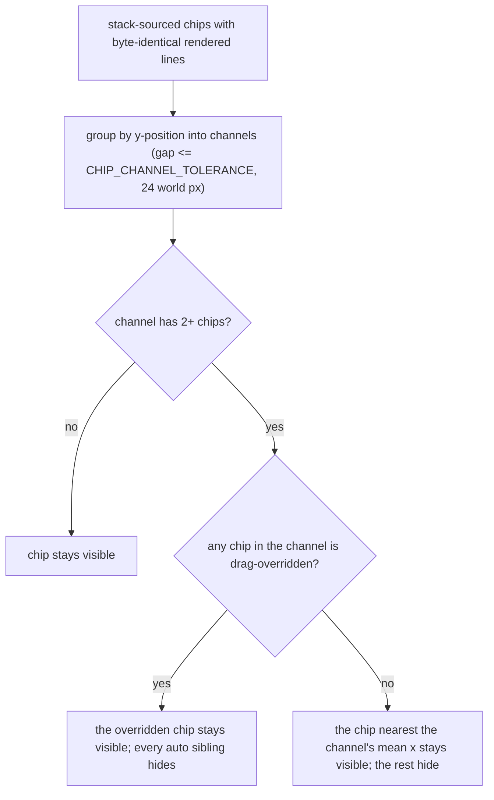

# flow-view

## What it does

[`src/flow-view/`](../../src/flow-view) turns a parsed `FlowDiagram` into on-screen positions, routed edges, and a rendered SVG. Without this domain the app has no DFD canvas: `flows` has parsed data with nowhere to draw, and the frontend's Flows tab is empty. Layout runs two ways — an async elkjs pass with 5-band partitioning and orthogonal edge routing, or a synchronous hand-rolled banded fallback used while ELK resolves or after it fails — and both feed the same custom SVG renderer, which also owns pan/zoom/drag, the minimap, breadcrumbs, edge-hover tooltips, and search-driven dimming.

A store is not always drawn one-to-one with an entity. When a process touches two or more stores in one direction, or (in the connected view) two or more stores share a cluster tag, author cluster, subtype family, group, or read/write/kind signature, they collapse into one **stack node** — a single box whose rows can represent individual stores or nested groupings, at a collapse level the caller controls. Two view modes decide how this grouping runs: **per-process** (the default) stacks each process's own reads and writes; **connected** keeps one node per store and only groups where clusters/subtypes/groups/adjacency say to. Both are global settings owned by the frontend shell, not this domain.

## How it works

### Position priority

A node's on-screen position resolves from whichever source is authoritative for it, checked in order — a user's own drag always wins.

`FlowDiagramSvg`'s `nodeBounds` and `elk-flow-layout.ts`'s `nodeSize` share their process and stack sizing (`processNodeSize`, `stackNodeSize`), so those two node types never disagree about where a box's edges are. External sizing is not shared: `nodeSize` computes an external's width as `estW(n.label, 6.6, 28, 110)` (label-length-dependent, 110px floor) with a fixed 52px height, while `nodeBounds` draws the renderer's own fixed `EXT_W = 120`, `EXT_H = 50` — ELK lays out an external against a box the SVG does not actually draw. For a stack node, `nodeBounds` centers the box on `stackNodeSize`'s official height (the same top ELK/`StackNode` use) but reports `stackRowLayout`'s full drawn height for `h` — the box's own peek-reserve padding is included in what chip placement and the viewBox treat as occupied space, even though ELK never sees it.

### Edge routing fallback

An edge draws ELK's routed polyline only when neither endpoint has moved off the position ELK computed for it; a dragged node reverts its edges to the live hand-router.

### View routing in buildFlowData

`buildFlowData(diagram, opts)` is the single entry point for node/edge construction; `opts.view` picks one of three independent builders.

`computeElkLayout` takes the same `opts` (`ComputeElkLayoutOpts extends BuildFlowDataOpts`) so ELK's node/edge id set always matches what `FlowDiagramSvg` builds against.

### Connected-view grouping order

Within the connected view, five passes run in a fixed order; each pass claims members from what the previous pass left, per process.

An author cluster's 2-per-process qualification (`qualifyPerProcess`, `STACK_THRESHOLD`) runs before the explicit-tag `existing` check, whether or not a `cluster:<slug>--<direction>` group already exists from step one — a process touching fewer than two of the cluster's members contributes nothing and is skipped, even when an explicit-tag group with the same id is already forming. Only a process that clears the threshold merges its members into that existing group, or starts a new one when no explicit-tag group exists. A process that touches only one member of a group another process qualified for still renders that member as its own plain node, flagged `duplicated`.

### Collapse level and a stack's dialog rows

`buildStackRows` (internal to `flow-layout.ts`) decides what each row inside a stack node represents, independent of which view produced the stack.

| Collapse level | Row content |
|---|---|
| `stores` | One row per member store; no grouping. |
| `clusters` | One row per explicit `cluster:`-tagged group and per subtype family with 2+ members in this stack, then one row per remaining loose store. |
| `groups` | One row per entity group with 2+ members in this stack (nesting its cluster/subtype and table rows as `children`), then a cluster/subtype spanning 2+ groups as its own row, then loose tables. |

A `store` row caps with its own `D#`; a `cluster`/`subtype` row caps `C`; a `group` row caps `G` — never a number, since only a store row is one. `stackRowBodyText(row)` returns the text a row renders (a store row's `displayName`, a grouped row's `<label> (<count>)`) and is what `stackNodeSize` measures to size the box; `StackNode` computes the same text inline rather than calling it.

### Chip content and the mixed-label rule

`resolveChipLines(label, hasAuthoredLabel)` turns a resolved edge label into the chip's rendered lines: an authored `label:` renders in full, split one item per line, never truncated; a column-preview fallback renders in full when short (`CHIP_TRUNCATE_MAX = 22` chars) or collapses to one line ending in `…` when long. For a stack edge whose members mix labelled and unlabelled entries, `resolveStackEdgeLabel` precomputes `chipLines` directly — the authored labels one per line, followed by exactly one gated column-preview line covering every unlabelled member — because re-splitting that combined string on `", "` would fragment the preview's own internal commas.

### Chip dedup

A stack read fanning out to every process that shares it repeats the identical label at the identical outlet once per process; `suppressDuplicateChips` collapses those to one visible chip.

Suppression is scoped to edges whose source resolves to a `'stack'` node — a plain process or store sending an identical label to two genuinely different destinations keeps both chips visible.

### Stacked-paper marker

A grouped row (`cluster`/`subtype`/`group`, never a plain `store` row) draws a "more inside" affordance in `StackNode`: the row's own bottom edge closes fully, then two sheets filled with the box colour are drawn behind it at `STACK_ROW_PEEK_GAP`-scaled offsets, each showing only a stair-stepped slice of its left edge, its own bottom edge, and a short mark where its top edge pokes out past the front box — never a full left edge or cap divider, so only the front row reads as a complete box. When the last row is grouped the drawn box ends on the back sheet's bottom edge (`stackRowLayout` drops the trailing clearance) and no separate closing line is drawn.

## Where it lives

| Path | Exports | Role |
|---|---|---|
| [`src/flow-view/elk-flow-layout.ts`](../../src/flow-view/elk-flow-layout.ts) (367L) | `computeElkLayout`, `buildElkGraph`, `nodeSize`, `bandOf`, `isDbEdge`, `SHORT_LABEL_MAX`, `isInlineLabel`, `terminateQuietly`, `ElkLayoutResult`, `ComputeElkLayoutOpts` | Async ELK layout: 5-band partitioning (source-ext=0, input-store=1, process-row=2, output-store=3, sink-ext=4), `ORTHOGONAL` edge routing. Per-process view sets `elk.separateConnectedComponents: 'false'` so disconnected stacks still obey band ordering. No Bun/Node-only APIs at module top level — browser-safe. |
| [`src/flow-view/flow-layout.ts`](../../src/flow-view/flow-layout.ts) (1761L) | `buildFlowData`, `computeFlowLayout`, `assignStoreNumbers`, `normalizeEdgeData`, `resolveChipLines`, `estProcessLineWidth`, `processNodeSize`, `stackNodeSize`, `stackRowLayout`, `stackRowBodyText`, `storeBodyWidth`, `measureText`, `layoutKeyForView`, `PROC_MIN_W`, `PROC_MIN_H`, `PROC_TEXT_LEFT`, `PROC_TEXT_RIGHT_PAD`, `PROC_LINE_H`, `PROC_TEXT_PAD_Y`, `STORE_ROW_H`, `STORE_CAP_W`, `STORE_STROKE_W`, `CHIP_TRUNCATE_MAX`, `STACK_ROW_PEEK_GAP`, `STACK_ROW_PEEK_RESERVE`, plus the `NodePos`/`StackMember`/`StackRow`/`ProcessNodeData`/`ExternalNodeData`/`StoreNodeData`/`StackNodeData`/`FlowNodeData`/`FlowElementData`/`BuildFlowDataOpts`/`FlowRenderData`/`StoreSplitMap` types | Renderer-agnostic layout: node/edge construction for all three views, the store split (read/write) map, external routing (max two aggregated copies per external), and the synchronous banded fallback (`computeFlowLayout`). `buildPerProcessStores`, `buildConnectedViewGrouping`, `buildStackRows`, and `resolveStackEdgeLabel` are internal, not exported. |
| [`src/flow-view/FlowDiagramSvg.tsx`](../../src/flow-view/FlowDiagramSvg.tsx) (2213L) | `FlowDiagramSvg`, `DARK_PALETTE`/`LIGHT_PALETTE` (`FlowPalette`), `ElkPositionMap`, `MinimapData`, `FlowDiagramSvgProps`, `nodeBounds`, `sizingInfo`, `suppressDuplicateChips`, `deoverlapChips`, `chipAnchor`, `elkChannelChip`, `computeEdgeAnchors`, `chipDims`, `boxesOverlap`, `FlowNode`, `FlowEdge`, `StackSizeInfo`, `EdgeAnchors`, `Box`, `Pt` | The SVG renderer: process/external/store/stack node drawing, pan/zoom/drag, edge-hover tooltip, chip placement and dedup, search-driven dimming (`searchTokens`, `baseToken`). Consumes `elkPositions`/`elkEdgeRoutes` from `computeElkLayout` and `flowDataOpts` passed straight through to `buildFlowData` — the two must agree on `opts` or their node/edge id sets diverge. |
| [`src/flow-view/FlowChrome.tsx`](../../src/flow-view/FlowChrome.tsx) (449L) | `FlowChrome`, `FlowChromeHandle`, `FlowChromeProps`, `BreadcrumbEntry` | Floating chrome around the SVG: breadcrumb chips, the DFD nav card (shown when more than one top-level diagram exists), and the bottom-left minimap (`FlowMinimap`, driven by an imperative `FlowChromeHandle` ref: `setStack`, `setDiagrams`, `setMinimap`, `setMinimapPanTo`). A `breadcrumbRef` + `ResizeObserver` writes the breadcrumb row's measured bottom edge into `--flow-search-bar-top` on `document.documentElement`. |
| [`src/flow-view/zoom-scale.ts`](../../src/flow-view/zoom-scale.ts) (74L) | `computeFitScale`, `screenScaleToPercent`, `percentToScreenScale`, `Size`, `Box` | Pure zoom/fit math, no DOM/React/Bun imports. Implements the native-1:1 zoom model: 100% means one diagram world-unit renders as one CSS pixel, not "fits the container." |

## Constraints

- `processNodeSize` and `stackNodeSize` are the single sizing source for both ELK and the SVG box for process and stack nodes — `elk-flow-layout.ts`'s `nodeSize` and `FlowDiagramSvg`'s `nodeBounds` both call them, so ELK never lays out a process or stack against a box different from what's drawn. Store width is not unified: `nodeSize`'s store branch computes ``estW(`D${storeNum} ${label}`, 6.6, 30, 150)`` independently of `FlowDiagramSvg`'s `storeWidth(name) = STORE_CAP_W + storeBodyWidth(name)`, so the same store name can lay out at a different width in ELK than it draws on canvas. Only `STORE_ROW_H` (row height) is actually shared for stores, via both files importing it from `flow-layout.ts`.
- `SHORT_LABEL_MAX` (`elk-flow-layout.ts`) derives from `CHIP_TRUNCATE_MAX` (`flow-layout.ts` = 22) rather than redeclaring it — one numeric source gates both ELK-side inline-chip eligibility and the on-canvas chip truncation. If the two diverged, ELK could reserve inline-chip layout space for a label the renderer then truncates on canvas, or the reverse, so the chip's estimated footprint would stop matching what's drawn.
- `STORE_STROKE_W = 1.4` is the single canonical stroke width for a store/stack box's outline and dividers; `STACK_ROW_PEEK_RESERVE` derives its clearance from it, so a future stroke-width change can't silently reopen the visual fusion between a grouped row's peek marks and the next row's own divider.
- Node positions are always centers (ELK top-left + half size), never top-left — `computeElkLayout` converts explicitly so ELK routes line up with the renderer's center-based `nodeBounds`.
- ELK receives node + edge geometry only, never label dummy nodes — label dummies split a band across two sub-layers; the renderer places all label placement itself (inline chip or truncated preview) in the inter-band channel.
- A stack node's official size (`stackNodeSize`, used by ELK and edge anchoring) counts only `STORE_ROW_H` per row; a grouped row's stacked-paper peek reserve is bottom padding on the *drawn* box only (`stackRowLayout`), so two stacks with the same row count always share the same official height regardless of whether one has a grouped row.
- The per-process view suppresses the duplicate-store marker on every stack row (`suppressDuplicateMarker`) — a shared store repeats in every process's own stack by design there, so the marker would cover nearly every row and stop marking anything exceptional. The underlying `duplicated` flag is untouched and still drawn in the connected view.
- `layoutKeyForView(baseKey, view)` appends the active view name to a diagram's fingerprint-derived layout key, so a drag saved in the per-process view never applies to the connected view or vice versa; collapse level is excluded from the key because it changes row content, not node ids. An empty `baseKey` (diagram not found in the fingerprint map) stays empty rather than gaining a view suffix with no fingerprint behind it.
- Chip dedup (`suppressDuplicateChips`) only ever hides chips whose edge source resolves to a `'stack'` node — a plain process or store can legitimately send an identical label to two different destinations, and both must stay visible.
- `buildFlowData`'s per-store branch (`opts.view` omitted) is byte-for-byte identical to its pre-stack behavior: a store both read and written by different processes still splits into `--read`/`--write` copies.

## Coupling

- **flows** ([`src/flows/`](../../src/flows)): every layout/render entry point takes a parsed `FlowDiagram` as input (`import type { FlowDiagram, FlowEdge, FlowStoreRef } from '../flows/flow-parse'` in `flow-layout.ts` and `elk-flow-layout.ts`) — type-only, no runtime dependency. flow-view never parses, validates, or levels diagrams itself; a shape change to `FlowDiagram`/`FlowStoreRef`/edge endpoint kinds forces a review of all four flow-view files that import them.
- **frontend** ([`src/app/`](../../src/app)): [`src/app/views/flow/FlowsView.tsx`](../../src/app/views/flow/FlowsView.tsx) is the sole orchestrator — it owns `flowViewParams` (`{ view, collapseLevel }`, default `{ view: 'per-process', collapseLevel: 'clusters' }`), calls `computeElkLayout(diagram, flowDataOpts)`, catches ELK failures so the renderer falls back to the banded layout, and calls `layoutKeyForView`. [`src/app/hash-router.ts`](../../src/app/hash-router.ts) owns the `FlowViewMode`/`FlowCollapseLevel` types and their `flowview=`/`collapse=` URL params — flow-view only consumes them through `BuildFlowDataOpts`, never defines or persists them. [`src/app/views/flow/LegendModal.tsx`](../../src/app/views/flow/LegendModal.tsx) imports `DARK_PALETTE`/`LIGHT_PALETTE` from `FlowDiagramSvg.tsx` directly. `FlowDiagramSvg.tsx` imports `PositionMap` from [`src/app/views/graph/layout-store`](../../src/app/views/graph/layout-store.ts) for drag persistence. `StackDialog` and the edge contract dialog live in [`src/app/components/flow-node/`](../../src/app/components/flow-node), outside this domain — `FlowDiagramSvg`'s `onOpenStack`/`onOpenContract` callbacks are the only link.
- **theme** ([`src/theme/`](../../src/theme)): `flow-layout.ts` and `FlowDiagramSvg.tsx` import `FlowKindKey`/`FlowKindEntry` from `src/theme/theme-defaults` for kind-colored store/external fills.
- [`src/app/logic/search.ts`](../../src/app/logic/search.ts)'s `searchFlowDiagrams` produces the same base tokens (role-split suffixes stripped) that `FlowDiagramSvg.tsx`'s `baseToken` strips to match against — a change to either suffix scheme has to stay in sync with the other.
- **docs**: [`docs/spec/dfd-store-clusters.md`](../spec/dfd-store-clusters.md) / [`docs/design/dfd-store-clusters.md`](../design/dfd-store-clusters.md) is the source of the stack-node model, the per-process/connected views, the collapse level, and the mixed-label chip rule. [`docs/spec/dfd-overhaul.md`](../spec/dfd-overhaul.md) / [`docs/design/dfd-overhaul.md`](../design/dfd-overhaul.md) is the source of the 5-band ELK layout contract (cited by name in `elk-flow-layout.ts`'s `bandOf`). [`docs/research/dfd-layout-and-leveling.md`](../research/dfd-layout-and-leveling.md) is the evidence base behind the ELK pipeline. [`docs/design/dfd-edge-hover-data.md`](../design/dfd-edge-hover-data.md) / [`docs/spec/dfd-edge-hover-data.md`](../spec/dfd-edge-hover-data.md) is the source of the edge-hover tooltip (`dataLines`, `tooltipLines`). [`docs/spec/viewer-ux-polish.md`](../spec/viewer-ux-polish.md) is the source of the native-1:1 zoom model in `zoom-scale.ts`. [`docs/design/graph-flow-search.md`](../design/graph-flow-search.md) / [`docs/spec/graph-flow-search.md`](../spec/graph-flow-search.md) is the source of the `searchTokens` dimming feature.
