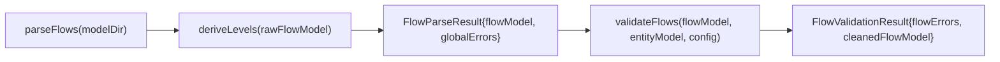
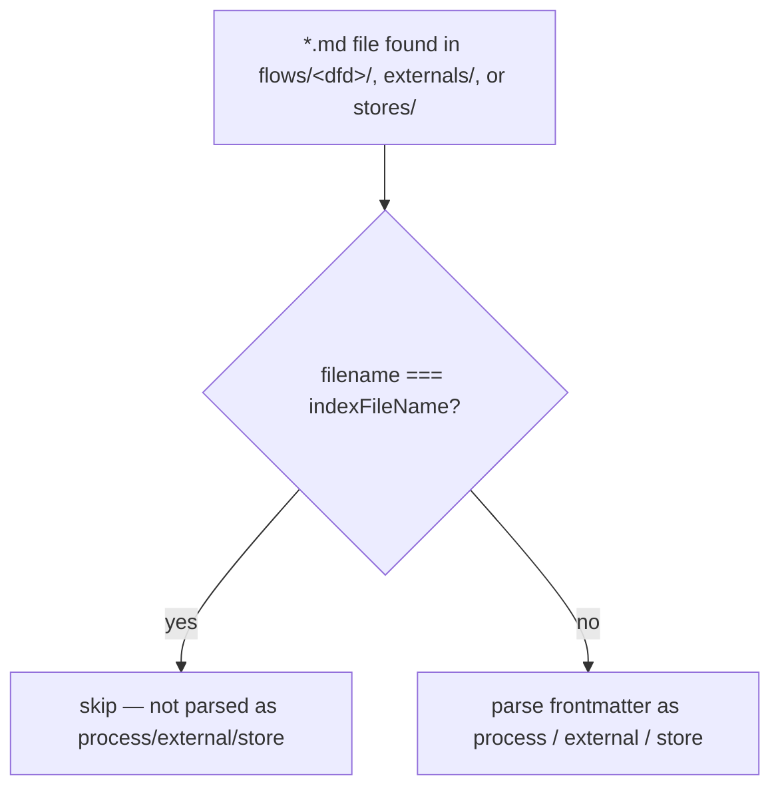
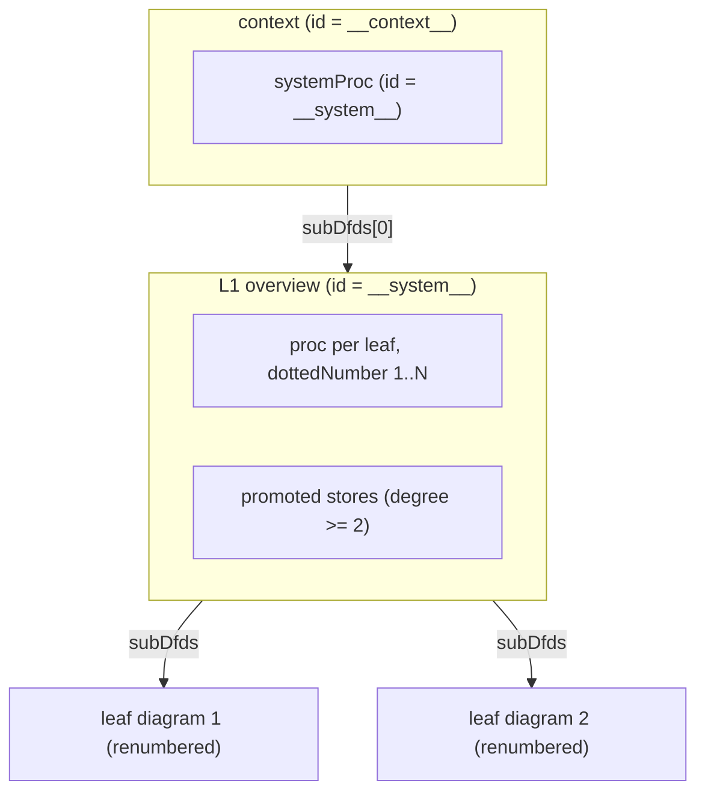
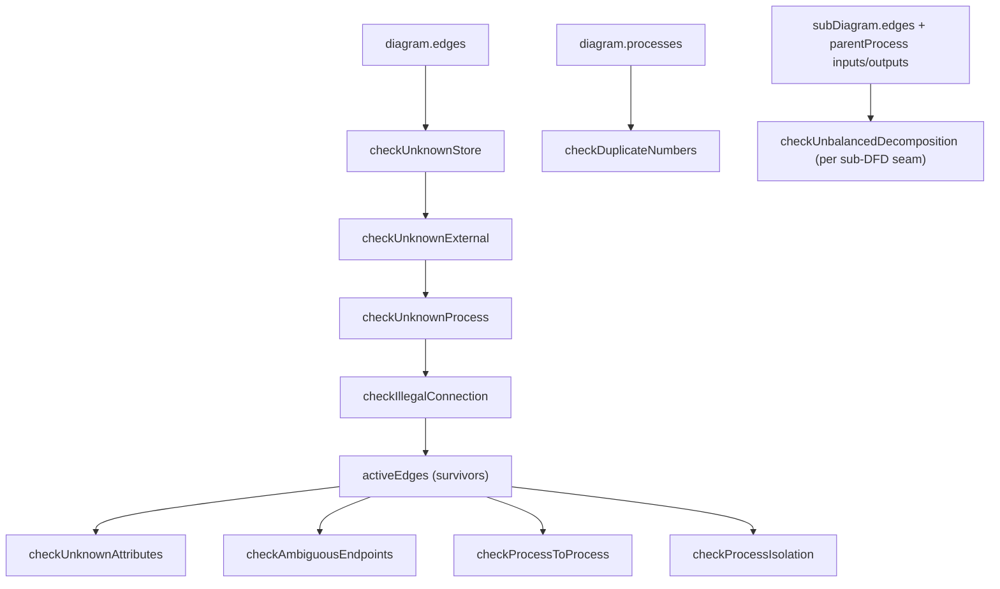

# flows

## What it does

[`src/flows/`](../../src/flows) turns a model's `flows/*/` process markdown into the SSADM data-flow-diagram tree that the app renders, validates, and cross-references. Without this domain the app has no DFD view at all: `flow-view` has nothing to lay out, `validate`'s `flow.*` rules have nothing to check, and the entity dialog's Processes tab has nothing to list. Six modules split the job: parse the leaf diagrams, synthesize the context/L1 diagrams above them, validate the whole tree against 12 `flow.*` rules, fingerprint each diagram's topology for layout caching, index which processes read or write each store/external, and turn slugs into display titles. Every module past the parser is pure and browser-safe — no Bun/Node I/O outside `flow-parse.ts` — so `flow-view` and the frontend can call them directly on data already in memory.

## How it works

**Pipeline: parse → level → validate.** `parseFlows` reads the model's DFD folders into flat leaf diagrams, then calls `deriveLevels` before returning, so every caller always receives the leveled tree, never raw leaves. `validateFlows` is a separate call the consumer makes afterward.

`deriveLevels` runs unconditionally inside `parseFlows` (`src/flows/flow-parse.ts:812`); `validateFlows` (`src/flows/flow-validate.ts:698`) is invoked separately by cli/server/generators once they also have the entity `Model`.

### Reserved-name skip during folder scans

`parseDiagramFolder`, `readExternalsDir`, and the root `stores/` scan in `parseFlows` all take the same `indexFileName` parameter (default `'index.md'`) and skip a file matching it before treating the rest as a process, external, or store definition.

Skip sites: `src/flows/flow-parse.ts:402` (externals), `:506` (process files), `:728` (stores).

### Level derivation: leaves wrapped in two synthetic diagrams

`deriveLevels` (`src/flows/flow-derive-levels.ts:406`) never mutates or re-parses leaves; it wraps the flat leaf array the parser produced inside a context (Level 0) diagram and an L1 overview diagram.

Context collects every external↔process boundary edge across all leaves and re-targets the process end at the single `systemProc`, deduped per `(extId, direction)` (`deriveContext`, `flow-derive-levels.ts:147`). L1 gets one process per leaf plus any store whose degree (distinct referencing leaves) is `>= 2` (`buildStoreDegreeMap` / `collectPromotedStores`, `flow-derive-levels.ts:56-91`); degree-1 stores stay local to their leaf and never appear at L1. `renumberDiagram` prefixes the L1 parent number onto each process's existing relative `dottedNumber` and recurses into `subDfds` at any depth, so a process 3 levels deep under leaf `N` gets `N.a.b.c` rather than losing its ancestry.

### Validation: Class B strips, Class A records

`validateDiagram` (`src/flows/flow-validate.ts:570`) runs four structural checks first, threading a growing `strippedEdgeIds` set through each so a store or process already implicated in one rule isn't double-flagged by the next. Only edges surviving all four (`activeEdges`) reach `checkUnknownAttributes`, `checkAmbiguousEndpoints`, `checkProcessToProcess`, and `checkProcessIsolation`. `checkDuplicateNumbers` reads `diagram.processes` directly, and `checkUnbalancedDecomposition` reads the sub-DFD's own edges and the parent process's declared inputs/outputs, both unfiltered by Class B stripping.

Class B (`flow.unknown_store`, `flow.unknown_external`, `flow.unknown_process`, `flow.illegal_connection`) strips the offending edge from `cleanedFlowModel`; Class A (`flow.unknown_attribute`, `flow.ambiguous_endpoint`, `flow.process_to_process`, `flow.process_no_input`/`flow.process_no_output`, `flow.duplicate_number`, `flow.unbalanced_decomposition`, `flow.store_naming_collision`) records a finding but strips nothing. `flow.process_to_process` is silenceable via `config.process_to_process === false`. `validateDiagram` skips all rule checks on the synthetic context/L1 diagrams (`diagram.id === CONTEXT_DIAGRAM_ID || diagram.id === SYSTEM_PROCESS_ID`, imported from `flow-derive-levels.ts`) but still recurses into their `subDfds` to reach real leaves. `checkStoreNamingCollisions` (`flow-validate.ts:649`) walks the whole tree once, before any per-diagram pass, to catch one store token resolving to conflicting `displayName`s across diagrams.

## Where it lives

| Path | Exports | Role |
|---|---|---|
| [`src/flows/flow-parse.ts`](../../src/flows/flow-parse.ts) (818L) | `parseFlows`, `parseProcessExamples`, `resolveEndpoint`, `FlowModel`/`FlowDiagram`/`FlowProcess`/`FlowExternal`/`FlowStoreRef`/`FlowEdge`/`FlowEndpoint`/`FlowExample`/`FlowExampleRow`/`FlowParseResult` types | SSADM DFD parser. Discovers DFD folders under `<modelDir>/flows/`; reads shared `externals/` and `stores/` registries once at model root; recurses into same-named sub-folders for nested sub-DFDs; calls `deriveLevels` before returning. The only module in this domain with Bun I/O (`Bun.file`, `Bun.Glob`). |
| [`src/flows/flow-derive-levels.ts`](../../src/flows/flow-derive-levels.ts) (434L) | `deriveLevels`, `CONTEXT_DIAGRAM_ID`, `SYSTEM_PROCESS_ID`, `SYNTHETIC_DIAGRAM_IDS` | Wraps flat leaves in a context + L1 synthetic diagram pair; store promotion by degree; recursive renumbering. Pure. |
| [`src/flows/flow-validate.ts`](../../src/flows/flow-validate.ts) (727L) | `validateFlows`, `FlowError`, `FlowRulesConfig`, `FlowValidationResult` | 12 `flow.*` rules, Class A/B split, cleaned-model rebuild. Pure. |
| [`src/flows/flow-fingerprint.ts`](../../src/flows/flow-fingerprint.ts) (90L) | `buildFlowLayoutKeys`, `layoutFlowFingerprint` | Hand-rolled FNV-1a 32-bit hash over sorted resolved `kind:name` ids and edge pairs, per diagram and recursively across the whole tree. Pure. |
| [`src/flows/flow-usage-index.ts`](../../src/flows/flow-usage-index.ts) (244L) | `buildEntityUsageIndex`, `buildFlowNodeUsageIndex`, `ProcessUsage` | `buildEntityUsageIndex` is the legacy `db:`-only index keyed by bare entity id; `buildFlowNodeUsageIndex` is the token-keyed superset (`"ext:Customer"`, `"file:gateway-log"`, `"db:Payment"`) covering every non-`proc` endpoint kind. Both recurse into `subDfds` and merge into a `'read' \| 'write' \| 'readwrite'` direction. Pure. `ProcessUsage` is consumed directly by seven [`src/app/`](../../src/app) files (`FlowNodeModal.tsx`, `EntityModal.tsx`, `ProcessesTable.tsx`, `ProcessesSection.tsx`, `EntityCard.tsx`, `FlowsView.tsx`, `DictionaryView.tsx`). |
| [`src/flows/titlelize.ts`](../../src/flows/titlelize.ts) (47L) | `titlelize` | Slug → Title Case (`order-to-cash` → `"Order To Cash"`, `HTTPRequest` → `"HTTP Request"`). Pure, framework-free. Used throughout the parser for display labels whenever no `title:` frontmatter override is present. |

## Constraints

- Endpoint tokens are always `kind:name` strings (`ext:Customer`, `db:Payment`, `file:gateway-log`, `proc:CreateOrder`); a bare name with no colon is parsed as `kind: 'proc'` (`parseEndpoint`, `flow-parse.ts:174`) and stays `proc` unless `checkAmbiguousEndpoints` (`flow-validate.ts:271`) finds the bare name in two or more of the external/store/process namespaces and fires `flow.ambiguous_endpoint`. `resolveEndpoint()` (`flow-parse.ts:218`) implements the same namespace check but is exercised only by [`test/checks/test-flow-endpoints.ts`](../../test/checks/test-flow-endpoints.ts), never called from production code.
- Every process's `id` must equal the `id` of its corresponding `subDfds` entry — `FlowsView`'s drill-down does `currentDiagram.subDfds.find(d => d.id === processId)`, and `deriveLevels`/`renumberDiagram` preserve this by construction. If the ids ever diverge, `.find()` returns `undefined`; `handleDrill` logs a `console.warn` and returns, so the click on the process silently does nothing in the UI.
- Display labels resolve in the same override order everywhere (process, external, store): explicit `title:` frontmatter → the type-specific field (`process:`/`external:`) or raw value → `titlelize(id)`. A top-level `description:` field on process, external, and store frontmatter is read independently of this label chain and carried onto `FlowProcess.description`, `FlowExternal.description`, and the store body map's `description`.
- `FlowStoreRef.kind` and `FlowExternal.kind` share the vocabulary `'db' | 'cache' | 'queue' | 'file' | 'doc' | 'manual' | 'other'` (externals additionally omit `'db'`); an absent `kind:` on an external means conventional green fill with no visual regression.
- Externals and stores are declared once at `<modelDir>/externals/` and `<modelDir>/stores/` and shared across every diagram and sub-DFD — there is no per-DFD override. `FlowModel.externals` carries the complete root registry (used by the validator's global-namespace checks); each `FlowDiagram.externals` holds only externals both referenced by that diagram's edges and defined in the root registry. `parseDiagramFolder` never globs for an `externals/` or `stores/` folder nested inside a `flows/<dfd>/` directory: one placed there is silently ignored, not treated as an override, and never raises a parse or validation error.
- Structural fingerprints and dotted numbers are never mixed into identity: `layoutFlowFingerprint` deliberately ignores labels, body text, column names, and numbering, so a cosmetic edit never invalidates a cached layout.
- A file named `index.md` inside `flows/<dfd>/`, `externals/`, or `stores/` is never parsed as a process, external, or store definition — the `indexFileName` skip applies identically in all three scan sites.

## Coupling

- **parser** ([`src/model/wikilink.ts`](../../src/model/wikilink.ts), [`src/model/markdown-highlight.ts`](../../src/model/markdown-highlight.ts), [`src/model/parse.ts`](../../src/model/parse.ts)) is a runtime dependency, not just a type import: `flow-parse.ts` wires `wikiLinkPlugin` and `highlightCodeFence` into its own `MarkdownIt` instance at module load, so `[[Target]]` links and code fences in process/external/store bodies render identically to ERD entity bodies. `flow-validate.ts` imports `type Model` from `parse.ts` and threads `entityModel: Model` through every rule-check function, reading `entityModel.nodes` directly to resolve `db:` endpoints against the entity model.
- **validate** ([`src/model/validate.ts`](../../src/model/validate.ts)) imports `type FlowError` from `flow-validate.ts` (type-only, no runtime circular dependency); defines the `flow.*` `RuleId` union and their explanation text; merges `flowErrors` into the combined validation summary. A new `flow.*` rule requires a matching entry in `validate.ts`'s `RuleId` union and explanation table.
- **cli** ([`src/cli/cli.ts`](../../src/cli/cli.ts)) dynamically imports `parseFlows` for the `validate`, `export`, and `index` commands; each folds flow Class-B errors into the same exit-code-1 decision as entity errors.
- **server** ([`src/server/server.ts`](../../src/server/server.ts)) imports `parseFlows`, `validateFlows`, and `buildFlowLayoutKeys` directly for the `/api/flow` route, returning `{ diagrams, entityModel, validation, flowLayoutKeys }`.
- **generators** ([`src/generators/app.ts`](../../src/generators/app.ts)) imports `type FlowModel` and `buildFlowLayoutKeys` to embed `window.__FLOW_MODEL__` and `window.__FLOW_LAYOUT_KEYS__` into the exported static HTML bundle; a null `flowModel` means no `flows/` directory existed.
- **flow-view** (`src/flow-view/*`) is a separate domain (ELK layout + SVG rendering). `elk-flow-layout.ts`, `flow-layout.ts`, `FlowChrome.tsx`, and `FlowDiagramSvg.tsx` import `type FlowDiagram`/`FlowStoreRef` only, no runtime dependency, but any shape change to `FlowDiagram`, `FlowProcess`, `FlowStoreRef`, or edge endpoint kinds forces a review of all four files. The frontend reads pre-computed layout keys from `window.__FLOW_LAYOUT_KEYS__` or the `/api/flow` payload rather than importing `flow-fingerprint.ts` directly.
- **router** ([`src/router/build.ts`](../../src/router/build.ts)) imports `FlowDiagram`, `FlowModel`, and `FlowStoreRef` directly and does its own structural walk (`diagram.subDfds.find(d => d.id === process.id)`) to resolve each process's sub-DFD when building router files, duplicating the drill-down lookup pattern documented in Constraints.
- **frontend** (`src/app/*`): `App.tsx`, `hooks/useModelData.ts`, `logic/doc-resolver.ts`, `logic/search.ts`, `logic/flow-spotlight.ts`, `views/flow/FlowsView.tsx`, `views/dict/DictionaryView.tsx`, `components/process/*`, `components/flow-node/*`, and `components/entity/*` import flow types and the usage-index builders directly. `SYNTHETIC_DIAGRAM_IDS` is imported by `DictionaryView.tsx` to exclude the context/L1 diagrams from the DD sidebar process list.
- **docs**: [`docs/design/process-flows.md`](../design/process-flows.md) / [`docs/spec/process-flows.md`](../spec/process-flows.md) (original DFD design and `flow.*` rule registry contract), [`docs/design/folder-model.md`](../design/folder-model.md) / [`docs/spec/folder-model.md`](../spec/folder-model.md) (root-registry restructure), [`docs/design/dfd-nesting-depth.md`](../design/dfd-nesting-depth.md) / [`docs/spec/dfd-nesting-depth.md`](../spec/dfd-nesting-depth.md) (arbitrary nesting depth, source of `renumberDiagram`), [`docs/design/dfd-overhaul.md`](../design/dfd-overhaul.md) / [`docs/spec/dfd-overhaul.md`](../spec/dfd-overhaul.md) (leveling half of the layout overhaul), [`docs/research/dfd-layout-and-leveling.md`](../research/dfd-layout-and-leveling.md), [`docs/research/ssadm-dfd-rules.md`](../research/ssadm-dfd-rules.md) (canonical SSADM/DFD reference backing the `flow.*` rules), and [`docs/guides/flows.md`](../guides/flows.md) (user-facing authoring guide).
