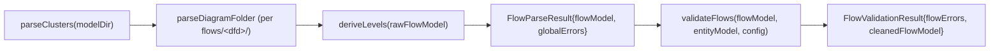
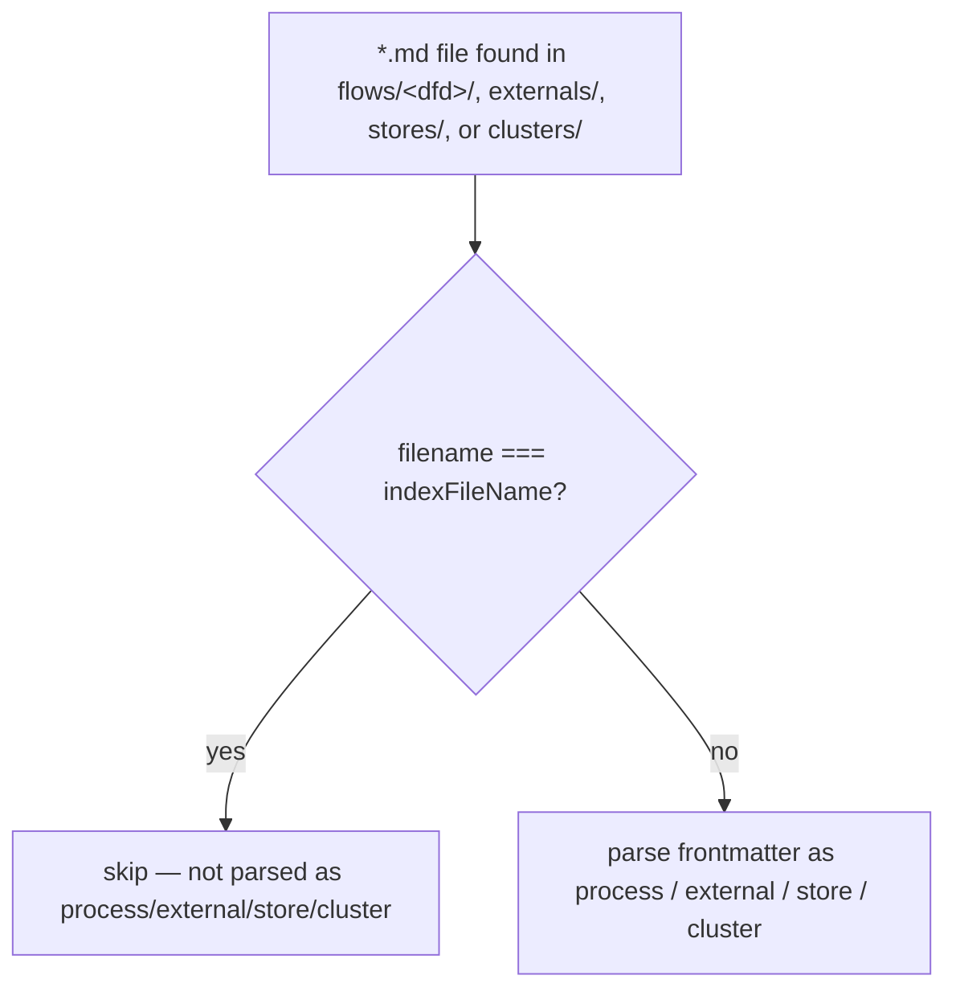
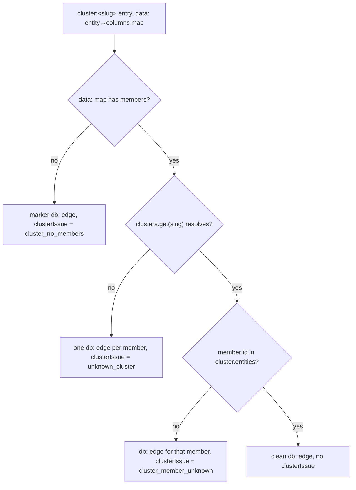
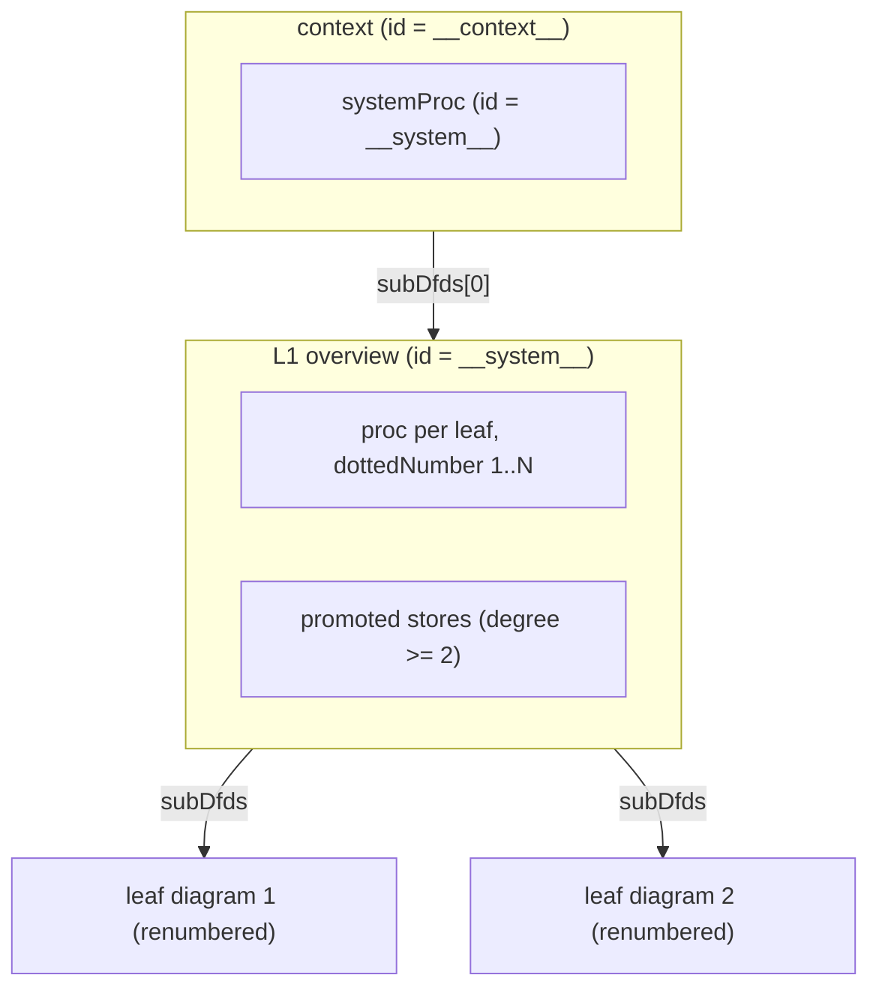
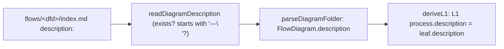
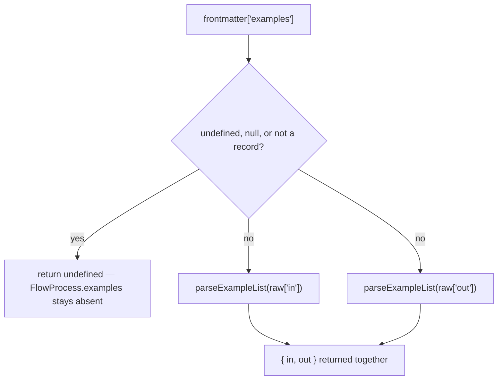
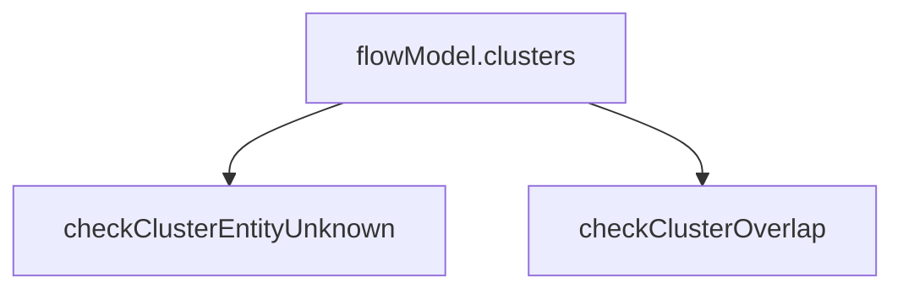
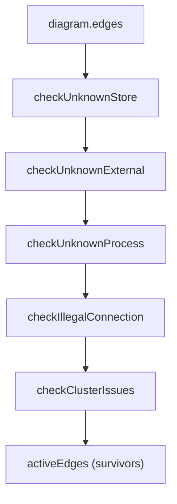

# flows

## What it does

[`src/flows/`](../../src/flows) turns a model's `flows/*/` process markdown into the SSADM data-flow-diagram tree that the app renders, validates, and cross-references. Without this domain the app has no DFD view at all: `flow-view` has nothing to lay out, `validate`'s `flow.*` rules have nothing to check, and the entity dialog's Processes tab has nothing to list. Eight modules split the job: parse the leaf diagrams (including each diagram folder's own `description:`), expand a `clusters/<slug>.md` author-defined group into member edges, synthesize the context/L1 diagrams above the leaves, validate the whole tree against 17 `flow.*` rules, fingerprint each diagram's topology for layout caching, index which processes read or write each store/external, and turn slugs into display titles. Every module except `flow-parse.ts` and `flow-clusters.ts` is pure and browser-safe — so `flow-view` and the frontend can call them directly on data already in memory.

`flow-clusters.ts`'s `cluster:` token names an entirely different concept than the `cluster.*` entity-subtype rules in [`src/model/validate.ts`](../../src/model/validate.ts). `flow.cluster_*` (this domain) is an author-declared group of *entities* under `clusters/<slug>.md`, expanded into `db:` edges on a DFD; `cluster.*` (the parser/validate domain) is a basetype/subtype grouping of entity records with a discriminator column. The two share the English word and nothing else — [`src/model/validate.ts`](../../src/model/validate.ts) declares `cluster.*` at lines 50-52 and `flow.cluster_*` at lines 67-71, within the same `RuleId` union but separated by the 12 diagram-scoped `flow.*` rules.

## How it works

**Pipeline: parse (with cluster expansion) → level → validate.** `parseFlows` reads the model's `clusters/` registry first, then folds `cluster:` expansion into every process's edge list as it walks `flows/*/`, then calls `deriveLevels` before returning — so every caller always receives the leveled tree, never raw leaves. `validateFlows` is a separate call the consumer makes afterward, once it also has the entity `Model`.

`parseClusters` (`src/flows/flow-clusters.ts:49`) runs unconditionally, even when no `flows/` folder exists, so a clusters-only model still reports its registry. `deriveLevels` runs unconditionally inside `parseFlows` (`src/flows/flow-parse.ts:883`); `validateFlows` (`src/flows/flow-validate.ts:821`) is invoked separately by [`src/cli/cli.ts`](../../src/cli/cli.ts) and [`src/server/server.ts`](../../src/server/server.ts) once they also have the entity `Model`. [`src/generators/app.ts`](../../src/generators/app.ts) never calls it: it only receives an already-validated `FlowModel` as a parameter.

### Reserved-name skip during folder scans

`parseDiagramFolder`, `readExternalsDir`, `parseClusters`, and the root `stores/` scan in `parseFlows` all take the same `indexFileName` parameter (default `'index.md'`) and skip a file matching it before treating the rest as a process, external, store, or cluster definition.

Skip sites: `src/flows/flow-parse.ts:430` (externals), `:568` (process files), `:798` (stores), `src/flows/flow-clusters.ts:59` (clusters).

### `cluster:` token expansion

A process `inputs`/`outputs` entry whose `from`/`to` is `cluster:<slug>` never reaches `parseEndpoint` — `buildEdgeFromInput`/`buildEdgeFromOutput` (`src/flows/flow-parse.ts:345`, `:364`) intercept the `cluster:` prefix and hand off to `expandClusterEdges` (`src/flows/flow-clusters.ts:92`), which turns the entry's `data:` map (entity id → columns) into one `db:` edge per mapped member. The closed `FlowEndpoint['kind']` set (`src/flows/flow-parse.ts:29-33`) never gains a `'cluster'` member — expansion happens before any `FlowEndpoint` is constructed for the entry.

An empty `data:` map wins over an unresolved slug: `expandClusterEdges` checks `members.length === 0` before it checks whether `clusters.get(slug)` resolved, so a `cluster:` entry with no mapped members always produces `cluster_no_members`, never `unknown_cluster`, even when the slug is also unknown. Every produced edge carries `cluster: { slug, label }` (`src/flows/flow-parse.ts:47-48`) regardless of whether it resolved; only an unresolved one also carries `clusterIssue`.

### Level derivation: leaves wrapped in two synthetic diagrams

`deriveLevels` (`src/flows/flow-derive-levels.ts:407`) never mutates or re-parses leaves; it wraps the flat leaf array the parser produced inside a context (Level 0) diagram and an L1 overview diagram.

Context collects every external↔process boundary edge across all leaves and re-targets the process end at the single `systemProc`, deduped per `(extId, direction)` (`deriveContext`, `flow-derive-levels.ts:147`). L1 gets one process per leaf plus any store whose degree (distinct referencing leaves) is `>= 2` (`buildStoreDegreeMap` / `collectPromotedStores`, `flow-derive-levels.ts:56-91`); degree-1 stores stay local to their leaf and never appear at L1. `renumberDiagram` prefixes the L1 parent number onto each process's existing relative `dottedNumber` and recurses into `subDfds` at any depth, so a process 3 levels deep under leaf `N` gets `N.a.b.c` rather than losing its ancestry. `deriveLevels` spreads the input `FlowModel` (`{ ...flowModel, diagrams: [contextDiagram] }`), so `FlowModel.clusters` passes through unchanged — leveling never touches the cluster registry.

### Diagram description: a folder's index file reaches its L1 process

A `flows/<dfd>/index.md` (or any nested sub-DFD folder's own index file) may carry `description:` in its frontmatter; `readDiagramDescription` (`src/flows/flow-parse.ts:490`) reads it and `parseDiagramFolder` (`:517`) sets it as `FlowDiagram.description` on the diagram it returns, whether that diagram is a top-level flow folder or a nested sub-DFD. `deriveL1` (`flow-derive-levels.ts:235`) then copies each top-level leaf's `description` onto that leaf's L1 process (`:265`) — a nested sub-DFD's own description is never copied anywhere by leveling, and the context/L1 diagram objects themselves never get a `description` of their own.

`readDiagramDescription` checks `content.startsWith('---\n')` before calling `parseFrontmatter`, rather than calling it unconditionally the way process/external/store parsing does. Because `flows/<dfd>/index.md` is also the file `ignatius index` regenerates (owning only its `<ignatius-*>` regions), a router-only index file with no hand-authored frontmatter at all yields `undefined` silently — it is never reported as `parse.invalid_yaml`. A missing index file (`file.exists()` false) yields the same `undefined`. Frontmatter that does start with the delimiter but fails to parse (bad YAML) still reports `parse.invalid_yaml` against the index path, same as every other frontmatter parse failure in this domain. [`test/checks/test-flow-diagram-description.ts`](../../test/checks/test-flow-diagram-description.ts) (imports `parseFlows` and `SYSTEM_PROCESS_ID` from this domain, plus `buildRouters`/`writeRouters` from [`src/router/`](../../src/router)) exercises: a described folder reaching `FlowDiagram.description` and its L1 process; an undescribed folder staying `undefined` with no error; a sub-DFD folder with no index file never inheriting its owning process's description; and malformed index frontmatter reporting `parse.invalid_yaml`.

### `parseProcessExamples`: defensive parsing of the `examples:` block

`parseProcessExamples` (`src/flows/flow-parse.ts:280`) converts a process's `examples:` frontmatter into `{ in: FlowExample[]; out: FlowExample[] }`. It never throws on malformed input; every layer of the shape either returns a fully-typed empty value or drops the offending element.

A malformed or absent `examples:` block never produces a partial result: either both `in` and `out` arrays come back, or the whole field is `undefined` and `FlowProcess.examples` is omitted (`parseDiagramFolder`, `flow-parse.ts:688`, only sets `examples` when `parsedExamples` is truthy).

Inside `parseExampleList` (`:286`), a non-array `in`/`out` value yields `[]`; an item that isn't a record is skipped outright rather than raising a parse error; a kept item copies `from`/`to`/`label` only when each is a string, and always hands `item['rows']` to `parseExampleRows` regardless of whether the item carried any of those three fields. `parseExampleRows` (`:300`) applies the same defensive pattern one level down: a non-array `rows:` value or an absent `rows:` key yields `rows: []` rather than an error, a non-record row is skipped, and within a kept row only the scalar-valued keys (`string`, `number`, or `boolean`) are copied into the `FlowExampleRow` — a key whose value is a nested object or array is silently dropped. Rows are never padded to a common key set: two rows in the same `in`/`out` entry can declare different columns, and each `FlowExampleRow` reflects only the keys its own frontmatter row had. [`test/checks/test-cp16-process-examples.ts`](../../test/checks/test-cp16-process-examples.ts) exercises the null-guard and the missing-rows branch directly against synthetic input (the live [`models/key-inherited`](../../models/key-inherited) fixture has no such entries) alongside a live-fixture pass over `Collect-Payment`'s `examples:` block that checks the happy path and the heterogeneous-column case.

### Validation: cluster-registry checks run once, before any diagram walk

`validateFlows` (`src/flows/flow-validate.ts:821`) runs two cluster-registry checks once against the whole `clusters/` list before it ever walks a diagram, then calls `validateDiagram` per top-level diagram.

Both registry checks run once, independent of any per-diagram pass that follows.

### Validation: Class B strip pipeline narrows edges before Class A sees them

`validateDiagram` (`:632`) runs five structural (Class B) checks first, threading a growing `strippedEdgeIds` set through each so a store, process, or cluster reference already implicated in one rule isn't double-flagged by the next.

Each Class B check inherits the edge set the previous one already narrowed, so the five run in a fixed order.

Only edges surviving all five (`activeEdges`) reach Class A. Four Class A checks then each run independently over `activeEdges`, with no ordering dependency between them: `checkUnknownAttributes`, `checkAmbiguousEndpoints`, `checkProcessToProcess`, `checkProcessIsolation`. Two further Class A checks read different inputs and bypass `activeEdges` entirely: `checkDuplicateNumbers` reads `diagram.processes` directly, and `checkUnbalancedDecomposition` reads the sub-DFD's own edges and the parent process's declared inputs/outputs — neither is filtered by Class B stripping.

Class B (`flow.unknown_store`, `flow.unknown_external`, `flow.unknown_process`, `flow.illegal_connection`, `flow.unknown_cluster`, `flow.cluster_member_unknown`) strips the offending edge from `cleanedFlowModel`; Class A (`flow.unknown_attribute`, `flow.ambiguous_endpoint`, `flow.process_to_process`, `flow.process_no_input`/`flow.process_no_output`, `flow.duplicate_number`, `flow.unbalanced_decomposition`, `flow.store_naming_collision`, `flow.cluster_no_members`, `flow.cluster_entity_unknown`, `flow.cluster_overlap`) records a finding; `flow.cluster_no_members` is the one Class-A rule whose edge is still stripped (`checkClusterIssues` strips all three `clusterIssue` cases regardless of class, since a marker or unresolved-member edge must never reach the renderer as a store). `flow.process_to_process` is silenceable via `config.process_to_process === false`. `validateDiagram` skips all rule checks on the synthetic context/L1 diagrams (`diagram.id === CONTEXT_DIAGRAM_ID || diagram.id === SYSTEM_PROCESS_ID`, imported from `flow-derive-levels.ts`) but still recurses into their `subDfds` to reach real leaves. `checkStoreNamingCollisions` (`flow-validate.ts:715`) walks the whole tree once, before any per-diagram pass, to catch one store token resolving to conflicting `displayName`s across diagrams.

## Where it lives

| Path | Exports | Role |
|---|---|---|
| [`src/flows/flow-parse.ts`](../../src/flows/flow-parse.ts) (889L) | `parseFlows`, `parseProcessExamples`, `resolveEndpoint`, `FlowModel`/`FlowDiagram`/`FlowProcess`/`FlowExternal`/`FlowStoreRef`/`FlowEdge`/`FlowEndpoint`/`FlowExample`/`FlowExampleRow`/`FlowParseResult` types | SSADM DFD parser. Discovers DFD folders under `<modelDir>/flows/`; reads shared `externals/`, `stores/`, and `clusters/` registries once at model root; recurses into same-named sub-folders for nested sub-DFDs; reads each diagram folder's `index.md` `description:` (`readDiagramDescription`) onto `FlowDiagram.description`; calls `deriveLevels` before returning. Has Bun I/O (`Bun.file`, `Bun.Glob`), alongside `flow-clusters.ts`. |
| [`src/flows/flow-clusters.ts`](../../src/flows/flow-clusters.ts) (130L) | `parseClusters`, `expandClusterEdges`, `toClusterDataMap`, `FlowCluster` type | Reads `<modelDir>/clusters/*.md` into a slug → `FlowCluster` map; expands a `cluster:<slug>` input/output entry into one `db:` edge per mapped member, tagging unresolved cases with `clusterIssue`. Has Bun I/O (`Bun.file`, `Bun.Glob`), called only from `flow-parse.ts`. |
| [`src/flows/flow-markdown.ts`](../../src/flows/flow-markdown.ts) (39L) | `md`, `isRecord`, `parseFrontmatter`, `normalizedLabel` | Shared frontmatter-delimiter parsing and the wikilink-enabled `MarkdownIt` instance, so `flow-parse.ts` (processes, externals, stores, diagram descriptions) and `flow-clusters.ts` (clusters) never fork the YAML regex or renderer config. `isRecord` also backs every defensive check in `parseProcessExamples`. |
| [`src/flows/flow-derive-levels.ts`](../../src/flows/flow-derive-levels.ts) (435L) | `deriveLevels`, `CONTEXT_DIAGRAM_ID`, `SYSTEM_PROCESS_ID`, `SYNTHETIC_DIAGRAM_IDS` | Wraps flat leaves in a context + L1 synthetic diagram pair; store promotion by degree; recursive renumbering; copies each top-level leaf's `description` onto its L1 overview process. Pure. |
| [`src/flows/flow-validate.ts`](../../src/flows/flow-validate.ts) (853L) | `validateFlows`, `FlowError`, `FlowRulesConfig`, `FlowValidationResult` | 17 `flow.*` rules (12 diagram-scoped + 5 `flow.cluster_*`), Class A/B split, cleaned-model rebuild. Pure. |
| [`src/flows/flow-fingerprint.ts`](../../src/flows/flow-fingerprint.ts) (90L) | `buildFlowLayoutKeys`, `layoutFlowFingerprint` | Hand-rolled FNV-1a 32-bit hash over sorted resolved `kind:name` ids and edge pairs, per diagram and recursively across the whole tree. Pure. |
| [`src/flows/flow-usage-index.ts`](../../src/flows/flow-usage-index.ts) (244L) | `buildEntityUsageIndex`, `buildFlowNodeUsageIndex`, `ProcessUsage` | `buildEntityUsageIndex` is the legacy `db:`-only index keyed by bare entity id; `buildFlowNodeUsageIndex` is the token-keyed superset (`"ext:Customer"`, `"file:gateway-log"`, `"db:Payment"`) covering every non-`proc` endpoint kind. Both recurse into `subDfds` and merge into a `'read' \| 'write' \| 'readwrite'` direction. Pure. `ProcessUsage` is consumed directly by seven [`src/app/`](../../src/app) files (`FlowNodeModal.tsx`, `EntityModal.tsx`, `ProcessesTable.tsx`, `ProcessesSection.tsx`, `EntityCard.tsx`, `FlowsView.tsx`, `DictionaryView.tsx`). |
| [`src/flows/titlelize.ts`](../../src/flows/titlelize.ts) (47L) | `titlelize` | Slug → Title Case (`order-to-cash` → `"Order To Cash"`, `HTTPRequest` → `"HTTP Request"`). Pure, framework-free. Used throughout the parser for display labels whenever no `title:` frontmatter override is present. |

## Constraints

- Endpoint tokens are always `kind:name` strings (`ext:Customer`, `db:Payment`, `file:gateway-log`, `proc:CreateOrder`); a bare name with no colon is parsed as `kind: 'proc'` (`parseEndpoint`, `flow-parse.ts:187`) and stays `proc` unless `checkAmbiguousEndpoints` (`flow-validate.ts:333`) finds the bare name in two or more of the external/store/process namespaces and fires `flow.ambiguous_endpoint`. `resolveEndpoint()` (`flow-parse.ts:231`) implements the same namespace check but is exercised only by [`test/checks/test-flow-endpoints.ts`](../../test/checks/test-flow-endpoints.ts), never called from production code. `cluster:` is not, and never becomes, a member of `FlowEndpoint['kind']` — `buildEdgeFromInput`/`buildEdgeFromOutput` consume the prefix before any endpoint is parsed.
- `flow.cluster_*` (this domain's author-cluster rules on `FlowEdge.clusterIssue`) and `cluster.*` (the entity-subtype rules in [`src/model/validate.ts`](../../src/model/validate.ts) operating on `Model.subtypeClusters`) are unrelated rule families that happen to share a name root; [`src/model/validate.ts`](../../src/model/validate.ts) declares both within the same `RuleId` union (`cluster.*` at lines 50-52, `flow.cluster_*` at lines 67-71), and a reader scanning by prefix alone will conflate them.
- An `expandClusterEdges` entry with an empty `data:` map always yields `flow.cluster_no_members`, even when the `clusters/<slug>.md` file also doesn't exist — the empty-map check runs before the slug-resolution check (`flow-clusters.ts:107-117`).
- `parseProcessExamples` (`flow-parse.ts:280`) never errors on malformed `examples:` input: an absent/`null`/non-record value returns `undefined` (no `examples` field at all, rather than `{in: [], out: []}`); a non-array `in`/`out` list, a non-record item, or a missing/non-array `rows:` key all degrade to an empty array; and within a kept row only `string`/`number`/`boolean`-valued keys survive, silently dropping any key whose value is an object or array. Rows are never padded to a common key set across an entry — heterogeneous rows are stored exactly as authored.
- `readDiagramDescription` (`flow-parse.ts:490`) never reports an error for a missing index file, a missing `description:` key, or an index file whose content doesn't start with `---\n` (the router-only case) — all three collapse to `FlowDiagram.description` staying `undefined`. It reports `parse.invalid_yaml` only when the file does start with the delimiter but the YAML itself fails to parse. It runs for every diagram folder the recursion visits, top-level `flows/<dfd>/` and any nested sub-DFD folder alike, but `deriveLevels` only ever reads it off the top-level leaves; a nested sub-DFD's own description is set on that `FlowDiagram` but never copied onto anything by leveling.
- Every process's `id` must equal the `id` of its corresponding `subDfds` entry — `FlowsView`'s drill-down does `currentDiagram.subDfds.find(d => d.id === processId)`, and `deriveLevels`/`renumberDiagram` preserve this by construction. If the ids ever diverge, `.find()` returns `undefined`; `handleDrill` logs a `console.warn` and returns, so the click on the process silently does nothing in the UI.
- Display labels all fall back to `titlelize(id)` eventually, but the chain length before that varies by resource type: process and external check an explicit `title:` frontmatter override, then the type-specific field (`process:` at `src/flows/flow-parse.ts:601-604`, `external:` at `:448-451`), then `titlelize(id)`; store and cluster have no type-specific field to fall through to, so their override goes straight to `titlelize(id)` (`title:` for stores at `src/flows/flow-parse.ts:810-813`, `label:` for clusters at `src/flows/flow-clusters.ts:65`). A top-level `description:` field on process, external, and store frontmatter is read independently of this label chain and carried onto `FlowProcess.description`, `FlowExternal.description`, and the store body map's `description`. A diagram folder's own `description:` (its `flows/<dfd>/index.md`) is a fourth, separate `description:` source, read by `readDiagramDescription` rather than the per-resource frontmatter parsing above, and lands on `FlowDiagram.description` instead of any process/external/store record. A reader who assumes the two chains behave identically will expect that omitting `title:`/`label:` on a store or cluster still leaves a human-authored fallback in place the way it does for a process or external (whose `process:`/`external:` field supplies one) — it doesn't: without `title:`/`label:`, a store or cluster falls straight to `titlelize(id)`, with no intermediate authored field to catch it.
- `FlowStoreRef.kind` and `FlowExternal.kind` share the vocabulary `'db' | 'cache' | 'queue' | 'file' | 'doc' | 'manual' | 'other'` (externals additionally omit `'db'`), but `kind:` is not equally required on both: a store's `kind:` is its type discriminator, while an external's is optional. An external without `kind:` is not a gap: it renders with the conventional green fill, not an error or an unstyled node.
- Externals, stores, and clusters are declared once at `<modelDir>/externals/`, `<modelDir>/stores/`, and `<modelDir>/clusters/`, and shared across every diagram and sub-DFD — there is no per-DFD override. `FlowModel.externals` carries the complete root registry (used by the validator's global-namespace checks); each `FlowDiagram.externals` holds only externals both referenced by that diagram's edges and defined in the root registry. `parseDiagramFolder` never globs for an `externals/` or `stores/` folder nested inside a `flows/<dfd>/` directory: one placed there is silently ignored, not treated as an override, and never raises a parse or validation error.
- Structural fingerprints and dotted numbers are never mixed into identity: `layoutFlowFingerprint` deliberately ignores labels, body text, column names, and numbering, so a cosmetic edit never invalidates a cached layout.
- A file named `index.md` inside `flows/<dfd>/`, `externals/`, `stores/`, or `clusters/` is never parsed as a process, external, store, or cluster definition — the `indexFileName` skip applies identically in all four scan sites. A process, external, store, or cluster authored into a file literally named `index.md` is silently dropped: it never parses into the model, and no error or warning flags the loss. That same file is the one `readDiagramDescription` reads for a diagram's `description:`, so `index.md` is dual-purpose by design in `flows/<dfd>/`: never a process, always the description source.

## Coupling

- **parser** ([`src/model/wikilink.ts`](../../src/model/wikilink.ts), [`src/model/markdown-highlight.ts`](../../src/model/markdown-highlight.ts), [`src/model/parse.ts`](../../src/model/parse.ts)) is a runtime dependency, not just a type import: `flow-markdown.ts` wires `wikiLinkPlugin` and `highlightCodeFence` into the shared `MarkdownIt` instance at module load, so `[[Target]]` links and code fences in process/external/store/cluster bodies render identically to ERD entity bodies. `flow-validate.ts` imports `type Model` from `parse.ts` and threads `entityModel: Model` through every rule-check function, reading `entityModel.nodes` directly to resolve `db:` endpoints against the entity model, and `checkClusterEntityUnknown` reads the same `entityModel.nodes` to validate a cluster's `entities:` list.
- **validate** ([`src/model/validate.ts`](../../src/model/validate.ts)) imports `type FlowError` from `flow-validate.ts` (type-only, no runtime circular dependency); defines the `flow.*` `RuleId` union (17 entries, including the 5 `flow.cluster_*` ones) and their explanation text, alongside the unrelated `cluster.*` entity-subtype `RuleId` range; merges `flowErrors` into the combined validation summary. A new `flow.*` rule requires a matching entry in `validate.ts`'s `RuleId` union and explanation table.
- **cli** ([`src/cli/cli.ts`](../../src/cli/cli.ts)) dynamically imports `parseFlows` for the `validate`, `export`, and `index` commands; each folds flow Class-B errors into the same exit-code-1 decision as entity errors.
- **server** ([`src/server/server.ts`](../../src/server/server.ts)) imports `parseFlows`, `validateFlows`, and `buildFlowLayoutKeys` directly for the `/api/flow` route, returning `{ diagrams, entityModel, validation, flowLayoutKeys, clusters }` — `clusters` is `flowModel.clusters`, the full `FlowCluster[]` registry.
- **generators** ([`src/generators/app.ts`](../../src/generators/app.ts)) imports `type FlowModel` and `buildFlowLayoutKeys` to embed `window.__FLOW_MODEL__`, `window.__FLOW_LAYOUT_KEYS__`, and `window.__FLOW_CLUSTERS__` (`flowModel.clusters`) into the exported static HTML bundle; a null `flowModel` means no `flows/` directory existed.
- **router** ([`src/router/build.ts`](../../src/router/build.ts)) imports `FlowDiagram`, `FlowModel`, and `FlowStoreRef` directly and does its own structural walk (`diagram.subDfds.find(d => d.id === process.id)`) to resolve each process's sub-DFD when building router files, duplicating the drill-down lookup pattern documented in Constraints. It also reads `diagram.description` directly: a flow folder's router row shows the description, and folds it into that row's hash only when present (`hash = description ? folderDigest([file.digest, description]) : file.digest`), so authoring or rewording a folder's `description:` dirties its parent's digest while a folder without one keeps its prior digest.
- **flow-view** (`src/flow-view/*`) is a separate domain (ELK layout + SVG rendering, and now the navigation model built from the leveled tree). `elk-flow-layout.ts`, `flow-layout.ts`, `FlowChrome.tsx`, and `FlowDiagramSvg.tsx` import `type FlowDiagram`/`FlowStoreRef` only, no runtime dependency, but any shape change to `FlowDiagram`, `FlowProcess`, `FlowStoreRef`, or edge endpoint kinds forces a review of all four files. `flow-layout.ts` and the store-stack dialog also import `type FlowCluster` from `flow-clusters.ts` to group stack rows by the same author cluster the DFD edges were expanded from — see [`docs/design/dfd-store-clusters.md`](../design/dfd-store-clusters.md) / [`docs/spec/dfd-store-clusters.md`](../spec/dfd-store-clusters.md) for that grouping's own contract. [`src/flow-view/flow-nav.ts`](../../src/flow-view/flow-nav.ts) (new) imports `type FlowDiagram`/`FlowProcess` and the runtime constant `SYSTEM_PROCESS_ID` from this domain to build the flow index and breadcrumb level menus off the leveled tree; its `describeProcess` reads `process.description ?? sub?.description`, then falls through to `modelDescription` only when `process.id === SYSTEM_PROCESS_ID` (the synthetic whole-system process); an ordinary leaf process with neither its own nor its sub-DFD's description resolves to `undefined` instead. A sub-DFD's own `FlowDiagram.description` is consulted there as a fallback even though `deriveLevels` never copies it anywhere itself. [`test/checks/test-flow-nav.ts`](../../test/checks/test-flow-nav.ts) builds its fixtures with this domain's `deriveLevels`/`CONTEXT_DIAGRAM_ID`/`SYSTEM_PROCESS_ID` but asserts against `flow-nav.ts` exports (`buildFlowIndex`, `levelEntries`, `resolveDiagramPath`), so it belongs to `flow-view`, not this domain. The frontend reads pre-computed layout keys from `window.__FLOW_LAYOUT_KEYS__` or the `/api/flow` payload rather than importing `flow-fingerprint.ts` directly.
- **skill** ([`skills/ignatius-modeling/`](../../skills/ignatius-modeling)) authors against this domain's file format without importing it: `references/dfd-authoring.md` and `references/flow-templates.md` author `flows/*.md` and `clusters/*.md` files directly against the `db:`/`ext:`/`<kind>:`/`cluster:` token shape and the `label:`/`data:` schema this domain parses, and `references/verification.md` parses `flow.*` and `flow.cluster_*` ruleIds by name in its rule reference table, enumerating `flow.cluster_overlap`, `flow.cluster_entity_unknown`, `flow.unknown_cluster`, `flow.cluster_member_unknown`, `flow.cluster_no_members`, `flow.unknown_attribute`, and `flow.unbalanced_decomposition`.
- **frontend** (`src/app/*`): `App.tsx`, `hooks/useModelData.ts`, `logic/doc-resolver.ts`, `logic/search.ts`, `logic/flow-spotlight.ts`, `views/flow/FlowsView.tsx`, `views/dict/DictionaryView.tsx`, `components/process/*`, `components/flow-node/*` (including `StackDialog.tsx`, which imports `type FlowCluster`), and `components/entity/*` import flow types and the usage-index builders directly. `useModelData.ts` holds `flowClusters: FlowCluster[]` state, populated from `window.__FLOW_CLUSTERS__` (static export) or the `/api/flow` payload's `clusters` field (live server). `SYNTHETIC_DIAGRAM_IDS` is imported by `DictionaryView.tsx` to exclude the context/L1 diagrams from the DD sidebar process list.
- **docs**: [`docs/design/process-flows.md`](../design/process-flows.md) / [`docs/spec/process-flows.md`](../spec/process-flows.md) (original DFD design and `flow.*` rule registry contract), [`docs/design/folder-model.md`](../design/folder-model.md) / [`docs/spec/folder-model.md`](../spec/folder-model.md) (root-registry restructure), [`docs/design/dfd-nesting-depth.md`](../design/dfd-nesting-depth.md) / [`docs/spec/dfd-nesting-depth.md`](../spec/dfd-nesting-depth.md) (arbitrary nesting depth, source of `renumberDiagram`), [`docs/design/dfd-overhaul.md`](../design/dfd-overhaul.md) / [`docs/spec/dfd-overhaul.md`](../spec/dfd-overhaul.md) (leveling half of the layout overhaul), [`docs/design/dfd-store-clusters.md`](../design/dfd-store-clusters.md) / [`docs/spec/dfd-store-clusters.md`](../spec/dfd-store-clusters.md) (the `clusters/` registry and `cluster:` token, source of `flow-clusters.ts`), [`docs/design/large-model-nav.md`](../design/large-model-nav.md) / [`docs/spec/large-model-nav.md`](../spec/large-model-nav.md) (the `FlowDiagram.description` field and its router/L1 propagation, source of `readDiagramDescription`; the flow index and level-menu navigation model this feeds are `flow-view`'s), [`docs/research/dfd-layout-and-leveling.md`](../research/dfd-layout-and-leveling.md), [`docs/research/ssadm-dfd-rules.md`](../research/ssadm-dfd-rules.md) (canonical SSADM/DFD reference backing the `flow.*` rules), and [`docs/guides/flows.md`](../guides/flows.md) (user-facing authoring guide, documents the `examples:` block's `{in, out}` shape with a worked `Collect-Payment` sample).
