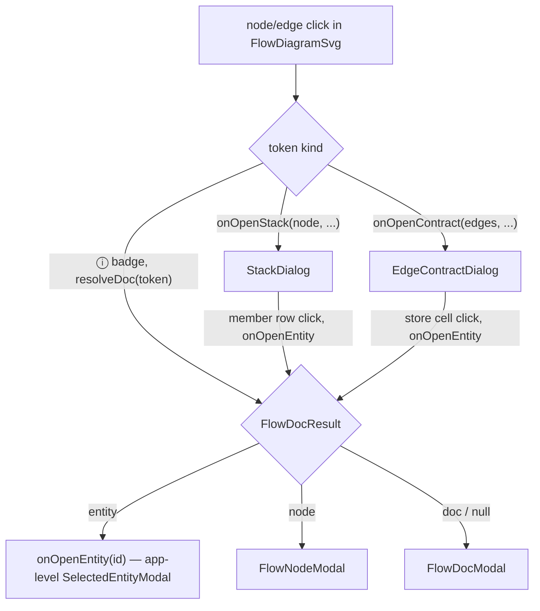
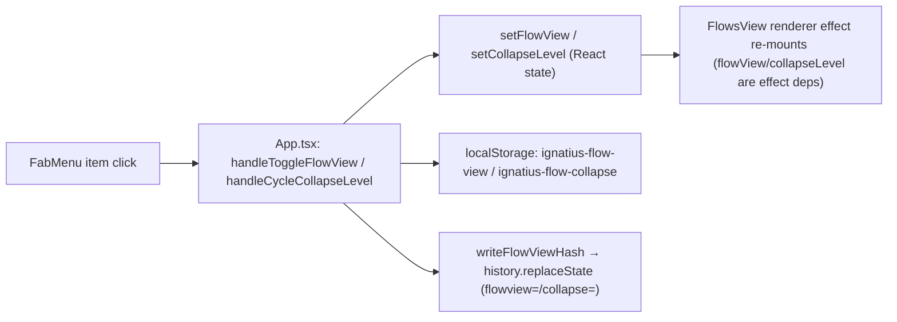

# frontend

## What it does

The unified SPA collapses three surfaces — graph (ERD), dict (data dictionary), and flow (DFDs) — into one React app: `GraphView`, `DictionaryView`, and `FlowsView` stay mounted simultaneously (graph/flow toggle `isActive`; dict toggles CSS `display:none`) so search text, scroll position, and canvas state survive view switches. `useHashRoute` owns the URL hash as the single source of truth for view, selected entity, zoom, pan, DFD deep-links, and — for the flow surface — the per-process/connected rendering mode and the stack collapse level.

[`src/app/App.tsx`](../../src/app/App.tsx) (860 lines) is the entry point. It was decomposed from the original `src/App.tsx` monolith, 5514 lines per `docs/design/app-tsx-decomposition.md:5`, into a layered [`src/app/`](../../src/app) tree: shell → views → components → ui → logic/dom, downward only. [`src/app/main.tsx`](../../src/app/main.tsx) is the React entry point.

## How it works

### Flow-surface dialog routing

A click inside the rendered flow SVG resolves to exactly one of four dialog kinds; `FlowSurface` (in [`src/app/views/flow/FlowsView.tsx`](../../src/app/views/flow/FlowsView.tsx)) enforces a single-dialog-at-a-time invariant across all of them.

Opening any of the five outcomes calls `setOpenResult`, which replaces whatever was open; a member click inside `StackDialog` or a store cell click inside `EdgeContractDialog` routes back through the same `open(token)` dispatcher, so it closes the dialog it was clicked from before opening the entity modal.

`EdgeContractDialog` ([`src/app/components/flow-node/EdgeContractDialog.tsx`](../../src/app/components/flow-node/EdgeContractDialog.tsx)) renders the CONTRACT for one data-carrying edge (or every member edge of a stack): a `db:`-endpoint edge resolves each edge's `data` column against the entity model for a Group/Store/Column/Type table sorted by store then by the entity's own column order; any other endpoint kind (`ext:`, `cache:`, `queue:`, …) has no entity-model backing and renders a one-column table of the authored `data` lines instead. `StackDialog` ([`src/app/components/flow-node/StackDialog.tsx`](../../src/app/components/flow-node/StackDialog.tsx)) renders a stack node's row breakdown at the current collapse level: a `store` row is a link that opens the store's entity dialog directly; a `cluster`/`subtype`/`group` row is a `
`/`
` disclosure (`.stack-dialog-row-toggle`, [`src/app/styles.css`](../../src/app/styles.css) lines 578-600) that reveals its child rows indented one level, recursively. `StackDialogExtra` renders grouping-source-specific content below the row table: a cluster's markdown body, a subtype row's link to its basetype entity, a group's description, or — for `source: 'adjacency'`, which has no `clusters/` file to draw a body from — a Writers/Readers table of the processes that feed the stack.

### Flow view mode and collapse level

`flowview=`/`collapse=` are global settings, not per-diagram: a FAB toggle changes them for every DFD in the session and both are deep-linkable via the URL hash.

On load, `App.tsx` resolves each setting hash first, then `localStorage`, then a hardcoded default (`per-process` / `clusters`) — the same precedence pattern `layoutMode` already used for the graph. `nextCollapseLevel` ([`src/app/hash-router.ts`](../../src/app/hash-router.ts)) is a `switch` over the closed `FlowCollapseLevel` union implementing the cycle `stores → clusters → groups → stores`; `FabMenu`'s `collapseActionLabel` names the action by its *target* level ("Collapse to clusters", "Collapse to groups", "Expand to stores") since the last leg of the cycle un-collapses.

A `flowview=`/`collapse=` value can also arrive via **Back/Forward**, independent of a fresh FAB toggle: a history entry pushed earlier (e.g. opening an entity) snapshotted whatever `flowview`/`collapse` was current at push time, since the FAB toggle only `replaceState`s the top entry rather than pushing a new one. `useHashRoute`'s `popstate` handler fires `onRestoreFlowView`/`onRestoreCollapseLevel` unconditionally whenever the reconciled hash carries either param, mirroring how it already restores `dfd=`.

## Where it lives

### Shell

| Path | Role |
|---|---|
| [`src/app/App.tsx`](../../src/app/App.tsx) | State, view-switch, modal hosting, composition. Owns `openEntityById` (with `fromFlow` flag), `modelIndex`/`modelIndexRef` useMemo/ref pair, `appErrorsByEntityId` Map, `appAllFlowNodeIds`, `entityUsageIndex` useMemo, and `pendingScrollProcessIdRef` for dict process-scroll. `dictViewRef` (`DictionaryViewHandle`) and `handleToggleLayoutMode` are shared between the FAB button and the keyboard shortcut `l`. `showHelp` boolean state wires the `?` top-bar button (`.help-toggle`) and `onHelp` passed to `useKeyboardShortcuts`; renders `HelpModal` when true. Owns `flowView`/`collapseLevel` state (seeded hash → localStorage → default `per-process`/`clusters`), `handleToggleFlowView`/`handleCycleCollapseLevel`, and `writeFlowViewHash` (a `history.replaceState` write beside the existing hash params, mirroring how `useHashRoute` writes `view`); both are threaded as props into `FlowsView` and `FabMenu`. **Keyboard pan:** `handleKeyboardPan(dx, dy)` routes the resolver's `{type:'pan'}` action to the active canvas — `graphViewRef.current?.panBy(dx, dy)` on graph, `flowsViewRef.current?.panBy(dx, dy)` on flow, no-op on dict. Interacts with `GraphView`, `DictionaryView`, and `FlowsView` exclusively through typed imperative handles (`GraphViewHandle`, `DictionaryViewHandle`, `FlowsViewHandle`). |
| [`src/app/App.tsx`](../../src/app/App.tsx) (cross-view search) | The shell owns per-surface search state that survives view switches. Graph search: `graphSearchTerm`/`graphSearchIncludeBody` plus `graphSearchCursorRef` (Enter-to-cycle cursor, reset on term/toggle change); `graphSearchMatches` is `null` when inactive or a `Set` (possibly empty) when active — `entityMatches` from [`src/app/logic/search.ts`](../../src/app/logic/search.ts) runs over `model.nodes`. Flow search: `flowSearchTerm`/`flowSearchIncludeBody`; `flowSearchResults` calls `searchFlowDiagrams`; `flowSearchTokens` is threaded into `FlowsView`'s `searchTokens` prop. Neither graph nor flow search state touches the model, layout fingerprint, layout-store, or URL hash. `bannerRef` measures the global-error banner's rendered height via `ResizeObserver` and writes it into the `--search-bar-top` CSS custom property so `SearchBar` sits below the banner. |
| [`src/app/App.tsx`](../../src/app/App.tsx) (branding gutter, fix 2026-08-01) | The branding block is `position: fixed`, out of document flow, so no stylesheet can know how much room to leave for it. A `brandingRef`-measuring `useEffect` publishes the block's measured width as the `--branding-gutter` CSS custom property (via `ResizeObserver`, re-published on `[branding, logoSrc]` change since a theme swap can change logo width) so the Dictionary view's full-bleed search bar can indent past it below ~1920px viewport width, where the two previously shared a row and the z-50 branding block painted over the z-30 search input. [`src/app/styles.css`](../../src/app/styles.css)'s `.dict-search-bar-inner` computes `padding-left: max(2rem, calc(16px + var(--branding-gutter, 0px) + 12px - var(--dict-bar-left-slack)))`. |
| [`src/app/main.tsx`](../../src/app/main.tsx) | React root mount, reads `window.__MODEL__`/`__THEME_MODE__` globals in static mode. |
| [`src/app/hash-router.ts`](../../src/app/hash-router.ts) | Exports `parseHash`/`serializeHash`, `ViewName`, `FlowViewMode`, `FlowCollapseLevel`, `HashState`, `nextCollapseLevel`. `HashState` carries `view?: 'graph'\|'dict'\|'flow'`, `entity?`, `zoom?`, `pan?`, `dfd?`, `flowview?: 'per-process'\|'connected'`, `collapse?: 'stores'\|'clusters'\|'groups'`. Format: `#view=<graph\|dict\|flow>&entity=<id>&zoom=<n>&pan=<x>,<y>&dfd=<diagram-id>&flowview=<per-process\|connected>&collapse=<stores\|clusters\|groups>`. All params optional; unknown/malformed values are silently dropped (`VALID_VIEWS`/`VALID_FLOW_VIEWS`/`VALID_COLLAPSE_LEVELS` lookup tables). |
| [`src/app/globals.d.ts`](../../src/app/globals.d.ts) | `window.__MODEL__`, `__THEME_MODE__`, `__IGNATIUS_MODE__` (`'live'\|'static'`), `__LAYOUT_KEY__`, `__FLOW_MODEL__`, `__FLOW_LAYOUT_KEYS__`, `__FLOW_CLUSTERS__` (the model-root `clusters/` registry, sibling to `__FLOW_MODEL__`, read directly by `FlowsView`'s `initFlowGraphCore` to build `buildFlowData`'s connected-view cluster grouping), `__IGNATIUS_CY__`, `__IGNATIUS_CY_GEN__`, `__IGNATIUS_FLOW_READY__`, `__IGNATIUS_FLOW_GEN__`, `__IGNATIUS_ACTIVE_FLOW_DFD__`, `__IGNATIUS_PERF__`. |
| [`src/app/index.html`](../../src/app/index.html) | Bun HTML entry point; imported directly by [`src/server/server.ts`](../../src/server/server.ts) (`import index from '../app/index.html'`) as the `Bun.serve()` route. |

### Hooks

| Path | Role |
|---|---|
| [`src/app/hooks/useModelData.ts`](../../src/app/hooks/useModelData.ts) | Exports `useModelData(opts?)`. Unified SSE subscription + model/flow fetch + findings state. Static mode reads `window.__MODEL__`/`__FLOW_MODEL__`/`__FLOW_CLUSTERS__` once on mount. Live mode boots with parallel `/api/model` + `/api/flow`, then re-fetches on every `model-changed` SSE event. Returns `{ model, findings, flowDiagrams, flowClusters, flowFindings, layoutKeyRef, bannerDismissed, setBannerDismissed }`. `applyFlowPayload` mirrors a non-empty `/api/flow` `clusters` field into both React state (`flowClusters`, returned by the hook) and the `window.__FLOW_CLUSTERS__` global; `App.tsx` does not destructure `flowClusters` from the hook's return, so the live consumer of the cluster registry is `FlowsView`'s `initFlowGraphCore`, which reads `window.__FLOW_CLUSTERS__` directly — the same global-read pattern `__FLOW_MODEL__` uses for the imperative (non-React-tree) renderer. **StrictMode double-fetch guard:** the boot `useEffect` declares a local `let ignore = false`, set `true` in its cleanup; every `setState` inside the boot and SSE-handler promise chains is gated on the flag to survive React StrictMode's dev-mode mount→cleanup→mount double-invoke. |
| [`src/app/hooks/useHashRoute.ts`](../../src/app/hooks/useHashRoute.ts) | Exports `useHashRoute(opts?)`. Owns hash read/write and `popstate` back/forward restoration. `entity=` in the hash is the single source of truth for the modal stack: `openEntity(id)` pushes history (deduped when the hash already carries the same entity), `closeEntity()` replaces it. `popstate` invokes `onEntityChange(id \| null)` to reconcile the shell without pushing another history entry; it also invokes `onRestoreFlowView(view)`/`onRestoreCollapseLevel(level)` whenever the reconciled hash carries a `flowview=`/`collapse=` value, unconditional on whether it differs from the shell's live state (mirroring how `dfd=` restoration works). Returns `{ view, setView, openEntity, closeEntity }`. |
| [`src/app/hooks/useThemeMode.ts`](../../src/app/hooks/useThemeMode.ts) | Exports `useThemeMode(themeConfig?, model?)`. Seeds from `window.__THEME_MODE__` or localStorage; calls `applyThemeCssVars` on change (also on `model` identity change). Returns `{ themeMode, toggleTheme }`. |
| [`src/app/hooks/useKeyboardShortcuts.ts`](../../src/app/hooks/useKeyboardShortcuts.ts) | Registers exactly ONE global `keydown` listener for the unified SPA shortcuts (g/d/f/l/b/?//` `/Cmd-Ctrl-k/arrows). Stale-closure hazard avoided via a `configRef` updated each render. Editable guard returns true when focus is in `INPUT`/`TEXTAREA`/`SELECT`/`contenteditable` or inside `.modal`. Dispatches through `resolveShortcut` from [`src/app/logic/shortcuts.ts`](../../src/app/logic/shortcuts.ts). Imported only by `App.tsx`. |

### Logic (pure, no DOM/React)

| Path | Role |
|---|---|
| [`src/app/logic/doc-resolver.ts`](../../src/app/logic/doc-resolver.ts) | Exports `buildFlowDocResolver(diagrams, getEntityModel)` and `splitDocToken(token)`. `FlowDocResult` discriminated union: `entity`/`node`/`doc`. Keyed by stable id/slug so `title:` overrides don't break `[[wiki-link]]` resolution. |
| [`src/app/logic/flow-node-ids.ts`](../../src/app/logic/flow-node-ids.ts) | Exports `buildAllFlowNodeIds(diagrams, entityModel?)`. Returns `ReadonlySet<string>` merging all process/external/non-db-store ids with ERD entity ids. |
| [`src/app/logic/color.ts`](../../src/app/logic/color.ts) | Exports `hexToRgba` and `blendHex`. |
| [`src/app/logic/search.ts`](../../src/app/logic/search.ts) | Search-matcher logic for all three surfaces. Dictionary matchers (`nodeMatchesSearch`, `processMatchesSearch`, `externalMatchesSearch`, `storeMatchesSearch`) always match id/label/columns/body, no opt-in flag. Graph/Flows matchers are a deliberately different, title-first UX: `entityMatches(node, term, includeBody)` matches only `node.id` by default, body only when `includeBody` is true; `flowProcessMatches`, `flowExternalMatches`, `flowStoreMatches`, `flowDiagramMatches` follow the same pattern. Exports `FlowSearchResultKind`, `FlowSearchResult`, and `searchFlowDiagrams(diagrams, term, includeBody)`, which recursively walks every diagram and its `subDfds` (parent before children); diagrams in `SYNTHETIC_DIAGRAM_IDS` (from [`src/flows/flow-derive-levels.ts`](../../src/flows/flow-derive-levels.ts)) are excluded from results but still walked so their leaf `subDfds` are reached. |
| [`src/app/logic/finding-rows.ts`](../../src/app/logic/finding-rows.ts) | Finding-row formatting logic extracted from `FindingsPanel`. |
| [`src/app/logic/relationship-key.ts`](../../src/app/logic/relationship-key.ts) | Exports `relationshipRowKey(edge: ModelEdge): string`. Stable, collision-free React key for relationship rows; encodes source, target, and sorted `on` FK pairs to handle dual-FK tables. |
| [`src/app/logic/spotlight.ts`](../../src/app/logic/spotlight.ts) | Pure `buildSpotlightConnections(index, entityId): SpotlightConnection[]`, direct (non-inherited) FK connections for the DD browse-lens spotlight overlay. Uses `edgesBySource`/`edgesByTarget` only. Self-edges excluded; all edges to the same otherId bundle into one connection; unknown entityId → `[]`. |
| [`src/app/logic/flow-spotlight.ts`](../../src/app/logic/flow-spotlight.ts) | Pure `buildFlowSpotlightConnections(diagrams, activeToken): FlowSpotlightConnection[]`. Token scheme `"<kind>:<name>"`; entity cards pass `"db:<entityId>"`. Walks all diagrams + sub-DFDs recursively. |
| [`src/app/logic/shortcuts.ts`](../../src/app/logic/shortcuts.ts) | Pure keyboard-shortcut resolver, no DOM/React/Bun/Node imports. Exports `resolveShortcut(e, view, editable): ShortcutAction \| null`, the `ShortcutAction` discriminated union, and `ShortcutKeyEvent`. Keymap: g/d/f view switch, l toggleLayout (graph only), b toggleLens (dict only), `/` search, `?` help, Cmd/Ctrl+`=`/`-`/`0` zoom, Cmd/Ctrl+k search, arrow keys → `{type:'pan', dx, dy}` on graph/flow only. `PAN_STEP = 10`, `PAN_STEP_FAST = 50` (Shift+arrow). Key matched on `e.key.toLowerCase()` for capslock-insensitivity. |
| [`src/app/logic/spotlight-lines.ts`](../../src/app/logic/spotlight-lines.ts) | Pure geometry helper separating overlapping spotlight-overlay lines. Exports `separateSpotlightLines(base, directions): SpotlightLineSpec[]`, `SPOTLIGHT_LINE_GAP = 14`. K=1 leaves the base line unchanged; K>1 applies a symmetric perpendicular offset so the centre of mass stays on the base anchor. Imported by [`src/app/components/entity/SpotlightOverlay.tsx`](../../src/app/components/entity/SpotlightOverlay.tsx). |
| [`src/app/logic/spotlight-inherited.ts`](../../src/app/logic/spotlight-inherited.ts) | Pure key-inheritance LINEAGE logic for the DD browse lens and DG graph. No DOM/React/Bun/Node imports. **Key edge** = an edge whose FK columns (`Object.keys(edge.on)`) are ALL ⊆ the child (source) node's primary key (`index.pkByNode`) — a subset test implementing IDEF1X identifying semantics, catching identifying-1:1 AND identifying-1:many (proper-subset FK). **Associative-entity barrier:** `isAssociative(index, nodeId)` returns true when a node has key edges to 2+ distinct parents whose FK columns together cover its entire PK (a pure junction/link table, e.g. `Project_Tag`) — `buildLineageWithPredecessors`'s BFS treats any such node as a traversal BARRIER (reachable, but the walk stops there) except at the start node itself. `buildLineageWithPredecessors` is a BFS over key edges (undirected) that also records, per member, the nearest key-edge predecessor on the shortest path from the active entity. `buildInheritedConnections(index, entityId): InheritedConnection[]` excludes the entity itself and its direct real-edge neighbors; `via` is `INHERITED_IDENTITY` when the predecessor is the active entity itself, else the nearest key-edge kin id; `direction` is always `'out'`. Result sorted ascending by `otherId`; singleton lineage → `[]`. |

### DOM helpers

| Path | Role |
|---|---|
| [`src/app/dom/body-links.ts`](../../src/app/dom/body-links.ts) | Exports `resolveBodyClick(e, scrollFn)` (shared body-click handler for entity/process/external/store DD body divs — intercepts `a[data-entity]` and `.entity-link--missing` spans) and `upgradeMissingLinksInContainer(container, knownIds)` (rewrites `.entity-link--missing` spans to live `<a>` anchors once the target id is known). |
| [`src/app/dom/theme-css-vars.ts`](../../src/app/dom/theme-css-vars.ts) | Exports `applyThemeCssVars(theme, mode)` and mode-aware color constants including `SPOTLIGHT_LINE_INHERITED`. Sets all CSS custom properties on `document.documentElement`, including spotlight vars `--spotlight-line-out`, `--spotlight-line-in`, `--spotlight-line-flow`, `--spotlight-line-inherited`. Called by `useThemeMode`. |

### UI components (`components/ui/`)

| Path | Role |
|---|---|
| `Modal.tsx` | Shared modal primitive (title + onClose + children + optional `headerExtra`). |
| `ZoomControl.tsx` | View-agnostic zoom readout. Props: `percent`, `onZoomIn`, `onZoomOut`, `onSetPercent(pct)`, `onReset`. Clicking the readout opens an inline commit-on-Enter/blur text input. |
| `FabMenu.tsx` | Per-view FAB menus, items view-gated. `kbd-hint` badges surface keyboard shortcuts inline. Flow-specific items (no `kbd-hint`): a per-process/connected toggle button labelled by the *current* mode's opposite (`"Connected view"` while `flowView === 'per-process'`, else `"Per-process view"`), and a collapse-level cycle button labelled by the *target* level via `collapseActionLabel` (`"Collapse to clusters"`, `"Collapse to groups"`, `"Expand to stores"`). |
| `HelpModal.tsx` | View-aware orientation overlay built on `Modal`. Three branches (graph/dict/flow), each documenting that surface's search behavior and closing with a `shortcutRows(view)`-driven keyboard section. |
| `SearchBar.tsx` | Exports `SearchBar` (`forwardRef<SearchBarHandle, SearchBarProps>`) and `SearchBarHandle` (`{ focus(): void }`). Shared search-bar chrome for the Graph and Flows surfaces: debounced (200ms) `<input type="search">`, a `role="switch"` "Include descriptions" toggle, a match-count readout, and a `children` slot for a results dropdown. |

### Flow search components (`components/flow/`)

| Path | Role |
|---|---|
| `FlowSearchResults.tsx` | Exports `FlowSearchResults({ results, onSelect })`. Rows arrive pre-grouped by diagram (contiguous), capped at `DISPLAY_CAP = 20` with a "+N more" line. One-letter kind badge per row (P/E/S/D). |

### Entity components (`components/entity/`)

| Path | Role |
|---|---|
| `EntityModal.tsx` | Exports `SelectedEntityModal`. |
| `EntityCard.tsx` | Exports `DictEntitySection`. |
| `ClassificationBadge.tsx` | Exports `DictClassificationBadge`. |
| `ColumnsTable.tsx` | Columns table, `variant='modal'\|'dict'`. |
| `ChildrenTable.tsx` | Children/subtype table, `variant='modal'\|'dict'`; uses `relationshipRowKey`. |
| `ExamplesAccordion.tsx` | Examples accordion, `variant='modal'\|'dict'`. |
| `GridCard.tsx` | Exports `GridCard`, compact entity card for the DD browse lens. |
| `FlowNodeGridCard.tsx` | Exports `ProcessGridCard`, `ExternalGridCard`, `StoreGridCard`. |
| `SpotlightOverlay.tsx` | The largest single component in the domain. Exports `SpotlightOverlay`. Position:fixed SVG + chips container over the DD browse grid. FK connections draw SOLID bezier paths (direction-coded stroke, arrowhead placement, predicate + cardinality pills). Flow connections draw DASHED paths (`--spotlight-line-flow`). Inherited (lineage) connections draw DOTTED paths in `--spotlight-line-inherited`, computed via `computeInheritedLines` from `buildInheritedConnections`'s output, with a provenance pill ("shared key" for `INHERITED_IDENTITY`, else "via `<kin>`"). Off-screen connections render as clickable directional chips instead of a line. Anchors re-measured every rAF-throttled frame via `ResizeObserver` on the grid container, `window resize`, and scroll on `.dict-view`. Calls `separateSpotlightLines` so overlapping edge bundles render as offset parallel paths. |

### Process components (`components/process/`)

| Path | Role |
|---|---|
| `IoTable.tsx` | Exports `IoTable` (a process's inputs/outputs table used by both the Dictionary and flow-node dialogs) and `resolveIoRowCells` (pure, no React import, exercised directly by unit tests — resolves the Data-cell value(s) for one row: a `db:` endpoint with a `label:` collapses to one labelled row instead of one row per column, an unlabelled `db:` endpoint keeps one row per column, and a non-`db` endpoint is always a single row). Accepts optional `onOpenEntity`/`onOpenToken`/`canOpenToken`: when provided, a `db:` endpoint cell renders as a rich entity link that opens the entity dialog directly and a resolvable non-`db` endpoint opens in-place via the flow token resolver, instead of falling back to dict scroll-to-anchor. Imported by `ProcessCard.tsx` (Dictionary) and `FlowNodeModal.tsx` (flow dialogs, which passes the rich-link props). |
| `KindMarker.tsx` | Exports `FlowKindMarker`. |
| `ProcessExamples.tsx` | Exports `FlowProcessExamplesSection`. |
| `ProcessCard.tsx` | Process DD card (`DictProcessSection`). |
| `ProcessesTable.tsx` | Exports `DictProcessesTable`. |
| `ProcessesSection.tsx` | Exports `ProcessesSection`. |

### Flow-node components (`components/flow-node/`)

| Path | Role |
|---|---|
| `FlowNodeModal.tsx` | Structured flow node dialog (process / external / non-`db` store). |
| `FlowDocModal.tsx` | Plain markdown doc dialog for unresolved wiki-links. |
| `ExternalCard.tsx` | External node card. |
| `StoreCard.tsx` | Non-`db` store card. |
| `StackDialog.tsx` | A stack node's row breakdown at the current collapse level, plus grouping-source-specific extra content (see How it works). Props: `node: StackNodeData`, `feederProcessLabels` (dotted-number + label of every process whose edge feeds the stack, shown as a header badge), `processLabelById` (for an adjacency stack's reader/writer links), `clusters: FlowCluster[]`, `groups: Record<string, GroupConfig>`, `onClose`, `onOpenEntity`. |
| `EdgeContractDialog.tsx` | The CONTRACT dialog for a data-carrying flow edge (see How it works). Props: `edges: FlowEdge[]`, `sourceLabel`/`targetLabel` (the same text the hover tooltip header shows), `entityModel?: Model`, `onClose`, `onOpenEntity`. |

### Findings

| Path | Role |
|---|---|
| `components/findings/FindingsPanel.tsx` | `<FindingsPanel>` renders only when `totalFindings > 0`; collapses to a badge; present across all three views. |

### Views

| Path | Role |
|---|---|
| `views/graph/GraphView.tsx` | Exports `GraphView` (forwardRef) and `GraphViewHandle`/`LayoutMode` types. Owns the full Cytoscape lifecycle, navigator lifecycle, zoom adapter, hash wiring, preset-layout cache-skip, ELK cost scaling. `GraphViewHandle` exposes `navigateToEntity`, `panelNavigate`, `resetLayout`, `applyLayoutMode`, `zoomIn`, `zoomOut`, `setPercent`, `resetZoom`, `panBy`, `retheme`. `wheelSensitivity: 0.2`. **Lineage trigger is SHIFT+HOVER, not click/select:** `cy.on('mouseover', 'node')` branches on `evt.originalEvent?.shiftKey` — shift held draws ephemeral `edge.inherited`-class cy edges via `buildInheritedConnections` plus 3-tier focus opacity; no shift is a plain direct-neighbor dim. **3-tier focus opacity:** direct (full opacity), inherited/ancestral (`.inherited-dim`, 0.5), unrelated (`.faded`, 0.2). **Cross-view search:** accepts `searchMatches: ReadonlySet<string> \| null`; `applySearchClasses` applies dedicated `.search-match`/`.search-dim` classes, kept separate from the hover-tier and lineage classes so search dimming survives hover/lineage/tap/relayout. |
| `views/graph/organic-layout.ts` | Organic (fCoSE-based) layout engine built on `cytoscape-fcose`. `ORGANIC_FALLBACK_THRESHOLD = 500` entities before falling back to layered. `buildScratchCore` runs the multi-seed layout search on a headless mirror core so only winning positions touch the live core; `groupRegions: true` (entity count ≥ 150) wraps each color family in an invisible compound parent so fCoSE decomposes large models into per-family sub-layouts. `arrangeOrganic(cy, iters)` is the post-settle local-polish pipeline (expand, fan subtype clusters, dock leaves/isolates, deoverlap). `gradeEdgeSpans(cy)` grades every edge's `span` (`'near'\|'mid'\|'far'`) by percentile within the layout's own length distribution, for `styles.ts`'s length-graded de-emphasis. |
| `views/graph/navigator.ts` | `mountNavigator`/`teardownNavigator`/`NavigatorInstance`, cytoscape-navigator lifecycle helpers. `teardownNavigator` calls `nav._removeCyListeners?.()` before `nav.destroy()` to avoid a resize-listener leak that fires on a destroyed core. |
| `views/graph/styles.ts` | `buildStyles(groups, theme, mode)` → cytoscape stylesheet array. `.faded` (0.2), `.inherited-dim` (0.5), `edge.inherited` dotted at 0.5 opacity. Length-graded de-emphasis on `edge[span]`. Graph search: `SEARCH_MATCH_BORDER` gold/yellow border on `.search-match`, `.search-dim` at 0.2 opacity, both pushed last in the stylesheet array to win the cascade. |
| `views/graph/markers.ts` | Exports `drawWarningBadges(cy, svg, entityIds: Set<string>)`, `createMarkerOverlay(container)`, `updateMarkers(cy, svg, theme, mode?)`. |
| `views/graph/wrap-label.ts` | `wrapEntityLabel`: underscores → spaces; names longer than ~13 chars break at PascalCase/acronym/digit boundaries. |
| `views/graph/layout-store.ts` | Exports `PositionMap`, `StorageLike`, `LayoutStoreHandle`, `createLayoutStore(storage?, now?)`. Single localStorage key `ignatius-layout-positions`; newest-10 pruning on save. `PositionMap` is also imported directly by [`src/flow-view/FlowDiagramSvg.tsx`](../../src/flow-view/FlowDiagramSvg.tsx). |
| `views/dict/DictionaryView.tsx` | `DictionaryView` is a `forwardRef` exposing `DictionaryViewHandle { toggleLens(); focusSearch(); }`. Keep-mounted via CSS `display:none`. Imports `SYNTHETIC_DIAGRAM_IDS` from [`src/flows/flow-derive-levels.ts`](../../src/flows/flow-derive-levels.ts) to exclude synthesized context/L1 diagrams from the DD sidebar. Owns DD CSS Custom Highlight search, `beforeprint`/`afterprint` print handling, DD sidebar process nesting. **Browse lens** (`'read'\|'browse'`, persisted to localStorage): entity groups + Processes/External Entities/Data Stores sections; spotlight state `hoverId`, `pinnedId`, `labelHoverCardId`, `focusId`. FK connections from `buildSpotlightConnections`; flow connections from `buildFlowSpotlightConnections`; inherited (lineage) connections from `buildInheritedConnections`, gated behind a document-level `shiftHeld` boolean. |
| `views/flow/FlowsView.tsx` | Exports `FlowsView` (forwardRef), `FlowsViewHandle`, `FlowSurface` (the stateful dialog-hosting wrapper around `FlowDiagramSvg`, see How it works), `FlowChromeCallbacks`, and `initFlowGraphCore` (the imperative renderer lifecycle both static and live modes call). `FlowsViewProps` carries `flowView: FlowViewMode` and `collapseLevel: FlowCollapseLevel`, both owned by the shell; a change to either is an effect dependency of the renderer-mount effect, so toggling either re-mounts `initFlowGraphCore` and every diagram in the session picks up the new opts. `renderDiagram` calls `computeElkLayout(diagram, flowDataOpts)` from [`src/flow-view/elk-flow-layout.ts`](../../src/flow-view/elk-flow-layout.ts) and passes `elkPositions`/`elkEdgeRoutes` into `FlowDiagramSvg`; falls back to a banded `computeFlowLayout` only on ELK failure. `FlowsViewHandle` exposes `selectDiagramById`, `resetLayout`, `zoomIn`, `zoomOut`, `setPercent`, `resetZoom`, `panBy`, `openFlowToken`. **`disposed` teardown guard:** `initFlowGraphCore` declares `let disposed = false`; the async `renderDiagram` checks it before and after every `await computeElkLayout(...)` to guard against an orphaned continuation resuming after React StrictMode's dev-mode mount→cleanup→mount. |
| `views/flow/LegendModal.tsx` | `LegendModal` component; imports `DARK_PALETTE`/`LIGHT_PALETTE`/`FlowPalette` from [`src/flow-view/FlowDiagramSvg.tsx`](../../src/flow-view/FlowDiagramSvg.tsx). |

### Other

| Path | Role |
|---|---|
| [`src/app/styles.css`](../../src/app/styles.css) (2830L+) | Full SPA stylesheet. `@media print` block, `::highlight(dd-search-highlight)`, `.dict-process-direction` badges, `.flow-minimap-wrapper`, `.zoom-control`, `.kbd-hint`, `.flow-edge-tooltip`, `.help-toggle`/`.help-modal`/`.help-section*` (help overlay), `.stack-dialog-row-toggle` (the `
` disclosure marker for `StackDialog` rows), DD chrome (`.dict-view`, `.dict-search-bar`, `.dict-browse-lens`, `.dict-grid-card`, `.spotlight-overlay`, `.spotlight-line*`), the shared Graph/Flows `.viewer-search-bar`/`.viewer-search-results` chrome, and the `.dict-search-bar-inner` branding-gutter padding rule. |
| [`src/app/hash-router.ts`](../../src/app/hash-router.ts) (fromFlow flag) | `openEntityById(id, fromFlow = false)` — when `true`, the modal's FK links, body `[[wiki-links]]`, and process-usage links stay in-place over the Flows view instead of switching to graph/dict. |
| [`src/theme/theme-defaults.ts`](../../src/theme/theme-defaults.ts) (kind-colored stores/externals) | `FlowsView` calls `resolveFlowKindPalette(themeMode, themeConfig?.flowKinds)` and passes the palette into `FlowDiagramSvg`. |
| [`src/model/model-index.ts`](../../src/model/model-index.ts) (ModelIndex wiring) | `buildModelIndex(model)` is called once per Model in `App.tsx` via `useMemo`; `modelIndexRef` mirrors the live value for cy-init closures. |
| `views/graph/layout-store.ts` (preset-layout cache-skip) | On a repeat graph load whose `layoutKey` matches a saved position set in `layout-store`, cy is constructed with `layout: { name: 'preset' }` and ELK does not run. |

## Constraints

- **`flowview=`/`collapse=` are global, not per-diagram.** A toggle re-mounts the entire flow renderer (`FlowsView`'s effect keys on `flowView`/`collapseLevel`); there is no per-DFD override.
- **`FlowSurface`'s dialog state admits exactly one open dialog.** `node`/`doc`/`contract`/`stack` share one `openResult` union; opening any of them replaces whatever was open, including from inside another dialog (a `StackDialog` member click or an `EdgeContractDialog` store cell click).
- **`EdgeContractDialog` only resolves columns for a `db:`-kind store endpoint.** Any other endpoint kind falls back to a one-column table of the raw `data` lines with no type/group resolution, because non-`db` endpoints have no entity-model backing and are never stacked.
- **`useModelData`'s `flowClusters` return value is not read by `App.tsx`.** The live consumer of the cluster registry is `FlowsView`'s `initFlowGraphCore`, which reads `window.__FLOW_CLUSTERS__` directly rather than through a prop.
- **`IoTable`'s rich-link props are opt-in.** Without `onOpenEntity`/`onOpenToken`/`canOpenToken`, a `db:` cell falls back to `onScrollToEntity` (dict scroll-to-anchor) and a non-`db` cell renders as plain text — only `FlowNodeModal` passes the rich-link props.
- **Layer rule is downward-only by discipline, not build enforcement.** Shell (`App.tsx`) → views (`views/*/`) → components (`components/*/`) → ui (`components/ui/`) → logic/dom (`logic/`, `dom/`); a lower layer importing from a higher one (or `logic/`/`dom/` importing React/DOM) reintroduces the tangled coupling the `src/App.tsx` decomposition ([`docs/design/app-tsx-decomposition.md`](../design/app-tsx-decomposition.md)) removed.
- **Pure logic modules stay DOM/React-free by discipline.** `logic/spotlight.ts`, `logic/spotlight-inherited.ts`, `logic/spotlight-lines.ts`, `logic/shortcuts.ts`, `logic/search.ts`, `logic/flow-spotlight.ts`, `logic/doc-resolver.ts`, `logic/finding-rows.ts`, `logic/relationship-key.ts`, `logic/color.ts`, `logic/flow-node-ids.ts`, and `components/process/IoTable.tsx`'s `resolveIoRowCells` are browser-safe and independently unit-testable; importing React or a DOM API into any of them breaks that testability and the reuse across `App.tsx`/view components it enables.
- **Views own their imperative handles; the shell never reaches in directly.** `GraphView`, `DictionaryView`, and `FlowsView` are `forwardRef` components exposing a typed `*ViewHandle` interface (`GraphViewHandle`, `DictionaryViewHandle`, `FlowsViewHandle`). Bypassing the handle to touch a view's internals from `App.tsx` recreates the tight shell/view coupling the decomposition removed.
- **`variant='modal'\|'dict'` is the convention for dual-context display components, not a separate component per host.** `ColumnsTable`, `ChildrenTable`, and `ExamplesAccordion` render the same data differently depending on whether they sit inside `EntityModal` or the Dictionary page. Splitting a variant into its own host-named component (as the pre-decomposition monolith did with `ColumnsTable` vs `DictColumnsTable`) reintroduces the near-clone duplication [`docs/design/app-tsx-decomposition.md`](../design/app-tsx-decomposition.md) documents as the original problem.
- **Ref-mirrors (`modelIndexRef`, `entityModelRef`, `openEntityByIdRef`, `hoveredNodeIdRef` in `GraphView`) exist to avoid stale closures.** They mirror `useState`/`useMemo` values into refs so long-lived imperative callbacks (Cytoscape event handlers, SSE handlers) read the current value; without the mirror, such a callback captures a stale value from whichever render attached it.
- **`graphSearchMatches`/`flowSearchTokens` use `null` for no active search and a `Set` (possibly empty) for an active one.** `GraphView` and `FlowsView`/`FlowDiagramSvg` branch on this exact null-vs-Set distinction; substituting a string-emptiness check treats an active-but-empty-result search the same as no search, breaking the dim/highlight behavior.
- **`layoutMode`, `flowView`, and `collapseLevel` resolve hash → localStorage → hardcoded default on mount, and each writer persists to localStorage before writing the hash.** Reversing the write order (hash before localStorage) leaves the two out of sync, so a later hash → localStorage → default resolution can restore a superseded value instead of the last one the user set.

## Coupling

- **model** ([`src/model/parse.ts`](../../src/model/parse.ts), `model-index.ts`, `validate.ts`) — `App.tsx` and most views/components import `Model`, `ModelNode`, `ModelEdge`, `ModelIndex`, `buildModelIndex`, `GroupConfig`, and validation `RULES`/`EntityError` directly. `EdgeContractDialog` and `StackDialog` both import `GroupConfig`/`Model` for column-type and group-label resolution. A change to the `Model` or `ModelIndex` shape forces changes throughout [`src/app/`](../../src/app).
- **flows** ([`src/flows/flow-derive-levels.ts`](../../src/flows/flow-derive-levels.ts), `flow-parse.ts`, `flow-validate.ts`, `flow-clusters.ts`) — `DictionaryView` and `FlowsView` import `SYNTHETIC_DIAGRAM_IDS` and flow-diagram types; `logic/flow-node-ids.ts` and `logic/search.ts` build on flow diagram shapes; `useModelData` types its `FlowApiPayload.clusters` as `FlowCluster[]` from `flow-clusters.ts`; `StackDialog` imports `FlowCluster` for its author-cluster body lookup. A change to flow diagram structure, leveling, or the cluster registry shape forces changes here.
- **flow-view** ([`src/flow-view/`](../../src/flow-view) — separate domain, ELK/SVG rendering) — `FlowsView.tsx`, `LegendModal.tsx`, `StackDialog.tsx`, and `EdgeContractDialog.tsx` import from it: `FlowDiagramSvg`, `FlowChrome`, `computeElkLayout`, `screenScaleToPercent`/`percentToScreenScale`, the `DARK_PALETTE`/`LIGHT_PALETTE` constants, `normalizeEdgeData`, and the `StackNodeData`/`StackRow`/`StackMember` types that back the stack dialog. Coupling runs both ways: [`src/flow-view/FlowDiagramSvg.tsx`](../../src/flow-view/FlowDiagramSvg.tsx) imports the `PositionMap` type from [`src/app/views/graph/layout-store.ts`](../../src/app/views/graph/layout-store.ts). A change to `FlowDiagramSvg`'s prop contract, `StackNodeData`'s shape, or ELK layout output forces a change in `FlowsView.tsx` and/or the two dialog components.
- **theme** ([`src/theme/theme-defaults.ts`](../../src/theme/theme-defaults.ts)) — `App.tsx`, `dom/theme-css-vars.ts`, `hooks/useThemeMode.ts`, `views/graph/styles.ts`, `views/graph/markers.ts`, `views/flow/LegendModal.tsx`, `views/flow/FlowsView.tsx`, `views/dict/DictionaryView.tsx`, and `components/entity/FlowNodeGridCard.tsx` all consume `semanticColors`/`resolveFlowKindPalette`/theme config types. A theme-shape change ripples widely through this domain.
- **server** ([`src/server/`](../../src/server)) — [`src/server/server.ts`](../../src/server/server.ts) imports [`src/app/index.html`](../../src/app/index.html) directly as its `Bun.serve()` HTML route; the frontend build/dev flow is driven by the server domain, not a separate bundler step. `/api/flow`'s response shape (including its `clusters` field) is the contract `useModelData`'s `FlowApiPayload` type encodes.
- **generators** — no direct import coupling found from [`src/app/`](../../src/app); the generated static HTML/model output is what static mode's `window.__MODEL__`/`window.__FLOW_MODEL__`/`window.__FLOW_CLUSTERS__` globals are populated with, so a change to what the generator embeds can affect `useModelData`'s static-mode read path.

### Related design docs

- [`docs/design/unified-app.md`](../design/unified-app.md) — collapsing graph/dict/flow into one React surface.
- [`docs/design/app-tsx-decomposition.md`](../design/app-tsx-decomposition.md) — the original `App.tsx` monolith breakup into [`src/app/`](../../src/app).
- [`docs/design/src-root-organization.md`](../design/src-root-organization.md) — where [`src/app/`](../../src/app) sits among the repo's other domains.
- [`docs/design/key-inheritance-lineage.md`](../design/key-inheritance-lineage.md) — the lineage feature implemented by `logic/spotlight-inherited.ts` (including the associative-entity barrier rule).
- [`docs/design/graph-flow-search.md`](../design/graph-flow-search.md) — the cross-view search feature (graph-flow-search) spanning `App.tsx`, `SearchBar`, and both view components.
- [`docs/design/dd-spotlight-grid.md`](../design/dd-spotlight-grid.md) — the Dictionary browse-lens spotlight grid and `SpotlightOverlay`.
- [`docs/design/dict-navigation.md`](../design/dict-navigation.md) — Dictionary sidebar/navigation behavior.
- [`docs/design/graph-position-persistence.md`](../design/graph-position-persistence.md) — the `layout-store`/`layoutFingerprint` node-position persistence design.
- [`docs/design/help-overlay.md`](../design/help-overlay.md) — the `HelpModal` orientation overlay.
- [`docs/design/keyboard-nav-shortcuts.md`](../design/keyboard-nav-shortcuts.md) — the `useKeyboardShortcuts`/`shortcuts.ts` design.
- [`docs/design/viewer-fab-ux.md`](../design/viewer-fab-ux.md) — the `FabMenu` design.
- [`docs/design/viewer-ux-polish.md`](../design/viewer-ux-polish.md) — spotlight-line separation and related overlay polish.
- [`docs/design/branding.md`](../design/branding.md) — the branding block / logo / footer system.
- [`docs/design/wiki-entity-links.md`](../design/wiki-entity-links.md) — `[[wiki-link]]` resolution in entity/process bodies, implemented by `logic/doc-resolver.ts`.
- [`docs/design/dfd-store-clusters.md`](../design/dfd-store-clusters.md) and [`docs/spec/dfd-store-clusters.md`](../spec/dfd-store-clusters.md) — the stack/cluster/collapse-level feature: `StackDialog`, `EdgeContractDialog`, `flowview=`/`collapse=`, and the FAB's per-process/connected and collapse-level controls.
