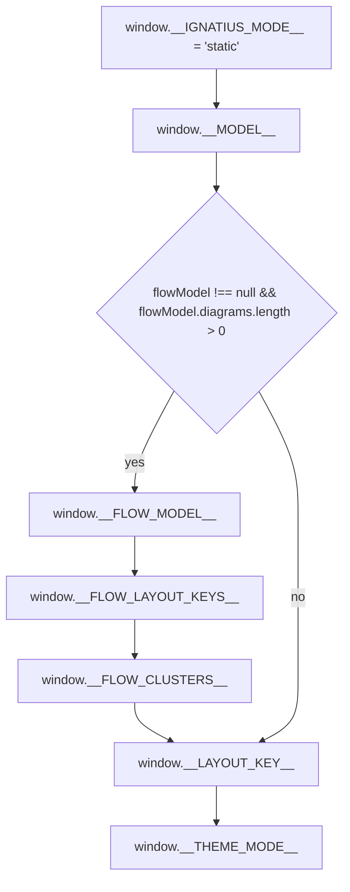

# generators

## What it does

[`src/generators/`](../../src/generators) produces the self-contained HTML file written by the CLI's `export` command. There is exactly one generator, `generateApp`, which injects the full union of runtime globals needed by the unified React SPA (Graph, Dictionary, Flows) into one file; there is no separate graph/dict/flow generator. [`src/generators/embedded-bundle.ts`](../../src/generators/embedded-bundle.ts) supplies the HTML/JS/CSS bundle content that `generateApp` inlines, either from the compiled binary's embedded files or from `dist/static/` on disk.

## How it works

`generateApp(model, flowModel, sourceOrDir, opts)` resolves a `BundleContent` (from disk or passed directly), builds one injection `<script>` block, then rewrites the bundle's HTML template in place: it swaps the external stylesheet `<link>` for an inlined `<style>`, swaps the external module `<script src>` for the injection script followed by an inlined `<script type="module">`, strips the bundle's own live-mode boot script, and rewrites `<title>` from the model's display name.

### Global injection order

A `flowModel` with zero diagrams skips flow-global injection outright, identical to `flowModel === null`: `__FLOW_MODEL__`, `__FLOW_LAYOUT_KEYS__`, and `__FLOW_CLUSTERS__` come back `undefined` at runtime, not empty stubs, even when `clusters` is non-empty.

A clusters-only model still parses `clusters` before any diagram exists, so `flowModel.clusters` can hold data even while the diagram check above suppresses its injection.

## Where it lives

| Path | Role |
|---|---|
| [`src/generators/app.ts`](../../src/generators/app.ts) (145 lines) | `generateApp(model, flowModel, sourceOrDir, opts)`. Resolves `sourceOrDir` (default `'dist/static'`) to a `BundleContent` via `loadBundleFromDir` when given a string, or uses it directly when already a `BundleContent`. Builds the injection script (`window.__MODEL__`, conditionally `__FLOW_MODEL__`/`__FLOW_LAYOUT_KEYS__`/`__FLOW_CLUSTERS__`, then always `__LAYOUT_KEY__` via `layoutFingerprint(model)` and `__THEME_MODE__` from `opts.themeMode`, default `'dark'`). Escapes `</script` sequences in JSON payloads and in the inlined JS bundle via a local `escapeScriptClose`, and HTML-escapes `&`, `<`, `>` in the `<title>` rewrite via a local `escapeHtmlText`. |
| [`src/generators/embedded-bundle.ts`](../../src/generators/embedded-bundle.ts) (119 lines) | Defines `BundleContent = { htmlTemplate, cssContent, jsContent }`. `loadBundleFromDir(bundleDir)` reads `index.html`, extracts the hashed JS/CSS filenames via regex against `src=`/`href=`, falls back to a `Glob('index-*.{js,css}')` scan, and throws a descriptive error (naming the exact `bun build` command and listing the directory's actual contents) if either file still can't be found. `loadEmbeddedBundle()` is the compiled-binary path: it imports `dist/static/index.html`, `dist/static/index.js`, `dist/static/index.css` at module load time with `with { type: 'file' }` so `bun build --compile` embeds them under `$bunfs/`, checks all three exist via `Bun.file().exists()`, and throws pointing at `bun run build:bundle` (or `build:cli`) if any are missing. |

## Constraints

- This is a two-file domain by design: the doc comment atop `app.ts` states there is no `graph.ts` or `flow-graph.ts` to import from — both were removed when the SPA was unified into one `generateApp`. Reintroducing a split-view generator would force every caller (currently just `cli.ts`) to thread optional `flowModel`/`model` through multiple generator functions instead of one, the exact coupling the unification removed.
- Two distinct escaping helpers exist for two distinct reasons and are not interchangeable: `escapeScriptClose` neutralizes `</script` inside a `<script>` body (JSON payloads, the inlined JS bundle), while `escapeHtmlText` escapes `&`/`<`/`>` for HTML text content (the `<title>` rewrite only). Swapping them breaks differently: using `escapeHtmlText` on the JSON payload or inlined JS leaves a literal `</script` sequence unescaped, letting the browser's HTML parser close the enclosing `<script>` tag early and truncate the injected bundle; using `escapeScriptClose` on the `<title>` rewrite leaves `&`/`<`/`>` unescaped, letting a model name containing those characters break the surrounding HTML markup.
- All regex-based template surgery in `app.ts` (stylesheet swap, module-script swap, live-mode-script strip, title rewrite) uses function-form replacements (`.replace(pattern, () => ...)`) rather than a string second argument, because the injected content (minified JS, arbitrary model JSON) can itself contain `$`-prefixed patterns that `String.prototype.replace` would otherwise interpret as substitution tokens.
- `embedded-bundle.ts`'s three `import ... with { type: 'file' }` statements must point at stable file names (`index.html`, `index.js`, `index.css`), not content-hashed ones, so `bun build --compile` can resolve them at compile time; the separate `build:stable-names` script ([`scripts/stable-names.ts`](../../scripts/stable-names.ts)) produces those stable names by copying the hashed outputs `build:bundle` produced, and runs after `build:bundle` inside `build:cli`.
- Covered by [`test/checks/test-app-title.ts`](../../test/checks/test-app-title.ts), [`test/checks/test-branding-zero-network.ts`](../../test/checks/test-branding-zero-network.ts), [`test/checks/test-graph-branding.ts`](../../test/checks/test-graph-branding.ts), [`test/checks/test-layout-key-injection.ts`](../../test/checks/test-layout-key-injection.ts), and [`test/checks/test-app-gen-zero-diagrams.ts`](../../test/checks/test-app-gen-zero-diagrams.ts) (pins the zero-diagrams-equals-null behavior above), run via `bun run test` (a shell loop over `test/checks/*.ts`), not `bun test`/`bun:test`. All five import `generateApp` and `BundleContent` directly, so a signature change to either — or to the embedded-bundle loading contract in `embedded-bundle.ts` — breaks a check even when `app.ts`'s own generation logic hasn't changed.

## Coupling

- **parser** ([`src/model/`](../../src/model)) — `generateApp` takes a `Model` (from [`src/model/parse.ts`](../../src/model/parse.ts)) and calls `layoutFingerprint` (from [`src/model/layout-fingerprint.ts`](../../src/model/layout-fingerprint.ts)) directly; a change to either's shape or signature is a breaking change here.
- **flows** ([`src/flows/`](../../src/flows)) — `generateApp` takes a `FlowModel | null` (from [`src/flows/flow-parse.ts`](../../src/flows/flow-parse.ts)), reads its `diagrams` and `clusters` fields, and calls `buildFlowLayoutKeys` (from [`src/flows/flow-fingerprint.ts`](../../src/flows/flow-fingerprint.ts)); a shape change to any of those is a breaking change here.
- **frontend** ([`src/app/`](../../src/app)) — `embedded-bundle.ts` imports the *compiled output* of the frontend (`dist/static/index.html`/`.js`/`.css`), not its source, so a source-level React change only reaches this domain after a `bun run build:bundle`. `app.ts`'s regex-based `<link>`/`<script>` replacement and its `window.__IGNATIUS_MODE__ = 'live';` strip both depend on the exact markup shape [`src/app/index.html`](../../src/app/index.html) compiles down to; a template restructure there can silently break the string replacement (the regexes would simply fail to match). The frontend reads `window.__FLOW_CLUSTERS__` back out in [`src/app/hooks/useModelData.ts`](../../src/app/hooks/useModelData.ts) and [`src/app/views/flow/FlowsView.tsx`](../../src/app/views/flow/FlowsView.tsx), so the injected key name and shape (`FlowCluster[]`) are a contract with both sides.
- **cli** ([`src/cli/`](../../src/cli)) — [`src/cli/cli.ts`](../../src/cli/cli.ts) is the only caller of both `loadEmbeddedBundle` and `generateApp`, invoked from the `export` command; it dynamically `import()`s both rather than importing them statically at module top.
- **docs** — documented for CLI users in [`docs/guides/commands.md`](../guides/commands.md) (the `## export` section) and listed as "Static output for `export`" in [`docs/guides/building-from-source.md`](../guides/building-from-source.md)'s source-layout table.
- No other domain imports from [`src/generators/`](../../src/generators).

