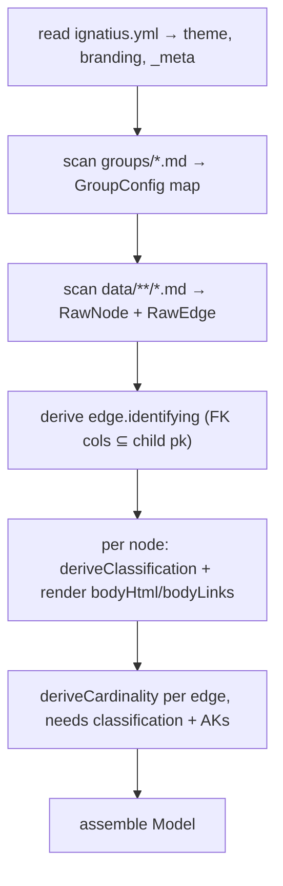
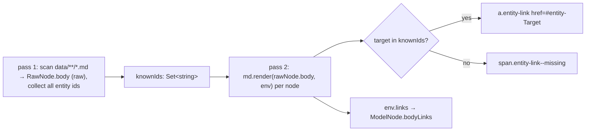
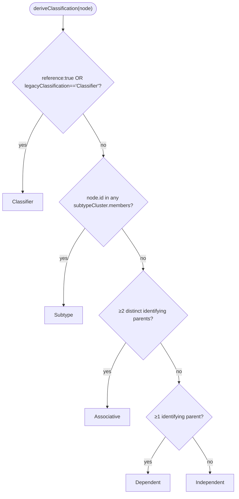
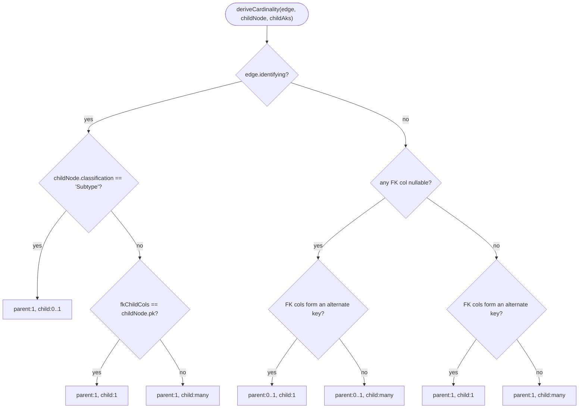

# parser

## What it does

[`src/model/parse.ts`](../../src/model/parse.ts) is the trust boundary between hand-authored model files and everything the app renders: it is the only place in the codebase that reads model source files off disk, and the only place that derives `classification`, edge `identifying`, and `cardinality` from structure rather than trusting whatever a hand-written frontmatter field claims. Without it, the CLI's validator, the live viewer, and the static export would each have to re-derive those fields themselves, or trust stale hand-written values that silently drift from the data.

`parseModels(dir)` turns a model root (`ignatius.yml` plus `data/`, `groups/`) into that trusted `Model`: entity nodes, edges, groups, subtype clusters, theme, and branding, plus each entity's markdown body (including `[[wiki-links]]`) rendered to HTML. It returns `ParseResult = { model, globalErrors }` only; a caller that needs O(1) lookups over the result calls `buildModelIndex(model)` ([`src/model/model-index.ts`](../../src/model/model-index.ts)) separately to get a `ModelIndex` — nodes, edges, keys, and clusters by id instead of scanning arrays.

Every consumer in the repo (`cli`, `server`, `validate`, `frontend`, `flows`, `generators`) sits downstream of this one function.

## How it works

**`parseModels` runs its derivation stages in a fixed order; classification and body rendering share one stage because neither depends on the other.**

`identifying` must exist before classification runs (the Associative/Dependent rules count identifying parents per node), and classification must exist before cardinality (the Subtype special case). Body rendering has no data dependency on classification, only on every node id being known so `[[…]]` targets can resolve; both are computed in the same per-node pass (parse.ts:475-492). Both the `groups/*.md` scan and the `data/**/*.md` scan skip a file whose basename equals `_meta.indexFile` (default `index.md`, overridable via `ignatius.yml`'s `index_file:` key, which must be a bare `.md` filename with no path separators or the parser raises `config.index_file_ext` / `config.index_file_path`): the groups scan skips it silently, the data scan additionally re-parses its frontmatter and raises `config.index_file_entity` if that reserved file declares an `entity:` field.

### Two-pass body rendering

**Body markdown renders only after every entity id is known, so a `[[Target]]` link can be told apart from a typo.**

`wikiLinkPlugin` ([`src/model/wikilink.ts`](../../src/model/wikilink.ts)) is a markdown-it inline rule registered before the `link` rule, so `[[…]]` is recognized ahead of standard link syntax. It never raises an error itself: an unresolved target renders as a non-navigating span, and is reported separately by `validate.ts`'s `body.unknown_link` rule.

### Classification derivation

**Classification is derived by a fixed rule order, first match wins; the frontmatter `classification:` field is only a fallback signal for the first rule.**

The frontmatter `relationships[].identifying` field is accepted for backward compat but is never read to compute an edge's `identifying` value; the Identify stage (the `derivedEdges` map, parse.ts:423-431) derives it from FK/PK column overlap before classification or cardinality run. `deriveCardinality` only consumes the already-computed `edge.identifying` as a parameter (parse.ts:153-178).

### Cardinality derivation

**Cardinality branches first on whether the edge is identifying, then on child classification, key overlap, and nullability.**

A dangling edge (unknown target, or an FK column absent from the child's PK) is carried through as `identifying: false` rather than raised in `parse.ts`; the parser reports only what stops it producing a `Model`, and `validate.ts` owns `edge.unknown_target` / `edge.dangling_fk_column` diagnostics, with fix hints and cleaned-model stripping. Raising it in both layers would report the same defect twice.

## Where it lives

| Path | Exports | Role |
|------|---------|------|
| [`src/model/parse.ts`](../../src/model/parse.ts) | `parseModels(dir): Promise<ParseResult>`, `normalizePredicate()`, `ModelNode`, `ModelEdge`, `Model`, `ParseResult`, `ModelMeta`, `Predicate`, `ColumnDef`, `SubtypeCluster`, `GroupConfig`, `Cardinality`, `HarnessMode` | Reads `ignatius.yml` (`_meta`, `theme:`, `branding:`) and `data/**/*.md` + `groups/*.md`; owns all derivation logic and the shared `MarkdownIt` instance |
| [`src/model/wikilink.ts`](../../src/model/wikilink.ts) | `WikiLinkEnv`, `splitWikiTarget()`, `wikiLinkPlugin(md)` | markdown-it inline rule for `[[Target]]` / `[[Target\|label]]`; registered onto `parse.ts`'s `md` via `md.use(wikiLinkPlugin)`. Types markdown-it's state/instance via minimal local interfaces (`InlineToken`, `InlineState`, `MarkdownItLike`) rather than casting to `any`, because markdown-it 14 ships no types in this repo. |
| [`src/model/model-index.ts`](../../src/model/model-index.ts) | `buildModelIndex(model): ModelIndex`, `endpointKey(source, target)`, `ModelIndex` | Pure, no Bun/Node/DOM imports; browser-safe. Builds `nodeById`, `edgesBySource`/`edgesByTarget`/`edgeByEndpointPair`, `pkByNode`/`columnsByNode`, `akColumnsByNode`/`fkColumnsByNode`, subtype-cluster maps, `nodesByGroup` |

`ModelMeta.indexFile` and `ModelMeta.harness` are populated from `ignatius.yml`'s top-level `index_file:` and `harness:` keys (`harness` is validated against `'auto' | 'claude' | 'agents' | 'both'` and dropped if it does not match). `ModelNode.sourcePath` is set for every parsed entity to its path relative to the model root (e.g. `data/catalog/Product.md`) and is optional only for hand-built test fixtures. Both entity and group frontmatter accept a top-level `description:` string, copied onto `ModelNode.description` / `GroupConfig.description` verbatim (distinct from `GroupConfig.desc`, which is the group's body rendered to HTML).

## Constraints

- `ModelIndex` maps do not survive JSON serialization: `JSON.stringify` turns a `Map` into `{}`, so a deserialized index has every lookup map emptied rather than absent. `buildModelIndex()` must be called fresh wherever a `Model` enters a consumer (after `parseModels`, after an SSE `model-changed` event, after reading a static global), never attached to a serialized payload; a lookup against the emptied maps returns `undefined` silently instead of throwing.
- `akColumnsByNode` and `fkColumnsByNode` are absent (not an empty `Set`) for nodes with no alternate keys / no outgoing edges. Callers must check for map-key presence, not just `Set` size; calling `.size` on the result of a missing `.get()` throws a `TypeError` (exact message is JS-engine-dependent).
- `subtypeMemberToCluster` is first-wins for a member appearing in multiple clusters; a caller reading only `subtypeMemberToCluster` for a multi-cluster member silently gets one cluster and misses the rest. `clustersByMemberId` is the array form that captures all of them.
- `identifying` and `cardinality` are always derived from structure on every parse; a caller that reads frontmatter `classification` or `relationships[].identifying` directly instead of the derived `ModelNode.classification` / `ModelEdge.identifying` gets values that go stale the moment the underlying data changes, since only the derived fields are recomputed on the next parse.
- `index_file:` must be a bare filename ending in `.md` with no `/`, `\`, or `..` segments; a violation is a `config.index_file_ext` / `config.index_file_path` global error rather than a thrown exception, but the invalid value is still written into `_meta.indexFile` and used as `indexFileName` (parse.ts:211-238, :252) — parsing does not fall back to `index.md`, so the reserved-file skip silently never matches any real file.

## Coupling

- `validate` — two-way type coupling: `parse.ts` imports `GlobalError` from [`src/model/validate.ts`](../../src/model/validate.ts), and `validate.ts` imports `Model`/`ModelNode`/`ModelEdge`/`SubtypeCluster` from `parse.ts`. `model-index.ts` mirrors `validate.ts`'s `checkAlternateKeys` (AK column union) and `checkEdgeDanglingFkColumn` (FK column derivation from `edge.on` keys) logic; a change to either derivation must be kept in sync in both files.
- `flows` — [`src/flows/flow-validate.ts`](../../src/flows/flow-validate.ts) imports `Model` from `parse.ts`; [`src/flows/flow-parse.ts`](../../src/flows/flow-parse.ts) imports `wikiLinkPlugin` from `wikilink.ts` directly into its own `MarkdownIt` instance (separate from the one in `parse.ts`). Both instances pass the same `highlight` callback, so entity and flow bodies highlight identically.
- [`src/model/markdown-highlight.ts`](../../src/model/markdown-highlight.ts) — shiki with six precompiled grammars (json, sql, javascript, typescript, python, bash) behind `createJavaScriptRawEngine()`, exported as `highlightCodeFence(code, lang)` and wired into both `MarkdownIt` constructors as the `highlight` option. Server-side only: app code imports `parse.ts` for types alone, so neither markdown-it nor these grammars reach the browser bundle.
- `frontend` ([`src/app/`](../../src/app)) — modules under [`src/app/logic/`](../../src/app/logic), [`src/app/hooks/`](../../src/app/hooks), [`src/app/components/entity/`](../../src/app/components/entity), and view files import `Model`, `ModelNode`, `ModelEdge`, `Predicate`, `ThemeConfig`, or `SubtypeCluster` as types from `parse.ts`; `App.tsx`, `spotlight.ts`, `spotlight-inherited.ts`, `DictionaryView.tsx`, and `GraphView.tsx` import `ModelIndex` from `model-index.ts`. `GroupConfig` is imported from `parse.ts` by `App.tsx`, `FabMenu.tsx`, and [`src/app/views/graph/styles.ts`](../../src/app/views/graph/styles.ts).
- `server` ([`src/server/server.ts`](../../src/server/server.ts)) and `cli` ([`src/cli/cli.ts`](../../src/cli/cli.ts)) both call `parseModels()` directly to produce the `Model` they serve or output.
- `generators` ([`src/generators/app.ts`](../../src/generators/app.ts)) imports the `Model` type from `parse.ts`.
- Changing the `Model`, `ModelNode`, `ModelEdge`, or `ModelIndex` shapes forces updates across all of the above; changing `ignatius.yml` top-level key handling in `parseModels` forces updates to `theme` and `branding` default-merge logic in [`src/theme/`](../../src/theme).
</content>
