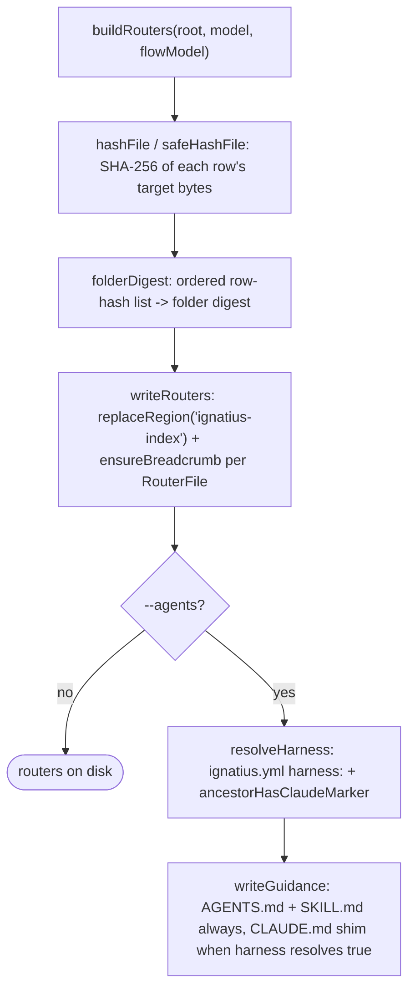
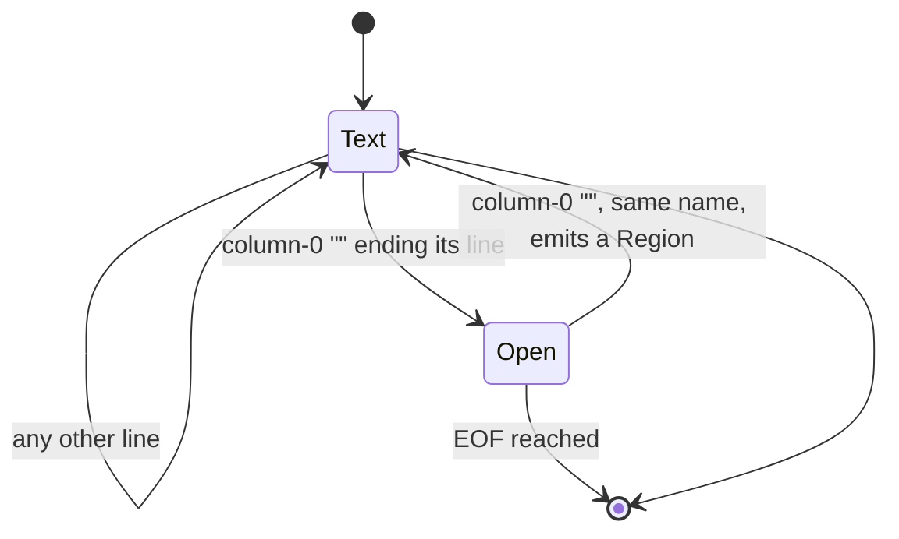
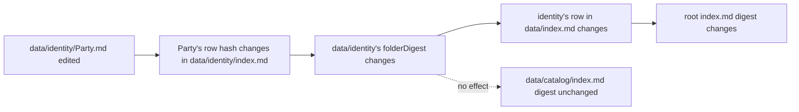

# router

## What it does

A model root (`ignatius.yml` plus `data/`, `groups/`, `flows/`, `externals/`, `stores/`) is a flat pile of markdown to any reader without `ignatius serve` running: a filename like `PaymentAllocation.md` says nothing about which group it belongs to or whether opening it answers the question at hand. [`src/router/`](../../src/router) generates a navigable `index.md` into every organizing folder so a reader descends root → section → group → entity through small tables instead of globbing the tree, and each router carries a rolled-up SHA-256 digest so drift is a `validate` finding rather than a file that quietly rots.

`buildRouters` ([`src/router/build.ts`](../../src/router/build.ts)) turns a parsed `Model` + `FlowModel` into one `RouterFile` per folder; `writeRouters` ([`src/router/write.ts`](../../src/router/write.ts)) writes each into a `<ignatius-index>` region, leaving every other byte in the file untouched. `--agents` additionally writes `AGENTS.md`, a [`CLAUDE.md`](../../CLAUDE.md) shim, and `SKILL.md` into the model root only, so an agent that opens any file under the root picks up the model's conventions with no install step.

## How it works

**Generating routers always runs; writing agent guidance is additive behind `--agents`, and only the [`CLAUDE.md`](../../CLAUDE.md) shim depends on harness detection.**

`buildRouters` walks five sections in a fixed order: `groups/` (flat, one row per group file), `data/` (mirrors each entity's resolved `sourcePath`, recursing into `buildDataFolder` per subdirectory), `flows/` (recursing into `buildFlowFolder` per flow and sub-DFD folder), `externals/`, and `stores/`, then assembles a root `RouterFile` whose five rows summarize each section. `safeHashFile` catches only OS-level read failures (a `code` property on the thrown error); anything else propagates. A caught failure is recorded in an `UnreadableTarget[]` list with the real error message and the row gets the sentinel hash `sha256:unreadable`, so the row still renders instead of crashing the whole run.

### A region boundary is a position, not a delimiter

**Only a bare column-0 tag advances the region parser out of plain text; every other arrangement of the same bytes is a parse error.**

`TAG_RE` (`^<(\/?)(ignatius-[\w-]+)([^<>]*)>[ \t]*$`, multiline) only matches a tag that starts a line and ends it (trailing spaces/tabs aside). A tag anywhere else on a line, inside a fence, inside a code span, indented, or as part of prose, is text the tokenizer never sees. `regions()` then pairs the resulting tokens in order:

| Arrangement | Result |
|---|---|
| Open tag while another region is already open | throws: regions cannot nest |
| Close tag with no open region pending | throws: no opening tag above it |
| Close tag whose name does not match the open region | throws: closing tag must match |
| Open tag with no matching close by EOF | throws: no closing tag |
| Two regions with the same name in one file | throws: keep one |

`readRegion` returns a named region's inner text (or `null`) after this scan; `replaceRegion` swaps a region's inner content and attributes in place, or appends a new `openTag\n\n<inner>\n\n</name>` block when the region doesn't exist yet — the double line break is required because CommonMark ends a raw HTML block at a blank line, and without one on each side the table inside renders as literal pipes.

### A digest change never crosses into a sibling folder

**A leaf edit changes exactly the digests on its ancestor path; a sibling folder's digest is untouched.**

`hashFile` hashes a target's raw bytes, so a whitespace-only edit still dirties a digest. `folderDigest` hashes the ordered list of row hashes for one folder; a parent's row for a child folder carries only that child's `folderDigest`, never its rows, which is why the propagation stops at the ancestor path.

## Where it lives

| File | Exports | Responsibility |
|---|---|---|
| [`src/router/region.ts`](../../src/router/region.ts) | `readRegion`, `replaceRegion` | Column-0 tag tokenizer, open/close pairing scan, region extraction and in-place replacement |
| [`src/router/fingerprint.ts`](../../src/router/fingerprint.ts) | `hashFile`, `folderDigest`, `RouterNode` | SHA-256 of raw file bytes; SHA-256 of an ordered row-hash list; the one-row shape (`name`, `kind`, `description`, `link`, `hash`) every table row is built from |
| [`src/router/build.ts`](../../src/router/build.ts) | `buildRouters`, `RouterFile`, `UnreadableTarget` | Model + `FlowModel` → `RouterFile[]`; `buildDataTree`/`buildDataFolder` mirror each entity's `sourcePath`, never its declared `group:`; `buildFlowFolder` recurses through sub-DFDs; `safeHashFile` collects unreadable targets instead of throwing |
| [`src/router/write.ts`](../../src/router/write.ts) | `writeRouters` | Region-scoped write of every `RouterFile`'s `<ignatius-index>` table and its `<ignatius-breadcrumb>` line; creates missing files, creates missing intermediate directories via `Bun.write` |
| [`src/router/detect.ts`](../../src/router/detect.ts) | `resolveHarness` | Resolves whether `--agents` writes the [`CLAUDE.md`](../../CLAUDE.md) shim, from `ignatius.yml`'s `harness:` (default `auto`) plus an ancestor filesystem probe for [`.claude/`](../../.claude) or [`CLAUDE.md`](../../CLAUDE.md) |
| [`src/router/agents.ts`](../../src/router/agents.ts) | `deriveKeyStyle`, `buildAgentsGuide`, `buildClaudeShim`, `buildSkillMeta`, `buildSkillBody`, `writeGuidance`, `KeyStyle` | `AGENTS.md`/[`CLAUDE.md`](../../CLAUDE.md)/`SKILL.md` content, derives the model's key-style convention (`key-inherited` / `orm-oriented` / `mixed` / `undetermined`) from PK shape, and writes all three guidance files into the model root only |

## Constraints

- `region.ts`'s tokenizer has no fence or code-span exemption: a tag shown as an example inside a hand-authored `<ignatius-rules>` block must be indented or HTML-escaped (`&lt;ignatius-index&gt;`), or it is read as a real boundary.
- `SKILL.md`'s YAML frontmatter (`name`, `description`) is the one write the generator makes outside a region; every other byte of every generated file, including the rest of `SKILL.md`, goes through `replaceRegion`. `writeGuidance` (`src/router/agents.ts:181-184`) rebuilds that frontmatter from `buildSkillMeta(model)` on every call without reading the existing `name`/`description` back, so a hand-edit to either field is silently discarded and replaced on the next `ignatius index --agents` run.
- `writeGuidance` writes `AGENTS.md` and `SKILL.md` unconditionally and the [`CLAUDE.md`](../../CLAUDE.md) shim only when its `writeClaude` argument is true; it writes into `root` only, never into a nested folder.
- `buildDataTree` walks `ModelNode.sourcePath`; a node with `sourcePath === undefined` is skipped rather than placed by its declared `group:`.
- `buildRouters`'s flow walk starts at `flowModel.diagrams[0]?.subDfds[0]?.subDfds`, assuming `flowModel` is already leveled; an unleveled `FlowModel` has no context/L1 wrapper to descend through and the walk would misalign.
- `storeRows` includes only `FlowStoreRef` entries with a defined `body` (actually read from a `stores/*.md` file); `db:<Entity>` tokens and undefined store tokens are excluded.
- `deriveKeyStyle` excludes `Classifier`-classified nodes from its PK-shape count and calls the model `mixed` once the minority signature (key-inherited vs. surrogate) reaches `MIXED_SHARE_THRESHOLD` (0.2) of relevant nodes.
- `resolveHarness`'s `auto` case (`ancestorHasClaudeMarker`) walks from the model root up to the filesystem root via `existsSync`, stopping at the first [`.claude`](../../.claude) directory or [`CLAUDE.md`](../../CLAUDE.md) file.

## Coupling

- **validate** ([`src/model/validate.ts`](../../src/model/validate.ts)) — `validateIndex` dynamically imports and reuses `buildRouters` to recompute every digest without writing anything, backing six `RuleId`s: `config.index_file_ext`, `config.index_file_path`, `config.index_file_entity` (frontmatter/config shape), and `index.stale`, `index.orphaned`, `index.unreadable_target` (router drift, read off `STORED_DIGEST_RE` against the current `<ignatius-index>` attribute).
- **cli** ([`src/cli/cli.ts`](../../src/cli/cli.ts)) — `indexCmd` (`ignatius index [path] [--model] [--agents]`) parses the model, runs `buildRouters` + `writeRouters`, and, under `--agents`, calls `resolveHarness` and `writeGuidance`. `validateCmd` gains an `--index` flag that calls `validateIndex` so a plain `ignatius validate` never pays a full-tree hash pass.
- **parser** ([`src/model/parse.ts`](../../src/model/parse.ts)) / **flows** ([`src/flows/flow-parse.ts`](../../src/flows/flow-parse.ts)) — `build.ts`, `agents.ts`, and `detect.ts` import `Model`, `ModelNode`, `ModelEdge`, `HarnessMode`, `FlowDiagram`, `FlowModel`, and `FlowStoreRef` as read-only inputs; router code never mutates a parsed model. The reserved `index_file` basename skip that keeps a written router from being re-parsed as an entity or flow definition lives in those two domains, not in [`src/router/`](../../src/router).
- **flows** ([`src/flows/flow-derive-levels.ts`](../../src/flows/flow-derive-levels.ts)) — `deriveLevels` wraps the parser's flat leaf diagrams in a context (Level 0) diagram and an L1 overview diagram before router ever sees them; `flowModel.diagrams[0]` is that context wrapper and `subDfds[0]` is the L1 wrapper, which is why `buildRouters` starts its walk one level past both. See [`docs/wiki/flows.md`](flows.md).
- **docs** — [`docs/design/model-index-routing.md`](../design/model-index-routing.md) (approach and rationale) and [`docs/spec/model-index-routing.md`](../spec/model-index-routing.md) (the SC1–SC14 contract, checkpoints CP1–CP7) are the design/spec pair for this domain.
