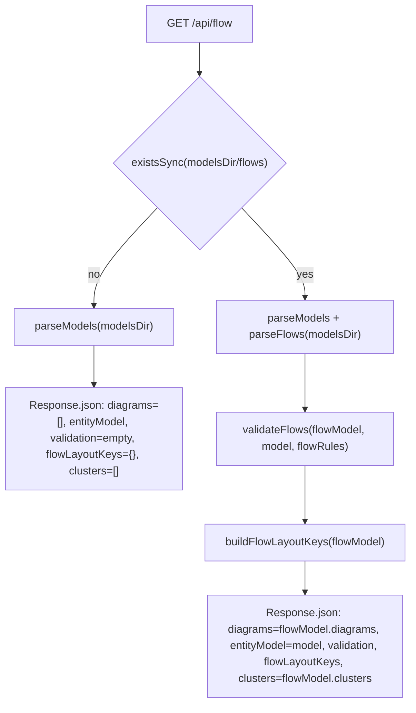
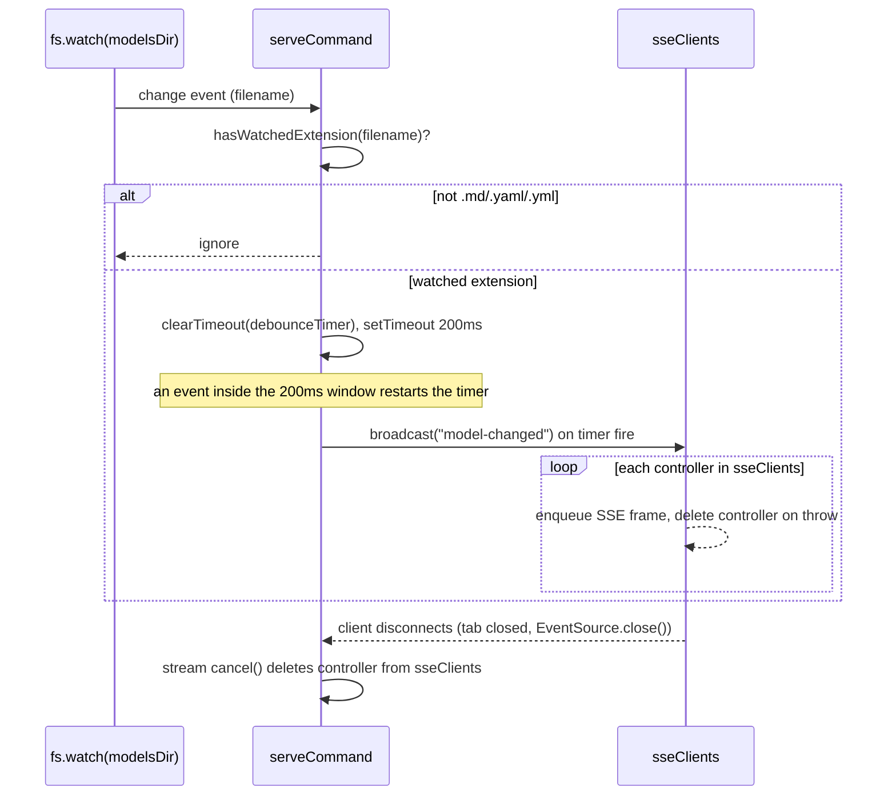

# server

## What it does

Without [`src/server/server.ts`](../../src/server/server.ts) there is no way to view a model or a flow diagram in a browser, and no live-reload when a model file changes on disk: it is the process a running `ignatius serve` invocation actually is. The file is a single-file domain exporting `serveCommand(modelsDir, opts)`, which starts a `Bun.serve()` instance that serves the ignatius SPA shell and its JSON/SSE API for one model directory.

## How it works

`serveCommand` registers every route on `Bun.serve`'s native `routes` map (no router library), wires an `fs.watch` on `modelsDir`, and returns a `ServeHandle = { server, stop }`. Two request paths carry the domain's real logic: the `/api/flow` branch, and the SSE broadcast loop that drives hot reload.

### `serveCommand`'s route table

| Route | Behavior |
|---|---|
| `GET /` | [`src/app/index.html`](../../src/app/index.html) bound directly as a Bun HTML import (the SPA shell) |
| `GET /dict` | 302 redirect to `/#view=dict` |
| `GET /flow` | 302 redirect to `/#view=flow` |
| `GET /flow-dict` | 302 redirect to `/#view=dict` (comment marks this CP5: the process dictionary fused into the SPA Dictionary view) |
| `GET /api/model` | `parseModels(modelsDir)` then `validateModel(model)` then `layoutFingerprint(model)`; returns `{ model, parseGlobalErrors, validation, layoutKey }` |
| `GET /api/flow` | see the branch diagram below; returns `{ diagrams, entityModel, validation, flowLayoutKeys, clusters }` in both branches |
| `GET /api/asset?path=` | resolves `path` under `modelsDir`; 400 on an absolute path or a `normalize(path)` that starts with `..`; 404 if the resolved file doesn't exist; otherwise streams the `Bun.file` |
| `GET /events` | SSE stream; disables Bun's idle timeout, tracks its controller in `sseClients` |

### The `/api/flow` empty-state and populated branches converge on one response shape

Both branches return the same five top-level keys (`diagrams`, `entityModel`, `validation`, `flowLayoutKeys`, `clusters`); the empty-state branch parses the model solely to populate `entityModel`, and returns `diagrams: []` and `clusters: []` rather than omitting either key. A source comment on the guard states the reason: the empty state must not be a different shape from the populated one, so a caller reading `entityModel`/`clusters` gets the same key set from either branch.

### fs.watch coalesces bursty file events into one SSE broadcast per debounce window

`broadcast(event, data)` encodes an `event: ...\ndata: ...\n\n` SSE frame and enqueues it to every controller in the per-instance `sseClients` set. The `/events` stream's `cancel()` callback is the primary cleanup path: it fires on a normal disconnect (tab closed, `EventSource.close()`) and deletes the controller from `sseClients`. A controller whose `enqueue` throws (a write to an already-broken pipe) is a secondary path, deleted from the set during that same `broadcast` iteration. `/events` calls `server.timeout(req, 0)` so Bun's default idle timeout never kills the long-lived stream, and writes a `: connected\n\n` comment line on open so the client sees an immediate response.

## Where it lives

| Path | What |
|---|---|
| [`src/server/server.ts`](../../src/server/server.ts) | The entire domain: `serveCommand`, `ServeHandle`, route table, SSE broadcast, `fs.watch` debounce, `import.meta.main` entry point. No subdirectory under [`src/server/`](../../src/server). |
| `test/checks/*.ts` files that import `serveCommand` (17 as of this writing, see `grep -rln serveCommand test/checks/*.ts`) | Integration checks that boot a real server to exercise it; there is no [`src/server/`](../../src/server) test directory. |

## Constraints

| Constraint | Detail |
|---|---|
| `/api/flow` response shape is fixed across both branches | The empty-state branch (no `flows/` directory) still parses the model and returns `entityModel` and `clusters: []`; a caller reading `entityModel`/`clusters` gets the same key set from either branch. |
| `/api/asset` path guard runs before `resolve()` | Rejects `isAbsolute(rawPath)` and a `normalize(rawPath)` starting with `..` with a 400, before the path is ever resolved against `modelsDir`. Reordering the check after `resolve()` would let a path-traversal read resolve outside `modelsDir` before the `..`/absolute check ever runs. |
| `/events` disables the default idle timeout | `server.timeout(req, 0)` on the SSE route only; every other route keeps Bun's default. Without the override, Bun's default idle timeout would silently close the long-lived SSE stream, killing live-reload for any tab left open past the timeout. |
| Watched extensions are `.md`, `.yaml`, `.yml` | `.yml` matters as much as `.yaml`: a comment in the source notes the model marker is `ignatius.yml`, so without watching `.yml` an edit to name, theme, branding, or `flow_rules` would never trigger a reload. |
| `import.meta.main` gates the direct-invocation entry point, not a path comparison | A comment explains why: in a compiled Bun binary every bundled module shares the same `$bunfs` path, so comparing `import.meta.path === Bun.main` would always be true. |
| `development: { hmr: true, console: true }` is passed to `Bun.serve` unconditionally | Not gated on an environment check, so a compiled/production binary still ships HMR and dev console output. Passing this object also enables Bun's contextual-error page (stack traces in the response) regardless of which keys it sets, since Bun gates that page on the field's truthiness alone — Bun's own docs warn this "shouldn't be used in production or you will risk leaking sensitive information." |
| `sseClients` removal relies on `cancel()` firing or `enqueue` throwing | A TCP-level drop with no FIN/RST (neither triggers `cancel()` nor makes the next `enqueue()` throw) leaves a dead controller in `sseClients` for the life of the server instance; every other disconnect path is covered by one of the two removal callbacks. |

## Coupling

| Dependency | Direction | Coupling |
|---|---|---|
| [`src/model/parse.ts`](../../src/model/parse.ts) (`parseModels`), [`src/model/validate.ts`](../../src/model/validate.ts) (`validateModel`) | imports | Used by `/api/model` and both `/api/flow` branches; a shape change to `Model`, `ParseResult`, or `ValidationResult` forces a matching change in the JSON contracts here and in any frontend code consuming them. |
| [`src/model/layout-fingerprint.ts`](../../src/model/layout-fingerprint.ts) (`layoutFingerprint`) | imports | Feeds the `layoutKey` field of `/api/model`. |
| [`src/flows/flow-parse.ts`](../../src/flows/flow-parse.ts) (`parseFlows`), [`src/flows/flow-validate.ts`](../../src/flows/flow-validate.ts) (`validateFlows`), [`src/flows/flow-fingerprint.ts`](../../src/flows/flow-fingerprint.ts) (`buildFlowLayoutKeys`) | imports | Drive `/api/flow`'s populated branch. `FlowModel.clusters` (from [`src/flows/flow-clusters.ts`](../../src/flows/flow-clusters.ts)) now travels through this endpoint as the response's `clusters` field; a change to `FlowModel`'s shape forces a matching change here. |
| `model._meta?.flowRules` | reads | Populated from `flow_rules:` in `ignatius.yml` by the parser; passed into `validateFlows` as its config argument. |
| [`src/app/index.html`](../../src/app/index.html) | imports | Bound directly to the `/` route as a Bun HTML import; a frontend build change is picked up through Bun's bundling of that import, with no separate wiring in this file. |
| [`src/cli/serve-port.ts`](../../src/cli/serve-port.ts) (`serveWithPortFallback`) | depends on `serveCommand` | Wraps `serveCommand` in an EADDRINUSE retry/prompt loop for the `serve` CLI command; a change to how `serveCommand` throws on a bound port would break that fallback logic. |
| [`scripts/perf-harness.ts`](../../scripts/perf-harness.ts) | spawns the CLI | Runs `bun src/cli/cli.ts serve <modelDir> --port <port>` as a subprocess to benchmark a running server; coupled through the CLI command, not a direct import of this file. |
| `test/checks/*.ts` | imports `serveCommand` | Boots a real server for integration checks (see the table above). |

