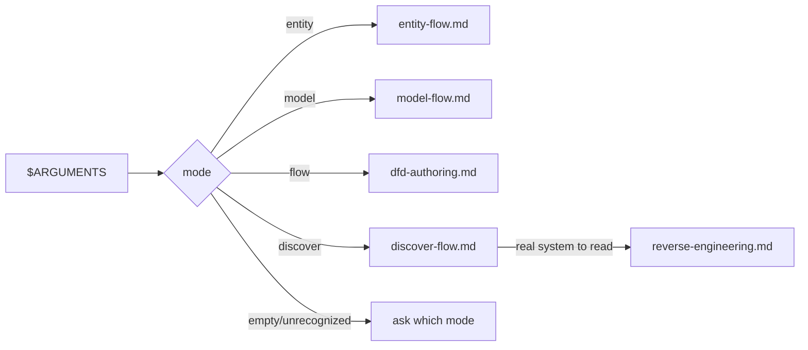
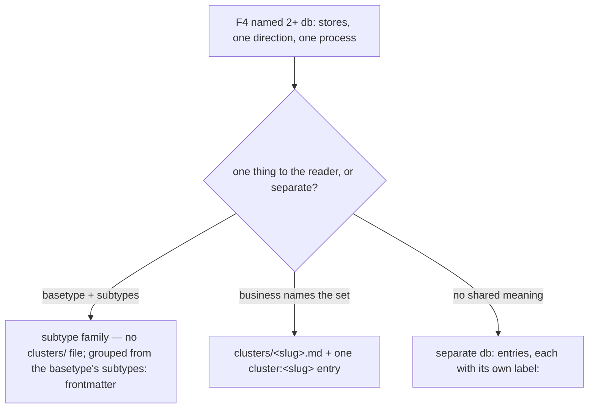
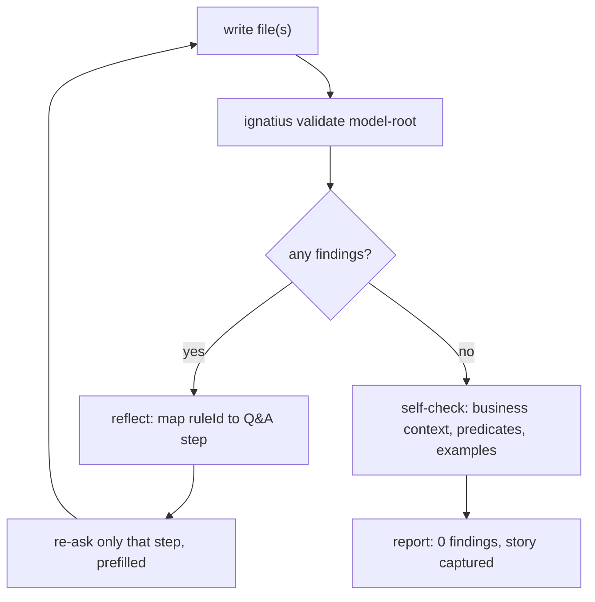

# skill

## What it does

[`skills/ignatius-modeling/`](../../skills/ignatius-modeling) is a Claude Code skill (`name: ignatius-modeling`, invoked as `/ignatius-modeling [entity|model|flow|discover]`) that turns a Q&A conversation into real ignatius model files on disk, then checks its own output by shelling out to `ignatius validate`. Without it, an entity, flow, or model file has to be hand-written against the parser's YAML frontmatter rules and the IDEF1X key-shape conventions in `references/conventions.md`, with no in-conversation check that the result parses or validates.

It never invents structure: PK shape, classification, and cardinality are always derived from what the user's data already implies (`references/conventions.md`), and every write it produces is held to the same `ignatius validate` bar as a file a human wrote by hand.

## How it works

`SKILL.md`'s frontmatter declares `allowed-tools: Read Write Edit Bash Glob AskUserQuestion` and reads `$ARGUMENTS` to pick one of four modes, each delegating to its own reference file.

**The mode's argument selects which reference file drives the conversation, and `discover` forks again on where the evidence comes from.**

- `entity` — add one entity file (`references/entity-flow.md`, steps E0-E10).
- `model` — bootstrap a new model skeleton (`references/model-flow.md`, steps M1-M8).
- `flow` — author a DFD for a user who already knows their processes (`references/dfd-authoring.md`, steps F0-F9, with lettered sub-steps F4a and F6a).
- `discover` — a five-gate Socratic interview that generates both entities and flows (`references/discover-flow.md`); it routes to `references/reverse-engineering.md` (phases R0-R4) when a live database, codebase, schema, or API exists to read instead of a user description.

Ten core rules in `SKILL.md` apply across all four modes: derive-never-ask (classification and per-edge `identifying` come from key shape, never a question), convention-is-derived (an entity's PK shape *is* its key-inherited-vs-orm-oriented style), adapt-to-the-user's-conventions (never invent naming), existence-rules-survive-the-key-style (a mandatory parent is asserted by key placement or by a documented `nullable: false` rule), subtype-independence (Subtype classification comes from cluster membership, never a direct ask), predicates-carry-business-meaning (push past "has many" to a domain verb), examples-always (every entity gets 2-3 `examples:` rows, every process gets `in`/`out` examples, generated by the skill and never skipped), `description:`-always (every entity, group, process, external, and store gets a one-line `description:` frontmatter field, generated by the skill, never skipped, and never named after the model's reserved `index_file` basename), capture-the-business-story (rules, constraints, and lifecycle go in the body with their source), and labels-and-clusters-always (every flow entry carries a prose `label:`, and stores a process treats as one thing are declared in `clusters/<slug>.md` and referenced with one `cluster:` entry; `dfd-authoring.md` Steps F4a and F5).

`references/interviewing.md` sets the conversational discipline every mode follows: one question at a time, explain the why, write files as answers land rather than only proposing YAML, infer from existing files before asking, and reflect on validator findings rather than blindly regenerating.

`discover` mode leads with verbs (find the business's processes), derives the nouns each verb requires, and writes nouns before verbs since a flow's `db:` `data:` fields point at entity columns that must already exist. Every candidate is run through five gates (Identify, Decide, Justify, Derive, Ground) translated into plain business questions; their underlying formal-logic names (excluded middle, law of identity, non-contradiction, sufficient reason, four causes, three-valued logic, falsifiable, syllogism, a priori, ontology) are banned from ever reaching the user. Gate 4, besides deriving the nouns a verb needs, also takes the user's own phrase for each piece of data as the flow entry's `label:`, and asks whether two or more same-direction stores are "one thing" worth a `clusters/<slug>.md` file. Gate 5's real instances seed both the entity's `examples:` (Step E7b) and the flow's `examples:` (Step F6), so one set of concrete values ends up in both places. `reverse-engineering.md` extracts the same shapes from a live system instead: a process's `SELECT`/`INSERT` targets become column-level flows, the DTO or parameter name in the code becomes the `label:`, and tables one transaction always writes together become a cluster.

### Grouping and labeling flow stores

**Step F4a routes two or more same-direction stores on one process to one of three shapes, and only the middle one touches `clusters/`.**

A cluster file needs two or more members, all `db:` entities, each entity in at most one cluster (`flow.cluster_overlap`), every listed member existing (`flow.cluster_entity_unknown`); referencing it wrong fires `flow.unknown_cluster` (bad slug), `flow.cluster_member_unknown` (a `data:` map key not in the cluster's `entities:`), or `flow.cluster_no_members` (an empty `data:` map). Every `inputs:`/`outputs:` entry, `db:`, `ext:`, `kind:`, and `cluster:` alike, also carries a prose `label:` beside its `data:` (Step F5): two to four words in the user's own phrasing, no commas unless the chip should break onto a second line, identical wording for stores in one stack that carry the same thing. `label:` is never checked by `ignatius validate` — a missing one only shows up as a raw column-list chip on the diagram, caught by the flow self-check, not the linter.

### The verification loop

**Every write routes through the same validator, and a finding re-asks the Q&A step that produced it rather than triggering a blind rewrite.**

`references/verification.md` parses each stderr line (`<sev>  <ruleId>  <location>  <message>`) against a hardcoded rule-reference table covering every `entity.*`/`parse.*`/`body.*`/`edge.*`/`cluster.*`/`config.*`/`index.*` ruleId, and a second table for `flow.*` rules that appear once a model has a `flows/` directory, including the five `flow.cluster_*` rules. The loop caps at 5 attempts; Class A warnings keep exit 0 but are still tracked to zero, not treated as done. A clean `validate` exit is necessary but not sufficient: the final self-check re-reads the entity body for captured business rules, checks that each predicate reads as a true sentence in both directions, and re-checks every `examples:` row key against `pk ∪ columns` by hand, because `entity.example_unknown_column` is live-server-only and `ignatius validate` never prints it.

When the write included flow files, the flow self-check adds three items validate cannot see on its own: every entry carries a `label:`, an ungrouped set of stores that should be a cluster but isn't declared as one, and a legibility count — the rows the default per-process view will draw, one per cluster or subtype family with two or more touched members plus one per loose store. More than about five in one direction flags a set still unnamed or a process that needs decomposing (Step F8); the check finishes by opening `ignatius serve <model-root>` at `#view=flow&dfd=<diagram-id>` and confirming each process shows one labelled read stack and one labelled write stack.

A second, separate gate covers router staleness: `ignatius validate --index <model-root>` recomputes each generated router's digest against current files and reports drift as `index.stale`, run only on a model that has been indexed at least once (`ignatius index` has run before); fixing it means running `ignatius index` again, then re-running `--index` to confirm clean.

## Where it lives

| Path | Covers |
|------|--------|
| [`skills/ignatius-modeling/SKILL.md`](../../skills/ignatius-modeling/SKILL.md) | Entry point: frontmatter, mode dispatch, the ten core rules, the reference-file index |
| [`skills/ignatius-modeling/references/interviewing.md`](../../skills/ignatius-modeling/references/interviewing.md) | Q&A conduct rules applied to every mode |
| [`skills/ignatius-modeling/references/entity-flow.md`](../../skills/ignatius-modeling/references/entity-flow.md) | `entity` mode, steps E0-E10 |
| [`skills/ignatius-modeling/references/model-flow.md`](../../skills/ignatius-modeling/references/model-flow.md) | `model` mode, steps M1-M8 |
| [`skills/ignatius-modeling/references/dfd-authoring.md`](../../skills/ignatius-modeling/references/dfd-authoring.md) | `flow` mode, steps F0-F9: the `db:`/`kind:` store fork (F4), the store-grouping step (F4a), the label step (F5), the descriptions step (F6a), sub-DFD decomposition (F8) |
| [`skills/ignatius-modeling/references/flow-templates.md`](../../skills/ignatius-modeling/references/flow-templates.md) | Process, external, non-`db` store, and cluster file templates and worked examples |
| [`skills/ignatius-modeling/references/discover-flow.md`](../../skills/ignatius-modeling/references/discover-flow.md) | `discover` mode: the five gates, verbs-first shape, banned-term list |
| [`skills/ignatius-modeling/references/reverse-engineering.md`](../../skills/ignatius-modeling/references/reverse-engineering.md) | Extracting entities + flows from a live system, phases R0-R4 |
| [`skills/ignatius-modeling/references/conventions.md`](../../skills/ignatius-modeling/references/conventions.md) | Reserved `index_file` basename, column types, classification/cardinality derivation tables |
| [`skills/ignatius-modeling/references/templates.md`](../../skills/ignatius-modeling/references/templates.md) | Entity, group, and `ignatius.yml` templates |
| [`skills/ignatius-modeling/references/verification.md`](../../skills/ignatius-modeling/references/verification.md) | The `ignatius validate` loop, both rule-reference tables, self-check steps |

## Constraints

| Condition | Consequence |
|---|---|
| A `data/` file is named after the model's `index_file` value (default `index.md`) and declares `entity:` | Fails `config.index_file_entity`; without `entity:` it is silently treated as a router and skipped, not scanned |
| A body links another entity as `[Party](Party.md)` instead of `[[Party]]` | Renders as a dead relative link, invisible to `body.unknown_link`, never reported |
| A non-`db` flow store uses a `<kind>:` prefix outside `cache`/`queue`/`file`/`doc`/`manual`/`other` | Not read as a kind at all; falls through to process-name resolution and fails with a misleading `flow.unknown_process` |
| An `examples:` row has a key outside `pk ∪ columns` | `entity.example_unknown_column` exists but is live-server-only; `ignatius validate` never prints it, so only the skill's own self-check (Step E7b) catches it |
| A sub-DFD is decomposed (Step F8, no depth cap) | `flow.unbalanced_decomposition` checks each level only against its immediate parent, never the root diagram |
| A `cluster:<slug>` entry's `data:` map keys a member the cluster file's `entities:` doesn't list, is empty, or the slug names no `clusters/<slug>.md` file | `flow.cluster_member_unknown` / `flow.cluster_no_members` / `flow.unknown_cluster` respectively (Step F4a); the first and third are Class B (block a clean exit), the second is Class A |
| An `inputs:`/`outputs:` entry carries no `label:` | Not a validator finding at all — the diagram falls back to the raw column-list chip; only the flow self-check in `references/verification.md` catches it (Step F5) |
| Discover mode's internal gate names (excluded middle, law of identity, etc.) | Banned from ever reaching the user; a leaked formal-logic term means the question needs rewriting as plain business English |

## Coupling

- `references/conventions.md`'s classification and cardinality derivation tables restate the parser's own key-shape derivation logic (parser domain); if that logic changes, these tables and `entity-flow.md` Step E3 go stale and the skill starts teaching wrong rules.
- `references/verification.md`'s rule-reference table hardcodes every `ruleId`, severity, and Class (A/B) `ignatius validate` can emit, the exact stderr line format, and the `index.*`/`config.index_file_*` rows `validate --index` adds (validate domain); a new or renamed lint rule, or a CLI output-format change (CLI domain), requires a matching edit here or the fix-hint lookup and the parsing loop both break.
- The skill writes exclusively into the six-folder model-root layout (`data/<group>/`, `groups/`, `flows/`, `externals/`, `stores/`, `clusters/`, plus `ignatius.yml`) that [`docs/spec/folder-model.md`](../spec/folder-model.md), [`docs/spec/dfd-store-clusters.md`](../spec/dfd-store-clusters.md), and the parser own; a folder-layout change forces another skill-wide reference rewrite, as it already has twice.
- `references/model-flow.md` Step M4's theme key/default table (`background`, `surface`, `border`, `text`, `textMuted`, `edgeIdentifying`, `edgeReferential`, plus `spacing.nodeSep`) is copied verbatim from [`src/theme/theme-defaults.ts`](../../src/theme/theme-defaults.ts)'s `defaultTheme` (theme domain); a change to those defaults must be mirrored here.
- The skill has no independent verification logic of its own: every write is checked exclusively by shelling out to `ignatius validate`, which runs the same `validateModel` logic ([`src/model/validate.ts`](../../src/model/validate.ts)) the test suite exercises directly (CLI/validate domains). `references/verification.md` flags one exception the CLI cannot catch (`entity.example_unknown_column`, live-server-only), coupling the skill's own self-check step to the frontend/server domain's in-app rule surface.
- `references/dfd-authoring.md` and `references/flow-templates.md` share the DFD frontmatter shape (`inputs:`/`outputs:`/`examples:` endpoint tokens `db:`/`ext:`/`<kind>:`/`cluster:`, the per-entry `label:`, and the `cluster:` entry's entity-to-columns `data:` map) with the flows domain's own parser; a token-set or frontmatter-key change there must be mirrored in both skill files.
