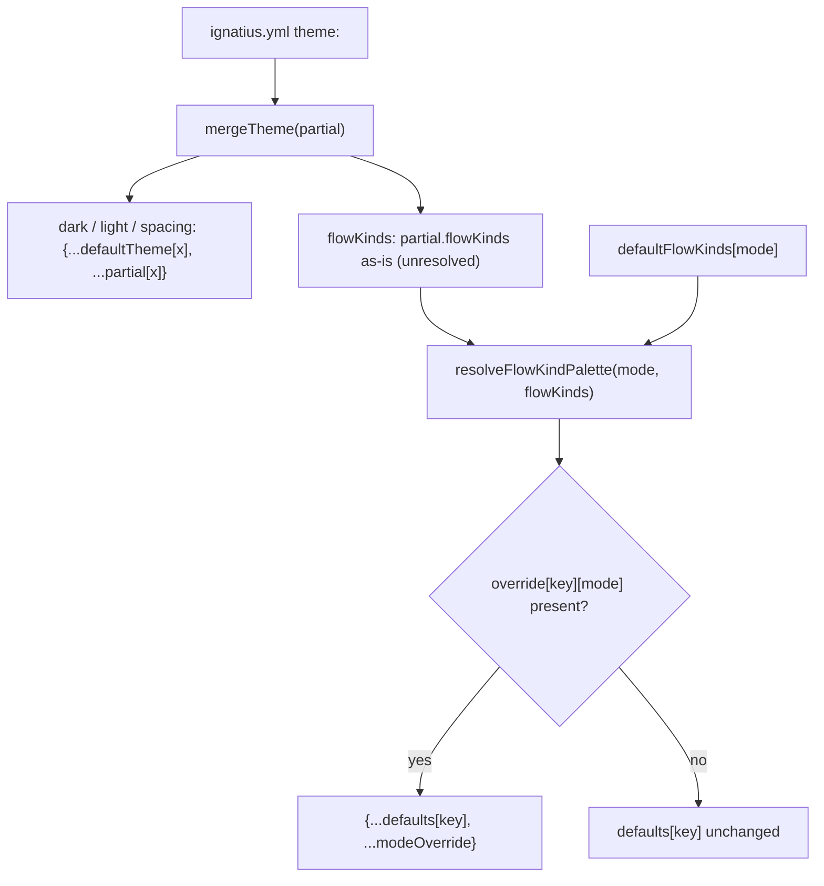
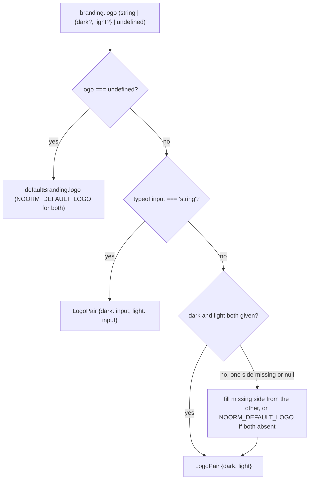
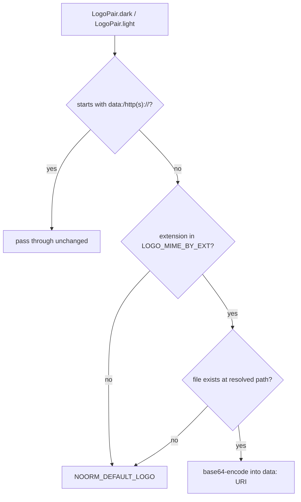

# theme

## What it does

Owns the built-in color/spacing defaults and branding (logo/title/copyright) for the app, plus the merge functions that layer a project's `ignatius.yml` `theme:`/`branding:` overrides on top of those defaults. Without it, every render path (Graph, Dictionary, Flows, static export) would need its own fallback logic for colors and logos instead of reading one resolved `ThemeConfig`/`Branding` object. Consumed by [`src/model/parse.ts`](../../src/model/parse.ts), the only caller of `mergeTheme`/`mergeBranding`, and by frontend/flow-view rendering code that reads the resulting values.

## How it works

`mergeTheme()` and `resolveFlowKindPalette()` do different jobs at different times: the former runs once, at parse time, over the whole `ThemeConfig`; the latter runs per render, per mode, only over flow-kind colors.

`dark`, `light`, and `spacing` each get the identical one-level object-spread shown above; only which default object and which partial object get spread differs. `mergeTheme` never touches `flowKinds` beyond a shallow copy, so `ThemeConfig.flowKinds` after a merge is the raw override set, not a resolved palette. Every consumer that needs actual flow-kind colors calls `resolveFlowKindPalette(mode, theme.flowKinds)` itself rather than reading `theme.flowKinds` directly.

### Logo resolution has two independent fallback points

`branding-defaults.ts` resolves a logo value twice: once when merging user config (`normalizeLogo`, sync, string-or-object shape), and again when embedding for export (`inlineLogo`, async, reads bytes off disk or passes a URI through).

#### Merge time: string shorthand and per-side fallback

`normalizeLogo` short-circuits on a bare string before any object-shape fallback logic runs.

`normalizeLogo` runs inside `mergeBranding`, synchronously, from a raw YAML value.

#### Export time: reading bytes or passing a URI through

`inlineLogo` runs once per side, after merge, to turn each resolved value into something an `` can render standalone.

`inlineLogo` runs inside `inlineBrandingLogos`, asynchronously, against the resolved model root. A broken image from an unreadable local file is never possible in the served/exported output: every branch that cannot resolve a real file lands on `NOORM_DEFAULT_LOGO`. The pass-through branch is the exception: an `http(s)://` override keeps that live URL in the exported HTML instead of embedding it (see Constraints).

### Flow-kind colors, per mode

Each of the 8 `FlowKindKey` values gets one `FlowKindEntry` (`bg`, `fg`, `border`) per mode. `db` and `external` keep their pre-existing colors; the other six are new, mode-appropriate hues assigned when `defaultFlowKinds` grew from 2 kinds to 8.

| Kind | Dark bg / fg / border | Light bg / fg / border | Store cap symbol |
|---|---|---|---|
| `db` | `#3d2e00` / `#f2d49b` / `#d29922` | `#fef9c3` / `#713f12` / `#ca8a04` | `D` |
| `cache` | `#451a03` / `#fcd34d` / `#d97706` | `#fef3c7` / `#92400e` / `#d97706` | `C` |
| `queue` | `#2e1065` / `#c4b5fd` / `#7c3aed` | `#ede9fe` / `#4c1d95` / `#7c3aed` | `Q` |
| `file` | `#1a2e05` / `#bef264` / `#65a30d` | `#f7fee7` / `#365314` / `#65a30d` | `F` |
| `doc` | `#082f49` / `#7dd3fc` / `#0284c7` | `#e0f2fe` / `#0c4a6e` / `#0284c7` | `Do` |
| `manual` | `#4c0519` / `#fda4af` / `#e11d48` | `#fff1f2` / `#881337` / `#e11d48` | `M` |
| `other` | `#1e293b` / `#94a3b8` / `#475569` | `#f1f5f9` / `#334155` / `#64748b` | `O` |
| `external` | `#1a3a1a` / `#b7f0c4` / `#3fb950` | `#dcfce7` / `#14532d` / `#16a34a` | (none, not a store) |

`FLOW_STORE_KIND_SYMBOLS` covers every key except `external` (it is not a store kind) and supplies the compact cap letter (`D`, `C`, `Q`, `F`, `Do`, `M`, `O`) that `storeCapLabel()` in [`src/flow-view/flow-layout.ts`](../../src/flow-view/flow-layout.ts) appends a per-stack store number to (e.g. `D1`, `C2`), and that `KindMarker.tsx`/`LegendModal.tsx` render directly as the store's marker glyph.

## Where it lives

| Path | What |
|---|---|
| [`src/theme/theme-defaults.ts`](../../src/theme/theme-defaults.ts) | `ThemeConfig`/`ThemePalette`/`ThemeSpacing`/`ThemeMode`/`FlowKindEntry`/`FlowKindKey` types, `defaultTheme`, `mergeTheme()`, `semanticColors`, `FLOW_KIND_KEYS`, `FLOW_STORE_KIND_SYMBOLS`, `defaultFlowKinds`, `resolveFlowKindPalette()` |
| [`src/theme/branding-defaults.ts`](../../src/theme/branding-defaults.ts) | `Branding`/`LogoPair`/`CopyrightConfig` types, `defaultBranding`, `mergeBranding()`, `inlineBrandingLogos()` |
| [`assets/noorm-logo.svg`](../../assets/noorm-logo.svg) | Embedded default logo, imported via Bun's `with { type: 'file' }` |
| [`docs/design/branding.md`](../design/branding.md) | Design doc for the branding system |
| [`docs/spec/branding.md`](../spec/branding.md) | Implementation spec for the branding system |
| [`docs/guides/themes-and-branding.md`](../guides/themes-and-branding.md) | User-facing guide: `theme:`/`branding:` blocks in `ignatius.yml`, defaults when absent |

`ThemePalette` (per mode) holds `background`, `surface`, `border`, `text`, `textMuted`, `edgeIdentifying`, `edgeReferential`, `pastelMix` (number). `ThemeSpacing` holds `nodeSep`, `markerOffset`, `markerScale: [number, number]`. `defaultTheme` supplies concrete dark/light values (dark `background: '#0e1116'`, light `background: '#ffffff'`) and `spacing: { nodeSep: 60, markerOffset: 10, markerScale: [0.5, 2.5] }`.

`semanticColors` maps entity classification names (`independent`, `dependent`, `classifier`, `subtype`, `associative`, plus a `link` color) to `{ bg, fg }` pairs, one full set per `ThemeMode`. It is a fixed export, not part of `ThemeConfig`, and has no merge function or user-facing config key.

`Branding = { logo: LogoPair; title: string; subtitle: string; copyright: CopyrightConfig; poweredBy: boolean }`. `defaultBranding.copyright` is a getter that returns `{ holder: 'Noorm Ignatius', year: new Date().getFullYear() }`, computed per access rather than frozen at module load. `defaultBranding.logo.dark`/`.light` are both `NOORM_DEFAULT_LOGO`, a `data:image/svg+xml;base64,...` URI built at module load from [`assets/noorm-logo.svg`](../../assets/noorm-logo.svg).

## Constraints

| Constraint | Detail |
|---|---|
| `mergeTheme` merge depth | Shallow, one level of object-spread per palette (`dark`, `light`, `spacing`). A partial `dark: { background }` override keeps the rest of `defaultTheme.dark` intact, but a nested field inside a non-palette object would not merge this way. |
| `flowKinds` bypasses `mergeTheme` | `mergeTheme` passes `partial.flowKinds` through unresolved (a shallow copy, or omitted entirely when absent). Reading `ThemeConfig.flowKinds` directly gets the override set, not usable colors; always go through `resolveFlowKindPalette(mode, flowKinds)`. |
| `resolveFlowKindPalette` merge depth | Per-kind, per-mode, at the `FlowKindEntry` level: `{...defaults[key], ...modeOverride}`. A caller does not need to supply the full `{bg, fg, border}` triple: a partial `{ bg }` override keeps the default `fg`/`border` for that kind. |
| `title`/`subtitle` length | `mergeBranding` throws `Error` if either exceeds 50 characters. |
| Explicit `null` in object-form logo | Falls through to `NOORM_DEFAULT_LOGO`, by design (documented in a `WHY` comment in `normalizeLogo`). |
| Only the default logo is zero-network | The default logo is base64-embedded at module load, never fetched or referenced by path, so generated output (including the compiled binary) needs no network/filesystem request for it. [`test/checks/test-branding-zero-network.ts`](../../test/checks/test-branding-zero-network.ts) verifies this default-logo path (parses a model with no `_branding.yaml` override) via Playwright (blocking all non-`file://`/`data:` requests) for both the dev `export` path and the compiled binary's `export` output. An `http(s)://` logo override is not covered by that test: `inlineLogo` passes it through unchanged, so the exported output keeps a live network reference. |
| `FLOW_STORE_KIND_SYMBOLS` excludes `external` | Its type is `Record<Exclude<FlowKindKey, 'external'>, string>`; indexing it with `'external'` is a type error, not a runtime gap. |

## Coupling

- [`src/model/parse.ts`](../../src/model/parse.ts) is the sole caller of `mergeTheme()` and `mergeBranding()`: `parseModels()` reads `ignatius.yml` and passes its `theme:`/`branding:` block through the respective merge function when present, otherwise uses `defaultTheme`/`defaultBranding` directly. `parse.ts` also re-exports the `ThemeConfig` and `Branding` types, but most `ThemeConfig` consumers import it directly from [`src/theme/theme-defaults.ts`](../../src/theme/theme-defaults.ts) instead: [`src/app/dom/theme-css-vars.ts`](../../src/app/dom/theme-css-vars.ts), [`src/app/views/graph/markers.ts`](../../src/app/views/graph/markers.ts), [`src/app/views/graph/styles.ts`](../../src/app/views/graph/styles.ts), and [`src/app/views/flow/FlowsView.tsx`](../../src/app/views/flow/FlowsView.tsx) all do, and only [`src/app/hooks/useThemeMode.ts`](../../src/app/hooks/useThemeMode.ts) goes through `../model/parse`. `Branding` has no consumer outside test files to characterize either way.
- `resolveFlowKindPalette()` is imported directly from [`src/theme/theme-defaults.ts`](../../src/theme/theme-defaults.ts) (not re-exported through `parse.ts`) by [`src/app/App.tsx`](../../src/app/App.tsx), [`src/app/views/flow/LegendModal.tsx`](../../src/app/views/flow/LegendModal.tsx), [`src/app/views/dict/DictionaryView.tsx`](../../src/app/views/dict/DictionaryView.tsx), and [`src/app/views/flow/FlowsView.tsx`](../../src/app/views/flow/FlowsView.tsx) to render DFD flow-kind swatches and legends.
- `FLOW_STORE_KIND_SYMBOLS` is imported by [`src/app/components/process/KindMarker.tsx`](../../src/app/components/process/KindMarker.tsx) (renders the store kind glyph on a flow endpoint), [`src/app/views/flow/LegendModal.tsx`](../../src/app/views/flow/LegendModal.tsx) (renders the symbol next to each kind's legend label), and [`src/flow-view/flow-layout.ts`](../../src/flow-view/flow-layout.ts) (its `storeCapLabel()` appends a per-stack store number, e.g. `D1`, `C2`). `defaultFlowKinds` and `FLOW_KIND_KEYS` are referenced only inside [`src/theme/theme-defaults.ts`](../../src/theme/theme-defaults.ts) itself and in test files, not by any of those consumers.
- Frontend consumers reading `ThemeConfig`/`ThemePalette`/`semanticColors` values include [`src/app/App.tsx`](../../src/app/App.tsx), [`src/app/hooks/useThemeMode.ts`](../../src/app/hooks/useThemeMode.ts), [`src/app/dom/theme-css-vars.ts`](../../src/app/dom/theme-css-vars.ts), [`src/app/views/graph/markers.ts`](../../src/app/views/graph/markers.ts), [`src/app/views/graph/styles.ts`](../../src/app/views/graph/styles.ts), and [`src/app/views/flow/FlowsView.tsx`](../../src/app/views/flow/FlowsView.tsx). Changing a `ThemePalette`/`ThemeSpacing` field name or shape forces updates across these.
- [`src/app/components/entity/FlowNodeGridCard.tsx`](../../src/app/components/entity/FlowNodeGridCard.tsx) and [`src/flow-view/FlowDiagramSvg.tsx`](../../src/flow-view/FlowDiagramSvg.tsx) import only the `FlowKindKey`/`FlowKindEntry` types from [`src/theme/theme-defaults.ts`](../../src/theme/theme-defaults.ts). [`src/app/views/dict/DictionaryView.tsx`](../../src/app/views/dict/DictionaryView.tsx) and [`src/flow-view/flow-layout.ts`](../../src/flow-view/flow-layout.ts) are mixed value+type cases: `DictionaryView.tsx` imports `resolveFlowKindPalette` as a value alongside the `FlowKindKey`/`FlowKindEntry` types in the same statement, and `flow-layout.ts` imports the value `FLOW_STORE_KIND_SYMBOLS` alongside the `FlowKindKey` type (it never imports `FlowKindEntry`).
- Adding a new theme-configurable value (a new palette field or a new `FlowKindKey`) requires updating [`src/theme/theme-defaults.ts`](../../src/theme/theme-defaults.ts)'s defaults and merge logic, [`src/model/parse.ts`](../../src/model/parse.ts)'s YAML parsing, and [`docs/guides/themes-and-branding.md`](../guides/themes-and-branding.md) to keep them in sync.
- `branding-defaults.ts` imports [`assets/noorm-logo.svg`](../../assets/noorm-logo.svg) directly (a file-import, not routed through generators), coupling it to Bun's `with { type: 'file' }` embedding behavior relied on by both the dev server and the compiled binary.
