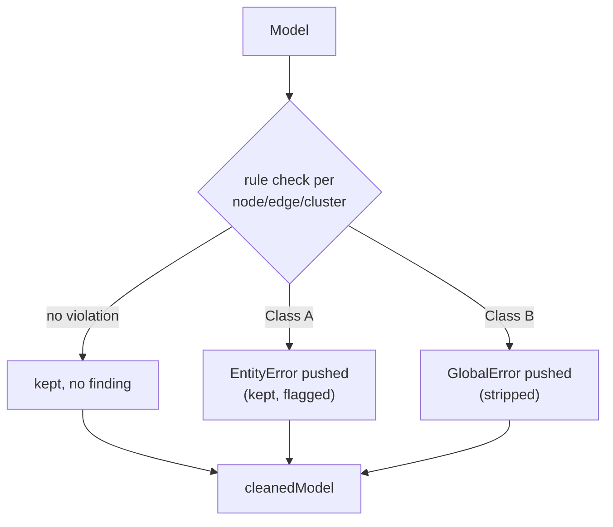
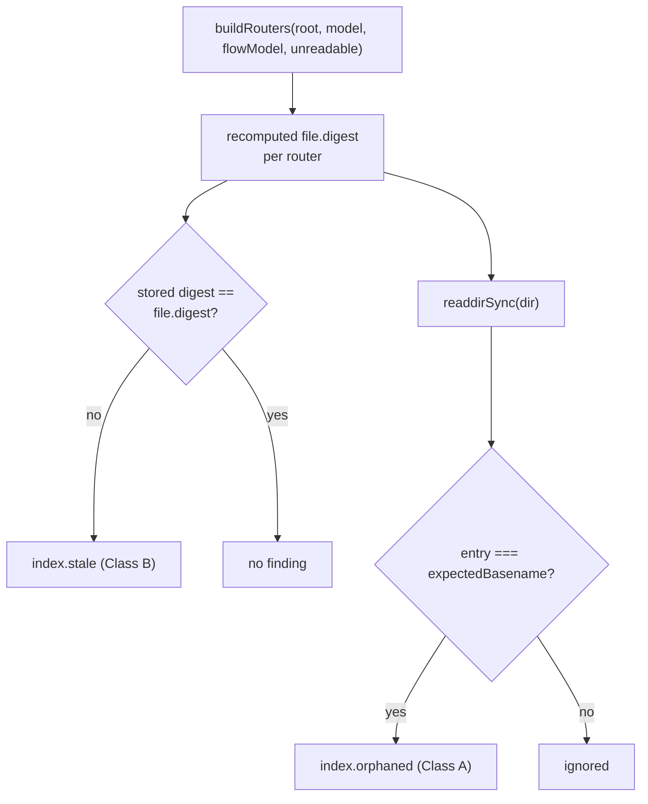

# validate

## What it does

[`src/model/validate.ts`](../../src/model/validate.ts) decides what a broken or drifted model file looks like to every downstream surface: the CLI's exit code, the live viewer's warning triangles, the static dict/graph export's findings banner, and `ignatius validate --index`'s router-drift report. Every consumer of a parsed `Model` traces its findings back to this one file's `RULES` registry, so a rule added here is what makes a bad entity, edge, cluster, or stale router file visible anywhere in the tool rather than silently rendered wrong.

The module has two halves with different I/O contracts. `validateModel` is pure: no Node/Bun I/O, only type-only imports, safe to run in the browser bundle. `validateIndex` is not: it shells out to `buildRouters` and `node:fs` to recompute router digests from disk, so it only runs where file access exists (CLI, server).

`RuleId` carries two unrelated `cluster`-named concepts: the pre-existing `cluster.*` prefix is about entity subtype clusters (a basetype entity with subtype members, declared inline in entity frontmatter), while the newer `flow.cluster_*` ids are about DFD store clusters (a named group of entities declared in a `clusters/<slug>.md` author file, expanded into flow edges by [`src/flows/flow-clusters.ts`](../../src/flows/flow-clusters.ts)). The two do not share code, data shape, or the files that declare them; only the English word "cluster" is shared.

## How it works

**`validateModel`'s per-rule fork decides whether a flagged node, edge, or cluster survives into `cleanedModel`.**

Class is looked up from the `RULES` registry, never computed ad hoc at the call site: `entity.*` and `body.unknown_link` rules are always Class A (the offending node stays, flagged); `parse.*`, `config.*`, `edge.unknown_target`, and `cluster.missing_basetype` are always Class B (the offending edge or cluster is dropped from `cleanedModel`); `edge.dangling_fk_column` and `cluster.missing_member`/`no_discriminator` are Class A. Nodes with an invalid `pk` or `columns` shape are additionally coerced to safe defaults (`[]` / `{}`) in `cleanedModel` regardless of class, so downstream renderers never crash on bad data.

| | Class A (degrade) | Class B (omit) |
|---|---|---|
| Effect on `cleanedModel` | element stays, flagged | element stripped |
| Finding type | `EntityError` | `GlobalError` |
| CLI exit code | never forces exit 1 by itself | forces exit 1 (`errorCount`) |
| Live/static rendering | degraded + warning triangle | omitted + global banner |

`validateModel` itself only walks entity, edge, and subtype-cluster rules; it never checks `flow.*` ids, including the five `flow.cluster_*` ones. Those are declared here (`RuleId`, `RULES`) but implemented in [`src/flows/flow-validate.ts`](../../src/flows/flow-validate.ts) and [`src/flows/flow-clusters.ts`](../../src/flows/flow-clusters.ts), which run against the flow model rather than the entity/edge/cluster model.

### validateIndex drift detection

**`validateIndex` recomputes what `ignatius index` should have written and reports where the current files disagree.**

`index.unreadable_target` (Class B) comes from `buildRouters`'s internal `safeHashFile` failures ([`src/router/build.ts`](../../src/router/build.ts)), collected into an `unreadable` out-param that `validateIndex` maps to findings. `validateIndex`'s own two local catches degrade silently instead: a failed `readFileSync` on a router's stored digest sets `content = null`, which the stale check treats as not-yet-generated (`index.stale`) rather than unreadable; a failed `readdirSync` on a router's directory yields an empty `entries` list, so orphan scanning for that directory silently finds nothing. `buildRouters` is reused rather than reimplemented so the drift comparison can never diverge from what `ignatius index` actually writes to disk.

## Where it lives

38 rule ids total across 8 prefixes; class shown as fired, `L` = `liveOnly`, `S` = `silenceable`.

| Symbol | Kind | What |
|---|---|---|
| `src/model/validate.ts:23` `RuleId` | type | union of 38 rule ids across 8 prefixes |
| `src/model/validate.ts:105` `RuleEntry` | type | `{ title, explanation, class: 'A'\|'B', liveOnly?, silenceable? }` |
| `src/model/validate.ts:130` `RULES` | const | `Record<RuleId, RuleEntry>` — TS compile-errors if any `RuleId` lacks an entry |
| `src/model/validate.ts:77,88,95` `EntityError` / `GlobalError` / `ValidationResult` | types | per-entity vs whole-model finding shapes; `ValidationResult = { entityErrors, globalErrors, cleanedModel }` |
| `src/model/validate.ts:558` `validateModel(model)` | function | pure, no I/O — runs all entity/edge/cluster rule predicates |
| `src/model/validate.ts:654,661` `IndexValidationResult` / `validateIndex(root, model, flowModel)` | type / async function | I/O — recomputes router digests via `buildRouters`, walks folders for orphaned index files |
| `src/model/validate.ts:751` `formatFindingsForStderr(globalErrors, entityErrors, flowErrors?)` | function | sorts (error-before-warning, then ruleId, then location) and formats findings for CLI stderr; drops `liveOnly` rows |
| `parse.*` | rule prefix (3, all B) | `invalid_yaml`, `missing_id`, `empty_frontmatter` |
| `config.*` | rule prefix (3, all B) | `index_file_ext`, `index_file_path`, `index_file_entity` |
| `index.*` | rule prefix (3: B, A, B) | `stale`, `orphaned`, `unreadable_target` |
| `entity.*` | rule prefix (6, all A) | `missing_pk`, `missing_columns`, `invalid_field_type`, `unknown_group`, `ak_unknown_column`, `example_unknown_column` (L) |
| `body.*` | rule prefix (1, A) | `unknown_link` |
| `edge.*` | rule prefix (2: B, A) | `unknown_target`, `dangling_fk_column` |
| `cluster.*` | rule prefix (3: B, A, A) | `missing_basetype`, `missing_member`, `no_discriminator` |
| `flow.*` | rule prefix (17: 6 B, 11 A) | `unknown_store`, `unknown_external`, `unknown_process`, `unknown_cluster`, `cluster_member_unknown` (B); `unknown_attribute`, `ambiguous_endpoint`, `process_no_input`, `process_no_output`, `process_to_process` (A, S), `unbalanced_decomposition`, `duplicate_number`, `store_naming_collision`, `cluster_no_members`, `cluster_entity_unknown`, `cluster_overlap` (A); `illegal_connection` (B) |

The five `flow.cluster_*` ids are the newest additions: `unknown_cluster` (a `cluster:` endpoint names a slug with no `clusters/<slug>.md` file) and `cluster_member_unknown` (a `cluster:` entry's `data:` map names a member not in the cluster's `entities:` list) are Class B and strip the produced edge(s); `cluster_no_members` (an empty `data:` map), `cluster_entity_unknown` (a cluster file's `entities:` list names an entity absent from the entity catalog), and `cluster_overlap` (an entity claimed by more than one `clusters/*.md` file) are Class A.

[`docs/design/schema-lint-and-error-ux.md`](../design/schema-lint-and-error-ux.md) and [`docs/spec/schema-lint-and-error-ux.md`](../spec/schema-lint-and-error-ux.md) carry the original rule-catalog design and contract; [`docs/design/model-index-routing.md`](../design/model-index-routing.md) and [`docs/spec/model-index-routing.md`](../spec/model-index-routing.md) cover the `config.*`/`index.*` additions and `validateIndex`; [`docs/design/dfd-store-clusters.md`](../design/dfd-store-clusters.md) and [`docs/spec/dfd-store-clusters.md`](../spec/dfd-store-clusters.md) cover the five `flow.cluster_*` ids and the `clusters/<slug>.md` author-file format they validate. [`test/checks/test-validate-index.ts`](../../test/checks/test-validate-index.ts) covers `validateIndex`.

## Constraints

- `validateModel` and `RULES` must stay free of Node/Bun I/O — the file is imported by the browser-side app ([`src/app/`](../../src/app)), so any I/O import here would break that bundle. `validateIndex` is the deliberate exception: it reaches `buildRouters` and `node:fs` through dynamic `import()` so those modules never enter this file's static import graph.
- `RULES` is `Record<RuleId, RuleEntry>` — adding a `RuleId` without a matching `RULES` entry is a TypeScript compile error, not a runtime gap.
- `flow.process_to_process` is the only rule with `silenceable: true`. The flag is informational; `ignatius.yml`'s `flow_rules: { process_to_process: false }` is the actual enforcement, and relying on `silenceable` alone does nothing to suppress the rule. `entity.example_unknown_column` is the only `liveOnly` rule; `formatFindingsForStderr` and the static dict generator drop it, only the live viewer and `/api/model` surface it.
- `index.stale`/`index.orphaned`/`index.unreadable_target` only fire under `ignatius validate --index`; plain `validate` never calls `validateIndex`, so it never hashes router targets.
- `STORED_DIGEST_RE` (`^<ignatius-index[\s>][^>]*\sdigest="([^"]*)"/m`) and the orphan-scan regex (`^<ignatius-index[\s>]/m`) both anchor to line start. A mid-line mention of `<ignatius-index` does not match either, and a differently-named tag like `<ignatius-index-legacy ...>` does not match the stored-digest regex (its next character after `<ignatius-index` is `-`, not whitespace or `>`).
- CLI callers derive the hard-exit decision from `RULES[ruleId].class === 'B'`, never from a finding's own `severity` field, keeping one source of truth for exit code across entity, global, and flow findings.
- Adding a `RuleId` with a `RULES` entry but no corresponding check in `validateModel` (or, for `flow.*` ids, in [`src/flows/flow-validate.ts`](../../src/flows/flow-validate.ts)/`flow-clusters.ts`) compiles clean: the id and its title exist, but no code path ever pushes its finding, so the rule silently never fires.

## Coupling

- parser ([`src/model/parse.ts`](../../src/model/parse.ts)): validate.ts type-imports `Model`, `ModelNode`, `ModelEdge`, `SubtypeCluster` from `./parse`; parse.ts type-imports `GlobalError` back from `./validate`. Both directions are `import type` only, no runtime circular dependency, but the two files' exported shapes must stay in sync.
- flows ([`src/flows/flow-validate.ts`](../../src/flows/flow-validate.ts), [`src/flows/flow-clusters.ts`](../../src/flows/flow-clusters.ts), [`src/flows/flow-parse.ts`](../../src/flows/flow-parse.ts)): all three type-import `GlobalError` from `../model/validate`; `flow-validate.ts` additionally type-imports `RuleId` and implements every `flow.*` id declared in this file's `RuleId` union, including the five `flow.cluster_*` ids; `flow-clusters.ts` produces the `clusterIssue` markers on expanded edges that `flow-validate.ts` turns into `flow.unknown_cluster` / `flow.cluster_member_unknown` / `flow.cluster_no_members` findings.
- router ([`src/router/build.ts`](../../src/router/build.ts)): `validateIndex` dynamically imports `buildRouters` and the `UnreadableTarget` type from `../router/build` to recompute digests; this dynamic import is the coupling point between validate and router. [`src/cli/cli.ts`](../../src/cli/cli.ts) is the only caller of `validateIndex`, gated behind the `--index` flag on the `validate` subcommand.
- cli ([`src/cli/cli.ts`](../../src/cli/cli.ts)): dynamically imports `validateModel`, `validateIndex`, `formatFindingsForStderr`, `RULES`; uses `RULES[ruleId].class` as the authoritative signal for whether flow findings count toward the hard-exit error count.
- server ([`src/server/server.ts`](../../src/server/server.ts)): imports `validateModel` directly (not dynamically) to validate models served live.
- frontend ([`src/app/`](../../src/app)): `App.tsx`, `EntityCard.tsx`, `EntityModal.tsx`, `FindingsPanel.tsx`, `ProcessCard.tsx` import `RULES` to look up rule titles for display; `App.tsx` additionally filters `liveOnly` findings out of the static-mode panel; `hooks/useModelData.ts` imports `validateModel` directly.
- Any new `RuleId` added here needs a matching `RULES` entry (compiler-enforced) and, if consumer-facing, a title recognizable in `App.tsx`/`FindingsPanel.tsx` — the registry is the single source of human-readable rule text across CLI stderr, dict, graph, and live viewer.
